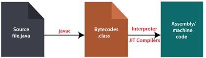
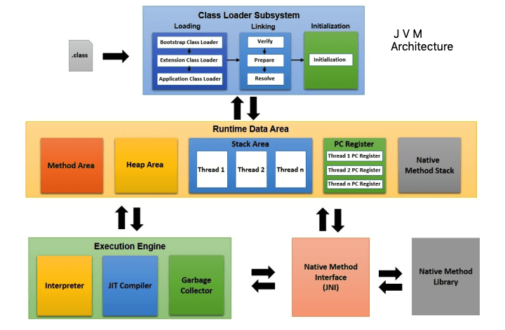
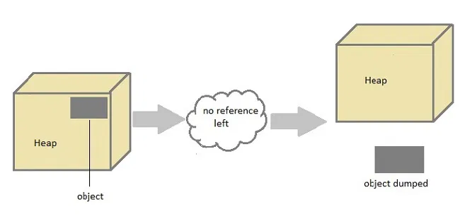

# Java Basics

My notes on Java.

[Java tutorial](https://www.studytonight.com/java/overview-of-java.php)

### Contents

- [Java Overview](#java-overview)
- [JVM (Java Virtual Machine)](#jvm-java-virtual-machine)
- [JVM Architecture](#jvm-architecture)
- [JRE (Java Runtime Environment)](#jre-java-runtime-environment)
- [JDK (Java Development Kit)](#jdk-java-development-kit)
- [Java Program Structure](#java-program-structure)
- [Java Variables](#java-variables)
- [Scope of Variables](#scope-of-variables)
- [Operators](#operators)
- [Data Types](#data-types)
- [Type Casting](#type-casting)
- [Static Block in Java](#static-block-in-java)
- [Initializer Block in Java](#initializer-block-in-java)
- [Parameter Vs. Argument in a Method](#parameter-vs-argument-in-a-method)
- [Call by Value Vs. Call by Reference](#call-by-value-vs-call-by-reference)
- [Switch Statement](#switch-statement)
- [Loops](#loops)
- [Arrays in Java](#arrays-in-java)
- [Different ways to create objects](#different-ways-to-create-objects)
- [Java Packages](#java-packages)
- [Garbage Collection in Java](#garbage-collection-in-java)

## Java Overview

- Java applications are called WORA (Write Once Run Anywhere). This means a programmer can develop Java code on one system and can expect it to run on any other Java-enabled system without any adjustment. This is all possible because of JVM.

- Unlike other programming languages such as C, C++ etc which are compiled into platform specific machines. Java is guaranteed to be write-once, run-anywhere language. On compilation Java program is compiled into bytecode. This bytecode is platform independent and can be run on any machine.
    - If you compile a c++ program on a windows machine, you cannot run it on a linux machine. But in case of Java, the bytecode can be run on any machine that has JVM installed.

- Java does not support low-level programming functions like pointers. The codes in Java is always written in the form of Classes and objects.

## JVM (Java Virtual Machine)

- It is an engine that provide runtime environment to lunch the Java application and responsible for converting the byte code (.class file) which generated by compiling the (.java file). JVM is a part of Java Runtime Environment(JRE).

- The Java source code first compiled into a binary byte code using Java compiler, then this byte code runs on the JVM, which is a software based interpreter. So Java is considered as both interpreted and compiled.

- The JVM doesn't understand Java typo, that's why you compile your *.java files to obtain *.class files that contain the bytecodes understandable by the JVM.

    

## JVM Architecture

- The JVM is divided into three main subsystems:
    - **ClassLoader Subsystem:** It is a part of the JRE that dynamically loads Java class files from file system, network or any other source into the Java Virtual Machine.
    - **Runtime Data Area:** It is divided into five parts:
        - **Method Area:** It stores the class code, code of variables, and methods of the Java program.
        - **Heap Area:** It is the runtime data area in which objects are allocated.
        - **Stack Area:** Method code is stored in the Method area. But during the execution of a method, it requires some more memory to store the data and results. This memory is allocated on Java stacks. Each time a method is called, a new frame is created into the stack. When method invocation is completed, a frame associated with it is destroyed.
        - **PC Registers:** It holds the address of Java Virtual Machine instruction currently being executed.
        - **Native Method Stack:** It holds native method information. For every thread, a separate native method stack will be created.
    - **Execution Engine:** It is responsible for executing the instructions contained in the methods of the classes loaded by the class loader.




## JRE (Java Runtime Environment)

- **JRE** provides the libraries, JVM, and other components to run the Java program. It doesn't contain any development tools such as compiler, debugger etc.

- `JRE = JVM + Libraries + Other components`

## JDK (Java Development Kit)

- **JDK** is a superset of JRE, and it contains everything that JRE has along with development tools such as compiler, debugger etc.

- `JDK = JRE + Development tools`

-------------------------------------------------------------

## Java Program Structure

- Any Java program must have a class name (which should match the filename) and the filename should end with .java extension.

- The main method is the entry point of any Java program. It is always written as `public static void main(String[] args)`. The main method is the starting point of any Java program.
    - `public`: It means this function is visible to all.
    - `static`: It means this function is accessible without creating an object of the class. JVM calls the main method without creating an object of the class.

-------------------------------------------------------------

## Java Variables

- A variable is a pointer to a location in memory where the data is stored.

- Variables types in Java:
    - **Local Variables:** Variables defined inside a method, constructor or any block.
    - **Instance Variables:** Variables defined inside a class but outside a method, constructor or any block.
    - **Static (Class) Variables :** Variables defined with the static keyword.

```java
public class Main {
    int x = 10; // instance variable
    static int y = 20; // static variable

    Main() {
        int z = 30; // local variable
    }

    void method() {
        int a = 40; // local variable
    }

    public static void main(String[] args) {
        int a = 40; // local variable

        for (int i = 0; i < 5; i++) {
            System.out.println(i); // local variable
        }

        {
            int b = 50; // local variable
        }
    }
}
```

### Local Variables

- Local variables are initialized when method, constructor or block start and will be destroyed once its end.
- Local variable reside in stack.
- Local variables are not given any default value, so local variables should be declared and an initial value should be assigned before the first use. If you try to use local variable before assigning any value, the compiler will throw an error.

```java
public class Main {
    public static void main(String[] args) {
        int x; // local variable
        System.out.println(x); // Error: The local variable x may not have been initialized
    }
}
```

### Instance Variables

- It's not shared among the objects which means each object will have its own copy of the instance variable so if you change the value of an instance variable, it will not affect the value of the instance variable of another object.

- **Non-static (instance) variable cannot be referenced from a static context.** When we try to access a non-static variable from a static context like main method, java compiler throws an error message `a non-static variable cannot be referenced from a static context.` This is because non-static variables are related with instance of class(object) and they get created when instance of a class is created by using new operator. So if we try to access a non-static variable without any instance, compiler will complain because those variables are not yet created and they don't have any existence until an instance is created and associated with it.

```java
class Test
{
  int x;
  public static void main(String[] args)
  {
    x = 10; // Error: non-static variable x cannot be referenced from a static context

  }
}
```

### Static Variables

- It is shared among all the objects of the class.
- It is initialized only once, when the class is loaded into memory, and it remains in memory for the entire duration of the program. Because of this, the value of a static variable is the same across all instances of the class, and any change to the static variable affects all instances.
- It is called by `classname.static_variable_name`. No need to create an object to call static variables.
- A static variable can never be defined inside a method i.e it can never be a local variable.

```java
public class Main {
    static int count = 0; // static variable
    int a = 0; // instance variable
   
   public static void main(String[] args) {
        Main obj1 = new Main();
        Main obj2 = new Main();
        obj1.count++;
        obj1.a++;
        obj2.count++;
        obj2.a++;
        System.out.println(obj1.count); // 2
        System.out.println(obj1.a); // 1
        System.out.println(obj2.count); // 2
        System.out.println(obj2.a); // 1
    }
}
```
-------------------------------------------------------------

## Scope of Variables

- **Local Variables:** The scope of local variables is limited to the method, constructor or block in which the variable is declared.
- **Instance Variables:** The scope of instance variables depends on the access modifier of the variable.
- **Static Variables:** The scope of static variables is similar to instance variables.

```java
public class Main {
    int x = 10; // instance variable
    static int y = 20; // static variable

    public void method() {
        int x = 100; // local variable
        System.out.println(x); // 100
        System.out.println(this.x); // 10
        System.out.println(y); // 20
    }

    public static void main(String[] args) {
        Main obj = new Main();
        obj.method();
        System.out.println(obj.x); // 10
        System.out.println(y); // 20
    }
}
```

-------------------------------------------------------------

## Operators

- **Arithmetic Operators:** `+`, `-`, `*`, `/`, `%`, `++`, `--`
- **Relational Operators:** `==`, `!=`, `>`, `<`, `>=`, `<=`
- **Logical Operators:** `&&`, `||`, `!`
- **Bitwise Operators:**
    - `&`: Bitwise AND -> 1 if both bits are 1
    - `|`: Bitwise OR -> 1 if either of the bits is 1
    - `^`: Bitwise XOR -> 1 if both bits are different
    - `~`: Bitwise Complement -> Flips the bits
    - `<<`: Left Shift
    - `>>`: Right Shift
- **Assignment Operators:** `=`, `+=`, `-=`, `*=`, `/=`, `%=`, `&=`, `|=`
- **Conditional Operator (Ternary Operator):** `(epr1) ? expr2 : expr3`
- **Instanceof Operator:** It is used to test whether the object is an instance of the specified type (class or subclass or interface).
    ```java
    public class Main {
        public static void main(String[] args) {
            String name = "John";
            boolean result = name instanceof String;
            System.out.println(result); // true
        }
    }
    ```
-------------------------------------------------------------

## Data Types

- **Primitive Data Types:** These are predefined by the language. Once a primitive data type has been declared its type can never change. There are 8 primitive data types in Java:

| Data Type | Default Value | Size   | Description |
|-----------|---------------|--------|-------------|
| byte      | 0             | 1 byte | Stores whole numbers from -128 to 127 |
| short     | 0             | 2 bytes| Stores whole numbers from -32,768 to 32,767 |
| int       | 0             | 4 bytes| Stores whole numbers from -2,147,483,648 to 2,147,483,647 |
| long      | 0             | 8 bytes| Stores whole numbers from -9,223,372,036,854,775,808 to 9,223,372,036,854,775,807 |
| float     | 0.0           | 4 bytes| Stores fractional numbers. Sufficient for storing 6 to 7 decimal digits |
| double    | 0.0           | 8 bytes| Stores fractional numbers. Sufficient for storing 15 decimal digits |
| char      |'\u0000' (null)| 2 bytes| Stores a single character/letter or ASCII values. Ranges from 0 to 65,535 |
| boolean   | false         | 1 bit  | Stores true or false values |

- **Non-Primitive(Rererence) Data Types:** A reference data type is used to refer to an object. They are created by the programmer and are not defined by Java. Examples of reference data types are:
    - **String**
    - **Arrays**
    - **Classes**

-------------------------------------------------------------

## Type Casting

- Casting is a process of changing one type value to another type.

- It's of two types:
    - **Widening Casting (Implicit):** It is done automatically by the compiler. It is also called automatic type conversion. It is done when the two types are compatible and the target type is larger than the source type. For example, byte to short, short to int, int to long, float to double etc.
        - `byte -> short -> char -> int -> long -> float -> double`
    - **Narrowing Casting (Explicit):** It is done manually by the programmer. It is done when the two types are not compatible. For example, double to int, float to short, int to byte etc.
        - `double -> float -> long -> int -> char -> short -> byte`

```java
public class Main {
    public static void main(String[] args) {
        int a = 10;
        double b = a; // Widening Casting (Implicit)
        System.out.println(b); // 10.0

        double c = 10.5;
        // int d = c; // Error: type mismatch
        int d = (int) c; // Narrowing Casting (Explicit)
        System.out.println(d); // 10
    }
}
```

-------------------------------------------------------------

-------------------------------------------------------------


## Static Block in Java

- A static block is a set of instructions that is run only once when a class is loaded into memory. It is executed before the main method.

- It's useful when you want to perform some action before the class is loaded like initializing static variables.
    - The static initializer runs when the class is loaded even if you never create any objects of that type. The constructor is called for each object of that type you instantiate.
    - Not all classes are meant to be instantiated. The constructor might never be called. It might even be private.

- A class can have multiple static blocks, and they will be executed in the order they are written in the program.

```java
public class Main {
    static {
        System.out.println("Static block 1");
    }

    static {
        System.out.println("Static block 2");
    }

    public static void main(String[] args) {
        System.out.println("Main method");
    }

    static {
        System.out.println("Static block 3");
    }
}
```
```
Output:
Static block 1
Static block 2
Static block 3
Main method
```

## Initializer Block in Java

- An initializer block is used to initialize the instance variables. It runs each time an object of the class is created. It is executed before the constructor.

- If you have multiple initializer blocks, they will be executed in the order they are written in the program before the constructor.

```java
public class Main {
    {
        System.out.println("Initializer block 1");
    }

    {
        System.out.println("Initializer block 2");
    }

    public Main() {
        System.out.println("Constructor");
    }

    public static void main(String[] args) {
        {
            System.out.println("Main method block");
        }
        Main obj = new Main();
        {
            System.out.println("Main method block 2");
        }
    }

    {
        System.out.println("Initializer block 3");
    }
}
```
```
Output:
Main method block
Initializer block 1
Initializer block 2
Initializer block 3
Constructor
Main method block 2
```

- If you have static and instance initializer blocks in the same class, the static initializer block will be executed first, and then the instance initializer block will be executed.

```java
public class Main {
    static {
        System.out.println("Static block");
    }

    {
        System.out.println("Initializer block");
    }

    public Main() {
        System.out.println("Constructor");
    }

    public static void main(String[] args) {
        Main obj = new Main();
    }
}
```
```
Output:
Static block
Initializer block
Constructor
```

-------------------------------------------------------------

## Parameter Vs. Argument in a Method

- **Parameter** : The variable in the declaration of the method is called a parameter. Parameters are always local to the method and do not have scope outside the method.

- **Argument** : The value that is passed to the method when it is called is called an argument.

```java
public void add(int a, int b){ // a, b are parameters
    int sum = a + b;
    System.out.println("Sum: " + sum);
}

public static void main(String[] args){
    add(10, 20); // 10, 20 are arguments
}
```

## Call by Value Vs. Call by Reference

**Jave only supports Call by Value**.

- **Call by Value**: A **copy of the actual parameter is passed** to the method. Changes made to the parameter inside the method have no effect on the actual parameter.

- **Call by Reference**: The **address of the actual parameter is passed** to the method. Changes made to the parameter inside the method have an effect on the actual parameter.

- If you want the changes made to the object inside the method to reflect on the actual object, you can pass the object as an argument to the method.
    ```java
    class Add {
        int x, y;
        Add(int i, int j) {
            x = i;
            y = j;
        }
    }

    class Demo
    {
        public static void main(String[] args)
        {
            Add obj = new Add(5, 10);
            // call by value (object is passed)
            change(obj);
            System.out.println("x = "+obj.x); // x = 6
            System.out.println("y = "+obj.y); // y = 11
        }
        public static void change(Add add)
        {
            add.x++;
            add.y++;
        }
    }
    ```
-------------------------------------------------------------


## Switch Statement

**Rules for Switch Statement:**
- The expression must be of type byte, short, int, char, String, or an enum.
- The case value must be of the same data type as the variable in the switch.
- The case value must be a constant literal or a final variable.
- Duplicate case values are not allowed.
- The default case is optional.
- The break statement is optional. If omitted, all statements after the matching case label are executed.

```java
public class Main {
    public static void main(String[] args) {
        int day = 4;
        switch (day) {
            case 1:
                System.out.println("Sunday");
                break;
            case 2:
                System.out.println("Monday");
                break;
            default:
                System.out.println("Invalid day");
        }
    }
}
```
-------------------------------------------------------------

## Loops

The default value in the loop condition is true. If you don't provide any condition, it will be true by default. Otherwise, you can provide a condition that will be evaluated to true or false to compare it with the default value.

- **For Loop:**
    ```java
    for (initialization; condition; increment/decrement) {
        // code to be executed
    }
    ```
- **For-each Loop:** It is used to traverse array or collection in Java. It terminates when no elements are left.
    ```java
    for (type variableName : arrayName) {
        // code to be executed
    }
    ```
- **While Loop:**
    ```java
    while (condition) {
        // code to be executed
    }
    ```

- **Do-While Loop:** It executes the code block once before checking the condition, then it will repeat the loop as long as the condition is true.
    ```java
    do {
        // code to be executed
    } while (condition);
    ```

-------------------------------------------------------------

## Arrays in Java

- A static data structure because size of an array must be specified at the time of its declaration.

- In Java, array is treated as an object and **stores into heap memory.** It allows to store primitive values or reference values.

- It occupies a contiguous memory location.

- **1D array:** `datatype[] arrayName;` or `datatype arrayName[];`
- **2D array:** `datatype[][] arrayName;`
    ```java
    int[][] arr = new int[2][3]; // 2D array with 2 rows and 3 columns
    int[][] arr2 = {{1, 2, 3}, {4, 5, 6}}; // 2D array with 2 rows and 3 columns
    ```

- Declaration and Initialization:
    ```java
    public class Main {
        public static void main(String[] args) {
            // Declaration
            int[] arr; // No memory is allocated for the actual array, only for the reference variable arr that resides in the stack memory which points to the heap memory where the actual array will be stored.

            // Declaration and instantiation
            int[] arr2 = new int[5]; // Memory is allocated in the heap memory. A reference variable arr2 is created in the stack memory that points to the newly created array in the heap memory.
        }
    }
    ```

- Working with Arrays:
    ```java
    public class Main {
        public static void main(String[] args) {
            int arr = {1, 2, 3, 4, 5};
            int[] arr2 = new int[5]; // All elements are initialized to 0 by default
            arr2 = new int[] {1, 2, 3, 4, 5}; // Initialization of array elements
            arr2[0] = 10; // Assigning value to array element
            System.out.println(arr2.length); // 5
        }
    }
    ```

### Jagged Array

- A jagged array is a 2D array where each row may have a different number of columns.

- Declaration:
    ```java
    int[][] arr = new int[3][];
    arr[0] = new int[3];
    arr[1] = new int[4];
    arr[2] = new int[2];
    ```
-------------------------------------------------------------

## Different ways to create objects

- You can create objects in Java in multiple ways:
    - Using new keyword
    - Using newInstance() method of Class class
    - Using clone() method
    - Using newInstance() method of Constructor class
    - Using Deserialization


- **Using new keyword:** It is created at runtime and creates a memory area in heap to store created object.
    ```java
    ClassName obj = new ClassName();
    ```

- **Using newInstance() method of Class class:** This method loads the `class` and returns an object of type `Class`. That further we cast in our required type to get required type of object.
    ```java
    ClassName obj = (ClassName) Class.forName("ClassName").newInstance();
    ```

- **Using clone() method:** When a `clone()` method is called JVM creates a new object and then copy all the content of the old object into it. When an object is created using the` clone()` method, a constructor is not invoked. To use the `clone()` method the class must implement the `Cloneable` interface.
    ```java
    public class Main implements Cloneable {
        int a = 10;
        public static void main(String[] args) {
            Main obj = new Main();
            try {
                Main obj2 = (Main) obj.clone();
                System.out.println(obj2.a); // 10
            } catch (CloneNotSupportedException e) {
                e.printStackTrace();
            }
        }
    }
    ```
-------------------------------------------------------------

## Java Packages

- Package is a **collection of related classes.** Java uses package to group related classes, interfaces and sub-packages in any Java project.

- Types of Packages:
    - **Built-in Packages**: These are the packages that are provided by Java such as `java.lang`, `java.util`, `java.io`, etc.
    - **User-defined Packages**: These are the packages that are created by the user.

- There are 3 different ways to refer to any class that is present in a different package:
    1. **Using Fully Qualified Name**: `java.util.ArrayList list = new java.util.ArrayList();`
        > This is generally used when two packages have classes with same names. If you import both the packages, the compiler will not be able to differentiate between the two classes. For example: `java.util` and `java.sql` packages contain `Date` class.
    2. **Import Package with all classes**: `import java.util.*;`
    3. **Import Specific Class**: `import java.util.ArrayList;`
        
### User-defined Package

- To create a package, you need to include a package statement at the top of the file: `package packageName;`

- Package statement must be first statement in the program even before the import statement.

- A package is always defined as a separate folder having the same name as the package name. For example the `.java` file for any class you define to be part of `mypack` package must be stored in a directory called `mypack`:
    ```java
    package mypack;
    public class Simple {
        public static void main(String[] args) {
            System.out.println("Welcome to package");
        }
    }
    ```
- All classes within the package must have the package statement otherwise the compiler will throw an error.

- A package inside another package is called a sub-package and you declare it by separating the package name by a dot(.): `package mypack.mysubpack;`

### Static import in Java

- The `static import` is used to import static members of a class.

- Using `static import`, it is possible to refer to the static member directly without its class name.

```java
import static java.lang.Math.*; // importing all static members of Math class
// import static java.lang.Math.sqrt; // importing only sqrt method
public class Test
{
    public static void main(String[] args)
    {
        System.out.println(Math.sqrt(144));
    }
}
```
----------------------------

## Garbage Collection in Java

- Java garbage collection is the process of **releasing unused memory occupied by unused objects.** This process **is done by the JVM automatically** because it is essential for memory management.

- When a Java programs run on the JVM, objects are created on the heap, which is a portion of memory dedicated to the program. Eventually, some objects will no longer be needed.

- When there is no reference to an object, then that object is assumed to be no longer needed and the memory occupied by the object are released.

- In the below image, you can understand that if an object does not have any reference than it will be dumped by the JVM.



- Unlike C++ there is no explicit way to destroy object. tTe Garbage Collection can not be forced explicitly. We may request JVM for garbage collection by calling `System.gc()` method. But This does not guarantee that JVM will perform the garbage collection.

- An object is able to get garbage collect if it is non-reference. We can make an object non-reference by using three ways:
    - Setting the object reference to `null`: `obj = null;`
    - Reassigning the reference to another object:
       ```java
       public class Demo {
            public static void main(String[] args) {
                Demo demo1 = new Demo(); // `demo1` refers to a `Demo` object
                Demo demo2 = new Demo(); // `demo2` refers to another `Demo` object

                // At this point, both `demo1` and `demo2` refer to different objects.

                demo2 = demo1; // `demo2` now refers to the same object as `demo1`

                // The object that `demo2` originally referred to is now unreachable.
                // No reference points to that object, so it's eligible for garbage collection.
            }
        }
        ```
     - Anonymous object does not have any reference so if it is not in use, it is ready for the garbage collection.
        > An anonymous object in Java is an object that is instantiated but not assigned to any reference variable. Since it doesn't have a reference, it can only be used at the point of creation. After its use, the object becomes unreachable and eligible for garbage collection.
     ```java
     public class Demo {
        void display() {
            System.out.println("Display method called");
        }

        public static void main(String[] args) {
            // Creating an anonymous object and immediately calling the display method
            new Demo().display();

            // After this line, the Demo object created above has no reference
            // and is eligible for garbage collection.
        }
    }
    ```

------------------------