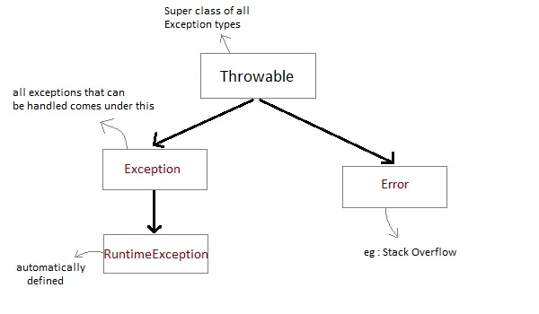

# Java Exception Handling

- Exception is a condition that occurs during program execution and lead to program termination abnormally. There can be several reasons that can lead to exceptions, including programmer error, hardware failures, files that need to be opened cannot be found, resource exhaustion etc.

- The problem with the exception is, it terminates the program and skip rest of the execution. To avoid this, we use exception handling that avoid program termination and continue the execution by skipping exception code.

- If we don't handle exception, the JVM will construct an exception and throw it. This will terminate the program abnormally and print the exception message on the console.

## How to Handle Exception

Java provides controls to handle exception in the program.

- **try**: The code that can throw exception is placed inside the try block. If an exception occurs, the control is transferred to the catch block.

- **catch**: The catch block is used to handle the exception. It contains the code that is executed when an exception occurs.

- **finally**: The finally block is used to execute the code that needs to be executed whether an exception occurs or not. It is executed after the try-catch block.
    - It's optional to use finally block.
    - For example, closing a file, closing a connection etc.

- **throw**: The throw keyword is used to throw an exception explicitly.
    - If it used inside a method, the method must declare the exception using `throws` keyword.
    ```java
    throw new ArithmeticException("Arithmetic Exception");
    throw new NullPointerException("Null Pointer Exception");
    ```

- **throws**: The throws keyword is used to declare the exception that can be thrown by the method.
    - Any method that is capable of causing exceptions must list all the exceptions possible during its execution, so that anyone calling that method gets a prior knowledge about which exceptions are to be handled.

```java
void method() throws Exception1, Exception2 {
    // code that can throw exception
}
```

```java
try {
    // code that can throw exception
} catch (Exception1 e) {
    // code to handle exception1
} catch (Exception2 e) {
    // code to handle exception2
} finally {
    // code that needs to be executed whether exception occurs or not
}
```

**While using multiple catch statements, it is important to remember that sub classes of class Exception inside catch must come before any of their super classes otherwise it will lead to compile time error. For example, if we have `catch(ArithmeticException e)` before `catch(Exception e)`, it will lead to compile time error.**

## Java Exception class Hierarchy

- All exception types are subclasses of class `Throwable`, which is at the top of exception class hierarchy.

- The `Throwable` class has two subclasses:
    - `Error`: Represents serious problems that a reasonable application should not try to catch.
        - These are exceptional conditions that are external to the application, and that the application usually cannot anticipate or recover from for example, `OutOfMemoryError`, `StackOverflowError` etc.
    - `Exception`: Represents exceptional conditions that a reasonable application might want to catch.
        - This class is extended to create user-defined exceptions.




## Types of Exceptions

- **Checked Exception**:
    - The exceptions that are **checked at compile time**. The compiler checks that the exception is either caught in `try-catch` block or declared in the method using `throws` keyword.
    - It is mandatory to handle checked exceptions.
    - They are **direct** subclasses of the `Exception` class, **excluding** any subclasses derived from `RuntimeException`.
    - Examples:
        - `IOException`: Occurs during input and output operations.
        - `SQLException`: Arises when trying to interact with a database.
        - `ClassNotFoundException`: Happens when trying to use a class that is not found by the classloader.
    ```java
    import java.io.BufferedReader;
    import java.io.FileReader;
    import java.io.IOException;

    public class FileReadExample {
        public static void main(String[] args) {
            try {
                BufferedReader reader = new BufferedReader(new FileReader("example.txt"));
                String line = reader.readLine();
                while (line != null) {
                    System.out.println(line);
                    line = reader.readLine();
                }
                reader.close();
            } catch (IOException e) {
                System.out.println("An error occurred while reading the file: " + e.getMessage());
            }
        }
    }
    ```

- **Unchecked Exception**:
    - Unchecked exceptions are the classes that extend `RuntimeException` class.
    - They typically **represent defects in the program.** They are used for issues that the application should not attempt to catch, as they are often irrecoverable. For instance, `ArithmeticException`, `NullPointerException` or `IndexOutOfBoundsException` usually points to bugs in the code that need to be fixed rather than caught and handled.
    - The exceptions that are ignored at compile time and **checked at runtime**, meaning the compiler does not require methods to handle or declare these exceptions.
    ```java
    public class NullPointerExceptionExample {
        public static void main(String[] args) {
            String text = null;
            try {
                System.out.println(text.length());
            } catch (NullPointerException e) {
                System.out.println("Caught NullPointerException: " + e.getMessage());
            }
        }
    }
    ```

- **Error**:
    - Errors are the classes that extend `Error` class.
    - Errors are **unchecked** and are not required to be handled.
    - For example, `OutOfMemoryError`, `StackOverflowError` etc.

## User-defined Exception

- Java allows us to create our own exceptions by
    - extending the `Exception` class for **checked exceptions** and
    - extending the `RuntimeException` class for **unchecked exceptions**.

- We use custom exceptions:
    - When built-in exceptions don’t describe the problem clearly.
    - When you want to handle specific application-related issues (e.g., invalid user input, insufficient funds, etc.).

- To create a custom exception:
    1. Create a new class that extends `Exception` or `RuntimeException`.
    2. Add a constructor that accepts a message and passes it to the parent class constructor.

```java
class MyException extends Exception {
    // constructor to accept exception message
    MyException(String message) {
        super(message); // pass message to the parent Exception class
    }
}

public class Bank {
    void withdraw(int amount) throws MyException {
        if (amount < 1000) {
            throw new MyException("Minimum withdrawal amount is 1000");
        }
    }

    public static void main(String[] args) {
        Bank bank = new Bank();
        try {
            bank.withdraw(500);
        } catch (MyException e) {
            System.out.println(e.getMessage()); // Minimum withdrawal amount is 1000
        }
    }
}
```

## Try with Resource Statement (Automatic Resource Management)

- This feature was introduced in Java 7. It automatically closes the resources after the try block is executed.

- A resource is an object that must be closed after the program is finished with it. For example, a file or connection.

- Any object that implements `java.lang.AutoCloseable` or `java.io.Closeable` can be passed as a parameter to try statement.

- We can write more than one resources in the try statement.

- Suppose, we run a JDBC program to connect to the database then we have to create a connection and close it at the end of task as well. But in case of try-with-resource we don’t need to close the connection, JVM will do this automatically by using AutoCloseable interface.

- **In Java 7,** try-with-resource was introduced and in which resource was created inside the try block. It was the limitation with Java 7 that a connection object created outside can not be refer inside the try-with-resource. **In Java 9** this limitation was removed so that now we can create object outside the try-with-resource and then refer inside it without getting any error.

- In a try-with-resources statement, any catch or finally block is run after the resources declared have been closed.

### Syntax

```java
try (resource_declaration) {
    // use the resource
} catch (Exception e) {
    // handle exception
}
```

### Example

**Without Try with Resource**

```java
import java.io.FileReader;
import java.io.IOException;

public class TryWithResourceExample {
    public static void main(String[] args) {
        FileReader reader = null;
        try {
            reader = new FileReader("example.txt");
            char[] chars = new char[100];
            reader.read(chars);
            for (char c : chars) {
                System.out.print(c);
            }
        } catch (IOException e) {
            System.out.println("An error occurred while reading the file: " + e.getMessage());
        } finally {
            try {
                if (reader != null) {
                    reader.close();
                }
            } catch (IOException e) {
                System.out.println("An error occurred while closing the file: " + e.getMessage());
            }
        }
    }
}
```

**With Try with Resource**

```java
import java.io.FileReader;
import java.io.IOException;

public class TryWithResourceExample {
    public static void main(String[] args) {
        try (FileReader reader = new FileReader("example.txt")) {
            char[] chars = new char[100];
            reader.read(chars);
            for (char c : chars) {
                System.out.print(c);
            }
        } catch (IOException e) {
            System.out.println("An error occurred while reading the file: " + e.getMessage());
        }
    }
}
```

In the above example, the `FileReader` object is declared inside the try block. The `FileReader` class implements the `AutoCloseable` interface. So, the `FileReader` object is automatically closed after the try block is executed.

## Method Overriding and Exception Handling

- In method overriding, the subclass method can only declare the **checked exception** which is **same or subclass** of the exception declared by the super class method or **no exception** at all.

- For example, if a method of super class declared `ArithmeticException` then method of subclass may declare `ArithmeticException`, its subclass or no exception but cannot declare its super/parent class like: `Exception` class.

- In other scenario, if super class method does not declare any exception, then sub class overriden method **cannot declare checked exception but it can declare unchecked exceptions.**


**Checked Exception**

```java
import java.io.*;

class Super
{
  void show() {
    System.out.println("parent class");
  }
}

public class Sub extends Super
{
  void show() throws IOException                //Compile time error
  {
    System.out.println("parent class");
  }

  public static void main(String[] args)
  {
    Super s=new Sub();
    s.show();
  }
}
```

**Unchecked Exception**

```java
import java.io.*;

class Super
{
  void show() {
    System.out.println("parent class");
  }
}

public class Sub extends Super
{
  void show() throws ArithmeticException
  {
    System.out.println("parent class");
  }

  public static void main(String[] args)
  {
    Super s=new Sub();
    s.show();
  }
}
```

### Examples

**Example 1:**

```java
import java.io.*;
class Super
{
 void show() throws Exception
  {  System.out.println("parent class");  }
}

public class Sub extends Super {
 void show() throws Exception           //Correct
   { System.out.println("child class"); }

 public static void main(String[] args)
 {
  try {
   Super s=new Sub();
   s.show();
   }
  catch(Exception e){}
 }
}
```

**Example 2:**

```java
import java.io.*;
class Super
{
 void show() throws Exception
  {  System.out.println("parent class");  }
}

public class Sub extends Super {
 void show()                            //Correct
   { System.out.println("child class"); }

 public static void main(String[] args)
 {
  try {
   Super s=new Sub();
   s.show();
   }
  catch(Exception e){}
 }
}
```

## Chained Exception

- Chained exceptions allow you to **relate one exception with another exception,** i.e one exception describes cause of another exception.
- For example, consider a situation in which a method throws an `ArithmeticException` because of an attempt to divide by zero but the actual cause of exception was an `I/O` error which caused the divisor to be zero. The method will throw only `ArithmeticException` to the caller. So the caller would not come to know about the actual cause of exception. Chained Exception is used in such type of situations.

- The `Throwable` class has two constructors that allow you to set the cause of the exception.
    - `Throwable (Throwable cause)`: This constructor is used to set the cause of the exception.
    - `Throwable (String message, Throwable cause)`: This constructor is used to set the cause of the exception and a message to describe the exception.
- The `Throwable` class provides useful methods like
    - `getCause()`: This method returns the cause of the exception.
    - `initCause(Throwable cause)`: This method initializes the cause of the exception.

```java
public class MyChainedException {

    public void main(String[] args) {
        try {
            throw new ArithmeticException("Top Level Exception.")
              .initCause(new IOException("IO cause."));
        } catch(ArithmeticException ae) {
            System.out.println("Caught : " + ae);
            System.out.println("Actual cause: "+ ae.getCause());
        }
    }
}
```


```java
public class ChainedExceptionExample {
    public static void main(String[] args) {
        try {
            // First method call, which causes an exception
            method1();
        } catch (Exception e) {
            // Printing the main exception and its cause
            e.printStackTrace();
        }
    }

    // First method
    public static void method1() throws Exception {
        try {
            // Second method call
            method2();
        } catch (Exception e) {
            // Throwing a new exception with the cause
            throw new Exception("Exception in method1", e);
        }
    }

    // Second method
    public static void method2() throws Exception {
        // This is where the initial exception occurs
        throw new Exception("Exception in method2");
    }
}
```

**Output:**

```
java.lang.Exception: Exception in method1
    at ChainedExceptionExample.method1(ChainedExceptionExample.java:13)
    at ChainedExceptionExample.main(ChainedExceptionExample.java:6)
Caused by: java.lang.Exception: Exception in method2
    at ChainedExceptionExample.method2(ChainedExceptionExample.java:19)
    at ChainedExceptionExample.method1(ChainedExceptionExample.java:11)
    ... 1 more
```

**Explanation:**
- method2 throws an exception: "Exception in method2".
- method1 catches this exception and throws a new one: "Exception in method1", but it passes the original exception as the cause.
- In the main method, we catch the exception from method1, which contains the cause from method2. The stack trace will show both exceptions, with the cause linked to the original.

## Exception Propagation

- **Exception propagation** is a way to pass an exception from one method to another. If an exception occurs in a method, the method creates an exception object and hands it off to the runtime system. The exception object contains information about the exception, including its type and the state of the program when the exception occurred.


In this example, an exception occurred in method `a1` which is called by method `a2` and `a2` is called by method `a3`. Method `a3()` is enclosed in try block to provide the safe guard. We know exception will be thrown be method `a1` but handled in method `a3()`. This is called exception propagation.

```java
class ExpDemo1{
  void a1()
  {
    int data = 30 / 0;
  }
  void a2()
  {
    a1();
  }
  void a3()
  {
    try {
      a2();
    }
    catch (Exception e)
    {
      System.out.println(e);
    }
  }

  public static void main(String args[])
  {
    ExpDemo1 obj1 = new ExpDemo1();
    obj1.a3();
  }
}
```