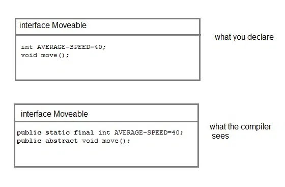
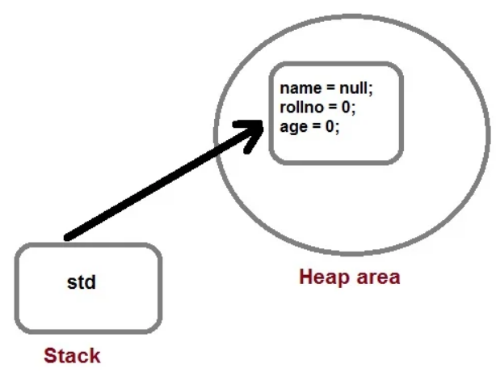
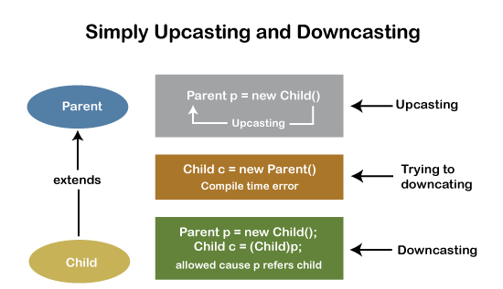

# OOP Basics

### Contents

- [Class](#class)
- [Nested Classes](#nested-classes)
- [Annonymous class](#annonymous-class)
- [Abstract Class](#abstract-class)
- [Concrete Class vs Abstract Class](#concrete-class-vs-abstract)
- [Interfaces](#interfaces)
- [Object](#object)
- [Concrete Method vs Abstract Method](#concrete-method-vs-abstract-method)
- [Constructor](#constructor)
- [Private Constructor](#private-constructor)
- [`this` Keyword](#this-keyword)
- [`super` Keyword](#super-keyword)
- [Access Modifiers](#access-modifiers)
- [Non-Access Modifiers](#non-access-modifiers)
- [Upcasting and Downcasting](#upcasting-and-downcasting)
- [Static and Dynamic Binding](#static-and-dynamic-binding)


## Class

- It is a template that describe the behaviors and states of a particular entity. **It is a blueprint for creating objects.**

- The fields declared inside the class are known as **instance variables.** It gets memory when an object is created at runtime.

- Syntax:
    ```java
    [access modifier] [class type] class ClassName{
        // fields
        // methods
    }
    ```
- **Default values of instance variables:** These values are initialized **by the default constructor** of JVM during object creation at runtime.
    - **int, byte, short, long** -> 0
    - **float, double** → 0.0
    - **string or any reference** -> null
    - **boolean** → false

## Nested Classes

- A class can be **defined within another class.** Such a class is known as a nested class.

```java
class Outer {
    class Inner {
        // code
    }
}
```
- There are 2 types of nested classes:
    - **Static Nested Class**
    - **Non-static Nested Class (Inner Class)**

### Static Nested Class

- Static nested classes can access only static members of its outer class i.e it cannot refer to non-static members of its enclosing class directly. Because of this restriction, static nested class is rarely used.

### Non-static Nested Class (Inner Class)

- It has access to all variables and methods of Outer class including its private data members and methods and may refer to them directly. But the reverse is not true, that is, Outer class cannot directly access members of Inner class.

- It can be created only within the scope of Outer class. Java compiler generates an error if any code outside Outer class attempts to instantiate Inner class directly.

## Annonymous class

- An anonymous class is a class that is **declared and instantiated at the same time.** It **does not have a name.**

- It is used when you need to override the method of a class or an interface.

```java
interface Animal {
    void eat();
}

class Demo {
    public static void main(String[] args) {
        Animal a = new Animal() {
            public void eat() {
                System.out.println("Animal is eating");
            }
        };
        a.eat();
    }
}
```

## Abstract Class

- An abstract class is a class that is declared with the `abstract` keyword. It may or may not include abstract methods.

- We **cannot create an object** of an abstract class. It can only be used as a superclass for other classes that extend it.

- An abstract class can have both abstract and non-abstract methods (concrete methods). Also, it can have constructors and static methods.

- If a class has **at least one abstract method**, then **the class must be declared as abstract**.

- Abstract classes are used to define generic types of behaviors at the top of an object-oriented programming class hierarchy, and use its subclasses to provide implementation details of the abstract class.

## Concrete Class vs Abstract Class

- **Concrete Class**: A class that has **all its methods implemented,** no method is present without body is known as concrete class.

- **Abstract Class**: A class that **has at least one abstract method** is known as abstract class. It can have abstract and non-abstract methods.

## Interfaces

- Interfaces are syntactically similar to classes, but **you cannot create instance of an Interface** and their **methods are declared without any body.** When you create an interface it defines what a class can do without saying anything about how the class will do it.

- From Java 8, interfaces can have default and static methods.
- From Java 9, interfaces can have private methods.

- When an interface inherits another interface `extends` keyword is used whereas class use `implements` keyword to inherit an interface.

- Multiple inheritance is supported in interfaces. Interface can `extend` one or more other interface and a class can `implement` multiple interfaces.

- Interface can be nested inside another interface.

- All methods declared inside interfaces are implicitly public and abstract, even if you don't use public or abstract keyword.

- All variables declared inside interface are implicitly public, static and final.

```java
interface Moveable
{
    int AVERAGE-SPEED = 40;
    void move();
}
```


--------------------------------------------
--------------------------------------------

## Object

- It is **an instance of a class.** It is a real-world entity that has a state and behavior.

- Syntax:
    ```java
    ClassName objectName = new ClassName();
    ```
- `Student std = new Student();`
    
    

--------------------------------------------
--------------------------------------------

## Concrete Method vs Abstract Method

### Concrete Method

- A concrete method is a method that is **declared with an implementation.**

### Abstract Method

- An abstract method is a method that is **declared without an implementation.** It is declared with the `abstract` keyword.

- When you extend Abstract class with abstract method, you must define the abstract method in the child class, or make the child class abstract.

- Abstract methods are usually declared where two or more subclasses are expected to do a similar thing in different ways through different implementations. These subclasses extend the same Abstract class and provide different implementations for the abstract methods.

--------------------------------------------
--------------------------------------------

## Constructor

- **Every class has a constructor** either implicitly(default) or explicitly defined by the programmer.

- Every time an object is created using the `new` keyword, at least one constructor will be invoked.

- If we don't declare a constructor in the class then **JVM builds a default constructor** for that class. This is known as default constructor.

- Constructor must have **no explicit return type.**
    ```java
    [access modifier] ClassName([parameters]){
        // constructor body
    }
    ```

### Types of Constructors

- **Default Constructor**: It **does not have any parameter.** Default constructor can be either user defined or provided by JVM.

- **Parameterized Constructor**: It **has parameters.**

### Constructor Overloading

- Overloaded constructors are differentiated on the basis of **their type of parameters** or **number of parameters.**

### Constructor Chaining

- Constructor chaining is the process of calling one constructor from another constructor in the same class.

- It can be achieved using `this()` keyword.

## Private Constructor

- A constructor can be made private to prevent the creation of objects of a class. Only one object can be created and all the methods are static in this case.

- It is used in singleton design pattern.
    ```java
    class Singleton{
        private static Singleton obj = new Singleton();
        private Singleton(){
            // private constructor
        }
        public static Singleton getInstance(){
            return obj;
        }
    }
    ```
--------------------------------------------
--------------------------------------------

## `this` Keyword

- It is used to refer **current object of a class.**
- We can use this keyword for the following purpose.
    - To refer to the instance variable of the current class. `this.variableName`
    - To invoke the current class method. `this.methodName()`
    - To pass as an argument in the method call. `this.methodName(this)`
    - To invoke the current class constructor. `this()`


## `super` Keyword

- The `super` keyword in Java is a reference variable that is used to **refer to the immediate parent class object.**

- It is **used to call the constructor of the parent class** and to access the parent class properties and methods.

- When calling the parent class constructor from the child class using `super` keyword, `super` keyword **should always be the first line** in the method/constructor of the child class.

- Can you use both `this()` and `super()` in a Constructor?
    - **No**, because both `this()` and `super()` should be the first statement in the constructor.

--------------------------------------------
--------------------------------------------

## Access Modifiers

- Access modifiers are used to restrict access to classes, methods, and fields.
    - **private**: only within the class.
    - **default**: only within the package.
    - **protected**: within the package and outside the package through child class.
    - **public**: from anywhere.

|                               |  Default  |  Private  |  Protected  |  Public  |
| ----------------------------- |-----------|-----------|-------------|----------|
| Same class                    |    Yes    |    Yes    |     Yes     |   Yes    |
| Same package Subclass         |    Yes    |    No     |     Yes     |   Yes    |
| Same package Non-subclass     |    Yes    |    No     |     Yes     |   Yes    |
| Different package Subclass    |    No     |    No     |     Yes     |   Yes    |
| Different package Non-subclass|    No     |    No     |     No      |   Yes    |

- **Access modifiers for:**
    - **interface:** public, default
    - **top-level class**: public, default
    - **inner class:** public, private, protected, default
    - **constructor:** public, protected, default, private
    - **fields& methods:** public, private, protected, default

## Non-Access Modifiers

- These modifiers are used to set **special properties to** the **variable, method, or class.**
- Non-access modifiers do not change the accessibility of variable or method, but they provide special properties to them.

- Non-access modifiers for:
    - **top-level class**: final, abstract
    - **inner class:** final, abstract, static
    - **fields & methods:** final, static, abstract, synchronized, volatile, transient

### `final`

- **Final Variable**: **You cannot change the value of final variable.**
- **Final Method**: **You cannot override it.**
- **Final Class**: **You cannot extend it.**

#### Java Blank Final Variable

- It is a final variable that **is not initialized at the time of declaration.**
- Java allows to declare a final variable without initialization but **it should be initialized by the constructor only.**

```java
class Bike {
    final int speedlimit; // blank final variable
    Bike() {
        speedlimit = 70;
        System.out.println(speedlimit);
    }
    public static void main(String[] args) {
        new Bike();
    }
}
```

#### Java Static Blank Final Variable

- It's declared using the `static` keyword. It can be **initialized in the static block only.**

- Static blank final variables are used to create **static constant** for the class.

```java
class Main {
    static final int data; // static blank final variable
    static {
        data = 50;
    }
    public static void main(String[] args) {
        System.out.println(Main.data);
    }
}
```

### `static`

- **Static Variable**: The variable is **shared among all instances of a class.**
- **Static Method**: The method **belongs to the class** rather than any instance of the class.
- **Static Class**: A class can be made static **only if it is a nested class**.

#### Static and Non-static Nested Classes

- Inner classes can access both static and non-static members of the outer class. A static class can access only the static members of the outer class.

```java
class Outer {
    int a = 10;
    static int b = 20;

    static class StaticInner {
        void display() {
            // System.out.println("a = " + a); // Error
            System.out.println("b = " + b); // OK
        }
    }

    class Inner {
        void display() {
            System.out.println("a = " + a); // OK
            System.out.println("b = " + b); // OK
        }
    }

    public static void main(String[] args) {
        Outer.StaticInner obj = new Outer.StaticInner();
        obj.display();
    }
}
```

### `abstract`

- **Abstract Class**: It cannot be instantiated. It can have abstract methods (methods without a body) as well as concrete methods (methods with a body).

--------------------------------------------
--------------------------------------------

## Upcasting and Downcasting

- **Upcasting**: is the process of converting a **subclass reference to a superclass reference.** It's also known as **"Widening."**

- `Animal dog2 = new Dog();` Upcasting is done implicitly. Here, `Dog` is a subclass of `Animal`.
    - Here, `dog2` is a reference variable that refers to an object of the `Dog` class.
    - The reference variable `dog2` is of type `Animal` and the object is of type `Dog`.
    - The reference `dog2` can only access methods and properties defined in the **Animal class**, even though the actual object is a Dog. However, if a method is overridden in the Dog class, the Dog class's version of the method will be executed.
    - The Animal constructor is invoked then the Dog constructor is invoked.

- **Downcasting**: is the conversion of a **superclass reference to a subclass reference.** This is also termed as "**Narrowing."**

| Upcasting                     | Downcasting       |
|-------------------------------|-------------------|
| A child object is typecasted to a parent object. | The reference of the parent class object is passed to the child class. |
| We can perform Upcasting implicitly or explicitly. | Implicitly Downcasting is not possible. |
| In the child class, we can access the methods and variables of the parent class and only the overridden methods of the child class. | The methods and variables of both the classes(parent and child) can be accessed. |
| We can access some specified methods of the child class. | All the methods and variables of both classes can be accessed by performing downcasting. |
| `Parent p = new Child()` | `Parent p = new Child()` <br> `Child c = (Child)p;` |



--------------------------------------------
--------------------------------------------

## Static and Dynamic Binding

- **Static Binding**: The binding which can be resolved at compile time by the compiler is known as static or early binding. It is also known as **compile-time polymorphism.**

- Examples of static binding:
    - When the type of object is determined at compile time.
    - When the function call is resolved at compile time. For example, method overloading.

- **Dynamic Binding**: The binding which can be resolved at runtime by the JVM is known as dynamic or late binding. It is also known as **runtime polymorphism.**

- Examples of dynamic binding:
    - When the type of object is determined at runtime.
    - When the function call is resolved at runtime. For example, method overriding.

--------------------------------------------
--------------------------------------------