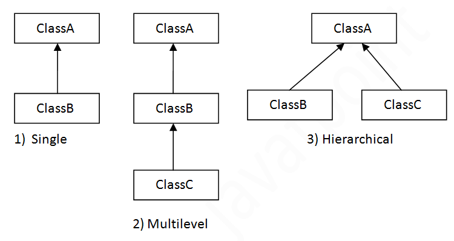

# Core OOP Concepts

- [What is OOP?](#what-is-oop)
- [Encapsulation (Data Hiding)](#encapsulation-data-hiding)
- [Inheritance (IS-A Relationship)](#inheritance-is-a-relationship)
- [Polymorphism (Many Forms)](#polymorphism-many-forms)
    - [Method Overriding (Runtime Polymorphism)](#method-overriding-runtime-polymorphism)
    - [Method Overloading (Compile-time Polymorphism)](#method-overloading-compile-time-polymorphism)
- [Abstraction](#abstraction)
- [Aggregation (HAS-A Relationship)](#aggregation-has-a-relationship)
- [Composition (Part-of Relationship)](#composition-part-of-relationship)
- [When to use Inheritance and Aggregation?](#when-to-use-inheritance-and-aggregation)

## What is OOP?

- **Object-Oriented Programming (OOP)** is a programming paradigm in computer science that **relies on the concept of classes and objects.** It is used to structure a software program into simple, reusable pieces of code blueprints (usually called classes), which are used to create individual instances of objects.

- OOP languages are not necessarily restricted to the object-oriented programming paradigm. Some languages, such as JavaScript, Python, and PHP, all allow for both procedural and object-oriented programming styles.


- It has four main principles:
    - **Encapsulation**
    - **Inheritance**
    - **Polymorphism**
    - **Abstraction**


## Encapsulation (Data Hiding)

- Encapsulation is the process of **combining data and methods into a single unit**(**class**). Encapsulation also involves **restricting direct access to some of an object's components,** which is a means of preventing accidental interference and misuse of the data.

- To achieve encapsulation:
    - Declare the variables of a class as private.
    - Provide public setter and getter methods to modify and view the variables values.

- Benefits of Encapsulation:
    - **Data Hiding**: The internal state of an object is hidden from the outside world.
    - **Controlled Access**: By using getter and setter methods, encapsulation provides controlled access to an object's attributes. For example, you can validate or process data before setting a value, or you can restrict changes to certain attributes altogether.
    - **Improved Maintainability:** Changes to the internal implementation of a class are less likely to affect other parts of the program due to encapsulation.
    - **Increased Security:** Encapsulation helps protect an object’s integrity by preventing unintended or unauthorized modifications to its data.

## Inheritance (IS-A Relationship)

- Inheritance is a mechanism in which one class inherits properties and behavior from another class. Using Inheritance lets us build on previous work without reinventing the wheel.

- `extends` and `implements` keywords are used to describe inheritance in Java.
    - **extends**: It is used to inherit the properties of a class.
    - **implements**: It is used to implement an interface.

- Benefits of Inheritance:
    - **Code Reusability**: By inheriting from a superclass, a subclass can reuse the code and functionality already defined in the superclass, making it easier to write and maintain code.
    - **Method Overriding**: Inheritance allows us to override methods of the superclass in the subclass.
    - **Polymorphism**: Inheritance allows us to use a subclass object wherever a superclass object is expected.
    - **Extensibility**: Inheritance allows us to add new methods and fields to the subclass without modifying the superclass (existing code is not affected).

- The main disadvantage of inheritance is that the two classes become **tightly coupled.** If a superclass is changed, all the subclasses are affected.

### Types of Inheritance

Java supports the following types of inheritance:

- **Single Inheritance**: A class inherits only one class.
- **Multilevel Inheritance**: A class is derived from a class that is also derived from another class.
- **Hierarchical Inheritance**: Multiple classes are derived from a single class.



- **Java does not support multiple inheritance.** Why?
    - **Diamond Problem**: If class C extends both A and B and class A and B have the same method and class C calls this method, there will be ambiguity to call the method of class A or B.

## Polymorphism (Many Forms)

- Polymorphism is the ability of something to have or to be displayed **in more than one form**.

- Polymorphism is achieved by **method overloading** and **method overriding**.

### Method Overriding (Runtime Polymorphism)

- When a subclass provides a specific implementation of a method that is already provided by its parent class.

- It only occurs in two classes that have an **IS-A relationship.**

- In overriding, method of both class must have **same name** and **same parameters.** The return type of the overriding method can be a subclass of the return type of the overridden method. For example, if the return type of the overridden method is `Animal`, then the return type of the overriding method can be `Dog` or `Cat`.

- Method overriding is also referred to as runtime polymorphism because **calling method is decided by JVM during runtime.**

- **Rules for Method Overriding:**
    - The method must have the same name as in the parent class.
    - There must be an IS-A relationship (inheritance).
    - Access modifier of child method must not restrictive than parent class method.
        - Java does not allows method overriding if child class has more restricted access modifier than parent class.
    - Private, final and static methods cannot be overridden.


### Method Overloading (Compile-time Polymorphism)

- When a class has two or more methods by the **same name but different number or type of parameters.**

- Overloaded method can have different access modifiers and it does not have any significance in method overloading

- When an overloaded method is called Java look for match between the arguments to call the method and the its parameters. This match need not always be exact, sometime when exact match is not found, Java automatic type conversion plays a vital role. For example, if a method is expecting a long argument and you pass an int, Java will automatically convert the int to long and call the method.

- We can have two methods with same name and parameters but the order of parameters is different. In this case, JVM will call the method based on the order of parameters.

- We can overload the `main()` method using different number and types of parameter but the JVM only understand the original `main()` method.
    ```java
    public static void main(String[] args) {
        System.out.println("Original main method");
    }

    public static void main(int a) {
        System.out.println("Main method with int parameter");
    }

    public static void main(String args) {
        System.out.println("Main method with String parameter");
    }
    //output
    // Original main method
    // To execute the overloaded main method, we need to call it.
    ```

## Abstraction

- Abstraction is the concept of **hiding the internal implementation details and showing only the functionality to the user.** The main idea is to simplify the interaction with objects by focusing on **what they do rather than how they do it.**

- In Java, abstraction is achieved using **abstract classes** and **interfaces.**
    - **Abstract Class** doesn't actually provide 100% abstraction because it can also have concrete methods.
    - **Interface** provides full abstraction because all methods in an interface are abstract by default.
    

--------------------------------
--------------------------------

## Aggregation (HAS-A Relationship)

- When a class contains a reference to another class. For example, a student has a reference to an address.
    

- It's useful when you want to **reuse the code** of one class in another class.

## Composition (Part-of Relationship)

- Composition is a special type of aggregation. It describes a relationship where **one class is a part of another class and cannot exist without it.**

- Think of it as a *"part-of"* relationship. Class A is a part of class B, A exists only if B exists.

## When to use Inheritance and Aggregation?

- When you **want to use** some property or behaviour of any class without the requirement of modifying it or adding more functionality to it, in such case **Aggregation is a better option** because in case of Aggregation we are just using any external class inside our class as a variable.

- Whereas when you **want to use and modify** some property or behaviour of any external class or may be want to add more function on top of it, its best to use **Inheritance**.

------------------------
------------------------