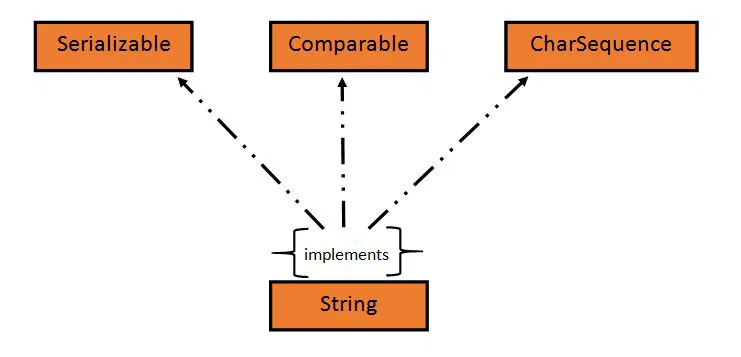
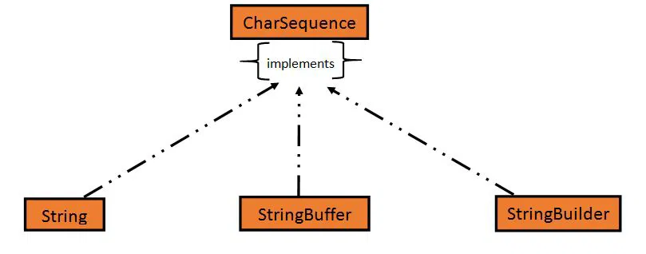
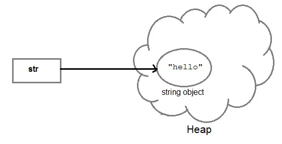
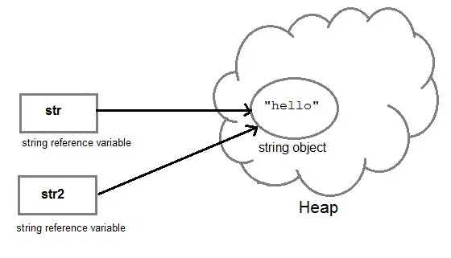
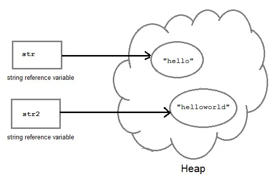
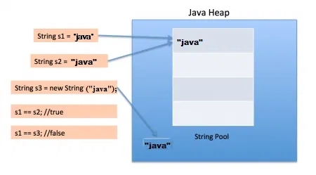

# Java String Handling

- String is an object that represents a sequence of characters.

- String is represented by `String` class which is located into `java.lang` package

- **Strings are immutable,** meaning that once a string is created, it cannot be changed. Any operation that appears to modify a string actually creates a new string object.
    > An object whose state cannot be changed after it is created is known as an **Immutable object**. `String`, `Integer`, `Byte`, `Short`, `Float`, `Double` and all other wrapper classes objects are immutable.

- Java String class implements `Serializable`, `Comparable` and `CharSequence` interface.



- `CharSequence` Interface is used for representing a sequence of characters. `CharSequence` interface is implemented by `String`, `StringBuffer` and `StringBuilder` classes. This three classes can be used for creating strings in java.



## String Creation

- There are two ways to create a string in Java:

    1. **By string literal:** `String str = "Hello";`
    2. **By `new` keyword:** `String str = new String("Hello");`

- **String Literal:**
    - When we create a string using string literal, it is stored in the **string pool.**
    - JVM checks the string pool first. If the string literal already exists in the pool, a reference to the pool instance is returned. If string does not exist in the pool, a new string object is created, and is placed in the pool.
    - **Memory Efficient:** It saves memory because no new objects are created if it exists in the string pool.

- **String Object:**
    - When we create a string using `new` keyword, it is stored in the **heap memory.**
    - If we create another string using the same string object, it will refer to a different object in the heap memory.
    - **Memory Inefficient:** It creates a new object in the heap memory every time.

## String object and How they are stored

```java
String str= "Hello";
String str2 = str;
str2=str2.concat("world");
```

|                        |
|:-----------------------:|
|  |
|  |
|  |

## String Concatenation

- **String concatenation** is the process of combining two strings.

- There are two ways to concatenate strings in Java:

    1. **By `+` operator:** `String str = "Hello" + "World";`
    2. **By `concat()` method:** `String str = "Hello".concat("World");`

## String Comparison

- **String comparison** is the process of comparing two strings.

- There are three ways to compare strings in Java:

    1. **By `equals()` method:** `str1.equals(str2);`
        - It compares the values of the strings.
    2. **By `==` operator:** `str1 == str2;`
        - It compares the references of the strings.
    3. **By `compareTo()` method:** `str1.compareTo(str2);`
        - It compares the values of the strings lexicographically.
        - It returns `0` if the strings are equal, a positive value if the first string is greater than the second string, and a negative value if the first string is less than the second string.


```java
public class Demo{
    public static void main(String[] args) {
    	String s1 = "Java";
    	String s2 = "Java";
    	String s3 = new String ("Java");
    	boolean b = (s1 == s2);     //true
    	System.out.println(b);
    	b =	(s1 == s3);      //false
    	System.out.println(b);
    }
}
```


```java
public class HelloWorld{
    public static void main(String[] args) {
    	String s1 = "Abhi";
    	String s2 = "Viraaj";
    	String s3 = "Abhi";
    	int a = s1.compareTo(s2);     //return -21 because s1 < s2
    	System.out.println(a);
    	a = s1.compareTo(s3);     //return 0 because s1 == s3
    	System.out.println(a);
    	a = s2.compareTo(s1);     //return 21 because s2 > s1
    	System.out.println(a);
    }
}
```

--------------------------------------------------------------------------------

## String class functions

Commonly used functions of the `String` class:

- `int length()`: It returns the length of the string.
- `char charAt(int index)`: It returns the character at the specified index.
- `int indexOf(int ch)`: It returns the index of the first occurrence of the specified character.
- `int indexOf(int ch, int fromIndex)`: It returns the index of the first occurrence of the specified character, starting the search from the specified index.
- `int indexOf(String str)`: It returns the index of the first occurrence of the specified string.
- `int indexOf(String str, int fromIndex)`: It returns the index of the first occurrence of the specified string, starting the search from the specified index.
- `boolean equalsIgnoreCase(String str)`: It compares the string with another string, ignoring their case.
- `String replace(char oldChar, char newChar)`: It replaces all occurrences of the specified character with another character.
- `String substring(int beginIndex)`: It returns the substring of the string starting from the specified index.
- `String substring(int beginIndex, int endIndex)`: It returns the substring of the string starting from the specified index and ending at the specified index - 1.
- `String toLowerCase()`: It converts the string to lowercase.
- `String toUpperCase()`: It converts the string to uppercase.
- `String valueOf(int value)`: It converts primitive data types to string.
    - `String s = String.valueOf(10);`
- `String toString()`: It returns the string representation of the object.
    - It is declared in the `Object` class, hence can be overridden by any java class. (`Object` class is super class of all java classes). It is intended to be overridden in subclasses to provide a meaningful string representation of the object.
    - If we don't override the `toString()` method and directly print the object, then it would print the `classname@hashcode`.
- `String trim()`: It removes the leading and trailing spaces from the string.
- `boolean contains(CharSequence s)`: It returns `true` if the string contains the specified sequence of characters.
- `boolean startsWith(String prefix)`: It returns `true` if the string starts with the specified prefix.
- `boolean endsWith(String suffix)`: It returns `true` if the string ends with the specified suffix.
- `boolean isEmpty()`: It returns `true` if the string is empty.

--------------------------------------------------------------------------------

## String Buffer

- StringBuffer class is used to **create a mutable string object.** It means, it can be changed after it is created.

- StringBuffer is **thread-safe,** meaning that multiple threads cannot access it simultaneously.

- It's helpful when we need to make a lot of modifications to a string.

```java
String str = "Hello";
str.concat("World");
System.out.println(str);     //Output : Hello

StringBuffer sb = new StringBuffer("Hello");
sb.append("World");
System.out.println(sb);     //Output : HelloWorld
```

### StringBuffer Constructors

- `StringBuffer()`: It creates an empty string buffer with the initial capacity of 16.
- `StringBuffer(int capacity)`: It creates an empty string buffer with the specified capacity.
- `StringBuffer(String str)`: It creates a string buffer with the specified string.

```java
public class Demo{
    public static void main(String[] args) {
    	StringBuffer sb1 = new StringBuffer();
        System.out.println(sb1);     //Output : ""
        StringBuffer sb2 = new StringBuffer(50);
        System.out.println(sb2);     //Output : ""
        System.out.println(sb2.capacity());     //Output : 50
        StringBuffer sb3 = new StringBuffer("Hello");
        System.out.println(sb3);     //Output : Hello
```

### StringBuffer Functions

Commonly used functions of the `StringBuffer` class:

- `int capacity()`: It returns the current capacity of the string buffer.
- `StringBuffer append(String s)`: It appends the specified string to the string buffer.
- `StringBuffer append(int i)`: It appends the specified integer to the string buffer.
- `StringBuffer insert(int index, String s)`: It inserts the specified string at the specified index.
- `StringBuffer insert(int index, int i)`: It inserts the specified integer at the specified index.
- `StringBuffer reverse()`: It reverses the string buffer.
- `StringBuffer replace(int startIndex, int endIndex, String str)`: It replaces the string from the specified start index to the specified end index - 1 with the specified string.

--------------------------------------------------------------------------------

## String Builder

- StringBuilder is similar to StringBuffer, but it is **not thread-safe.** Also its stored in the stack memory unlike StringBuffer which is stored in the heap memory.

- If synchronization is not required, it is better to use StringBuilder. For example, in a single-threaded environment.

- StringBuilder is **faster** than StringBuffer because it is not thread-safe.

### StringBuilder Constructors

- `StringBuilder()`: It creates an empty string builder with the initial capacity of 16.
- `StringBuilder(int capacity)`: It creates an empty string builder with the specified capacity.
- `StringBuilder(String str)`: It creates a string builder with the specified string.

```java
StringBuilder sb1 = new StringBuilder();
System.out.println(sb1);     //Output : ""
StringBuilder sb2 = new StringBuilder(50);
System.out.println(sb2);     //Output : ""
System.out.println(sb2.capacity());     //Output : 50
StringBuilder sb3 = new StringBuilder("Hello");
System.out.println(sb3);     //Output : Hello
```

--------------------------------------------------------------------------------

## String Tokenizer

- `StringTokenizer` class is used to break a string into tokens based on a delimiter. **It's deprecated.**
- The` split()` method is preferred and recommended even though it is comparatively slower than `StringTokenizer`.This is because it is more robust and easier to use than StringTokenizer.
--------------------------------------------------------------------------------