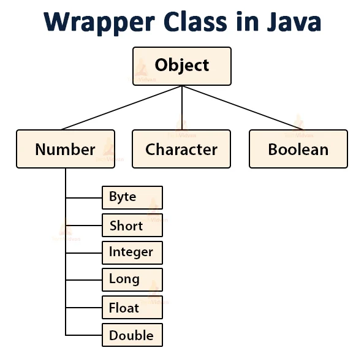

# Wrapper Class

- Wrapper Class is used for converting primitive data type into object and object into a primitive data type. For each primitive data type, a pre-defined class is present which is known as Wrapper class.

- It's used when an object is required instead of a primitive data type.



## Need of Wrapper Classes

There are certain needs for using the Wrapper class in Java as mentioned below:

- **They convert primitive data types into objects.** Objects are needed if we wish to modify the arguments passed into a method (because primitive types are passed by value).
- **The classes in `java.util` package handles only objects** and hence wrapper classes help in this case also.
- **Data structures in the Collection framework,** such as `ArrayList` and `Vector`, **store only objects** (reference types) and not primitive types.
- **An object is needed to support synchronization in multithreading.**

## Advantages of Wrapper Classes

- Collections allowed only object data.
- On object data we can call multiple methods `compareTo()`, `equals()`, `toString()`
- Cloning process only objects
- Object data allowed `null` values.
- Serialization can allow only object data.

## Wrapper Classes

**Autoboxing** and **Unboxing** are the two main concepts of Wrapper class.

| Primitive Data Type | Wrapper Class |
|----------------------|---------------|
| byte                 | Byte          |
| short                | Short         |
| int                  | Integer       |
| long                 | Long          |
| float                | Float         |
| double               | Double        |
| char                 | Character     |
| boolean              | Boolean       |


## Autoboxing and Unboxing

- **Autoboxing**: Automatic conversion of primitive data type into its corresponding wrapper class object.
    ```java
    int a = 10;
    Integer i = a; // Autoboxing
    ```
- **Unboxing**: Automatic conversion of object into its corresponding primitive data type.
    ```java
    Integer i = new Integer(10);
    int a = i; // Unboxing
    ```
    ```java
    ArrayList<Integer> arrayList = new ArrayList<Integer>();
    arrayList.add(100); // autoboxing int to Integer
    int a = arrayList.get(0); // unboxing Integer to int
    ```
- **Autoboxing and Unboxing in method**:
    ```java
    class Demo {
        // autoboxing in parameters
        static int add(Integer a, Integer b) {
            // unboxing in return
            return a+b;
        }
        
        public static void main(String args[]) {
            
            int sum = add(10,20);
            
            System.out.println("sum = "+sum);
            
            }
    }
    ```

## Number Class

- Java Number class is the super class of all the numeric wrapper classes.

- The Number class contains some methods to provide the common operations for all the sub classes.
    - Methods to convert the value of the object into their respective primitive data types.
        - `byteValue()`, `shortValue()`, `intValue()`, `longValue()`, `floatValue()`, `doubleValue()`
    - `compareTo()`: Compares this Number object to the argument.
    - `equals()`: Compares this Number object to the argument.
    - `valueOf()`: Returns an Integer object holding the value of the specified primitive.
    - `toString()`: Returns a String object representing the value of a specified number.

## Notes on Wrapper Classes

- All the primitive wrapper classes are immutable. When a new object is created the old object is not modified.
    ```java
    class WrapperPrimitiveDemo1
    {
        public static void main(String[] args)
        {
            Integer a = new Integer(12);
            System.out.println("Old value = "+a); // Old value = 12
            xyz(a);
            System.out.println("New Value = "+a); // New Value = 12
        }
        private static void xyz(Integer a)
        {
            a = a + 10;
        }
    }
    ```
