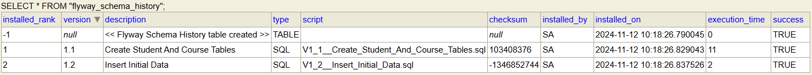

# Flyway

**Since developers can make changes in code that are easy to roll back using Git, why can't developers do the same thing when it comes to schema changes?**

- Many times, we need to make changes to the database schema, such as adding a new table/view/index/column, changing the data type of a column, or inserting some initial data into the database. All of this can of course be “solved” using a bunch of sql scripts. But that is not really a sustainable solution as these scripts tend to become overly complex and hard to maintain quite quickly. You also need to keep track of which scripts have been run and which haven’t.

- Flyway is a database migration tool that allows you to manage your database changes in a simple and easy way.
    > Just like Git helps you manage your source code changes, Flyway helps you manage your database changes.

- It is a lightweight and easy-to-use tool that can be integrated into your project to automate the process of database migration.

## Database/Schema Migrations

- Database migrations are the process of applying changes to the database schema, such as creating new tables, modifying existing tables, or inserting data into the database.

- This often involves tasks such as adding or removing tables, columns, or indexes, as well as modifying data types or constraints. Executed correctly, these migrations ensure data integrity, consistency, and optimal database performance throughout the software development life cycle. 

## Flyway Schema Versioning

- Flyway uses a version-based approach to manage database schema changes. Each migration script is assigned a version number, and Flyway ensures that these scripts are executed in the correct order based on their version numbers.

- Flyway maintains a table called `flyway_schema_history` in the database to keep track of the applied migrations. This table stores information about each migration script, such as its version number, description, checksum, and execution status.


- When Flyway runs, it checks the `flyway_schema_history` table to determine which migrations have already been applied to the database. It then compares the available migration scripts with the applied ones and executes the pending migrations in the correct order.

- It checks the checksum of the migration script to ensure that the script has not been modified since it was applied. If the checksums do not match, Flyway will fail the migration process, preventing any potential data corruption.

## Flyway Migration Scripts

- Flyway migration scripts are SQL files that contain the database schema changes you want to apply. These scripts are stored in a specific directory within your project, typically under the `src/main/resources/db/migration` directory.

- The naming convention for migration scripts is as follows: `<Prefix><Version>__<Description>.sql`
    - Prefixes: 
        - `V` for versioned migrations
        - `R` for repeatable migrations
        - `U` for undo migrations
        - `B` for baseline migrations
    - `V{version_number}__{description}.sql`
        - The `{version_number}` is a unique identifier for the migration script, and the `{description}` provides a brief description of the changes being made in the script.
        - The double underscore `__` is used to separate the version number from the description.
        - Examples: 
            - `V1__CreateTable.sql`, `V2__AddColumn.sql`, `V3__InsertData.sql`
            - `V1_1__create_test_tables.sql:`, `V1_2__insert_test_data.sql`


## Flyway Configuration with Spring Boot

- Flyway can be easily integrated into your project by adding the Flyway dependency to your build `pom.xml` file.
    ```xml
    <dependency>
        <groupId>org.flywaydb</groupId>
        <artifactId>flyway-core</artifactId>
    </dependency>
    ```

- Flyway can be configured using the `application.properties` file in a Spring Boot application. You can specify the database connection details, migration scripts location, and other configuration settings in this file.

- Example `application.properties` configuration for Flyway:
    - `spring.flyway.enabled=true`:
        - Enable Flyway migration (default is true). When set to true, Spring Boot will automatically run Flyway migrations during the application startup.

    - `spring.flyway.locations=classpath:db/migration`:
        - Specifies the location of the migration scripts. 
        - By default, Flyway looks for migration scripts in the `classpath:db/migration` directory. 
        - You can also specify multiple locations separated by commas, such as `classpath:db/migration,classpath:db/other_migration`.

    - `spring.flyway.baselineVersion=0`:
        - Defines the baseline version for the database schema. 
        - For example, if your existing database schema is at a state that aligns with 0, Flyway will consider that all migrations before version 0 are already applied and won’t try to apply them again and will start applying migrations from version 1.
        - Useful for projects where you’re integrating Flyway into an already existing database. You need to tell Flyway where to start applying migrations.


    - `spring.flyway.baselineOnMigrate=true`:
        - Use when you want to start using Flyway with an existing database that doesn’t have any migration history.
        - When this property is set to true, it creates automatically V1 from our current schema in database and only higher versions will be applied. This means if we want to add a new script, we should start in V2. If we start in V1, that script will be ignored.

    - `spring.flyway.validateOnMigrate=true`:
        - Validate the applied migrations against the migration scripts. 
        - When true, Flyway will compare the checksum of the applied migrations with the checksum of the migration scripts to ensure that the scripts have not been modified since they were applied. 
        - If the checksums do not match, Flyway will fail the migration process.

-------------------