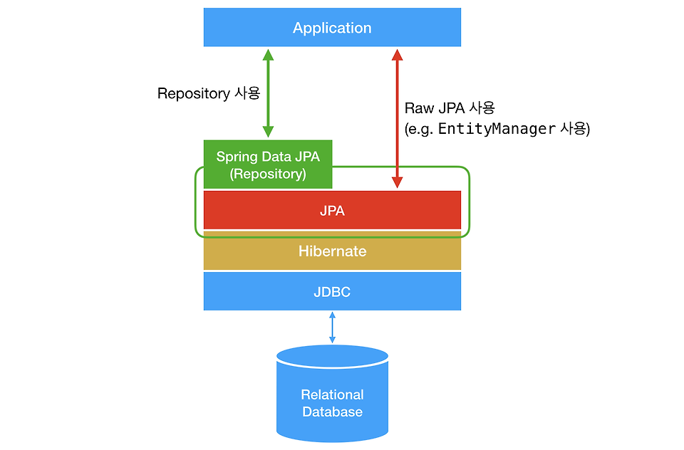
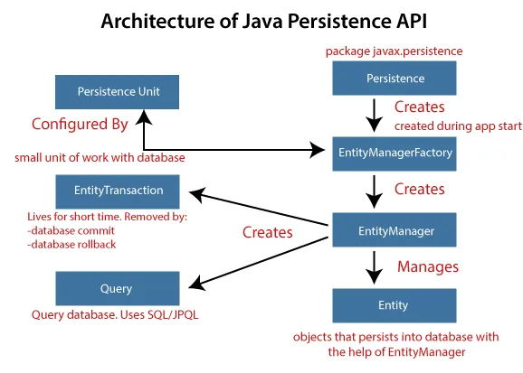
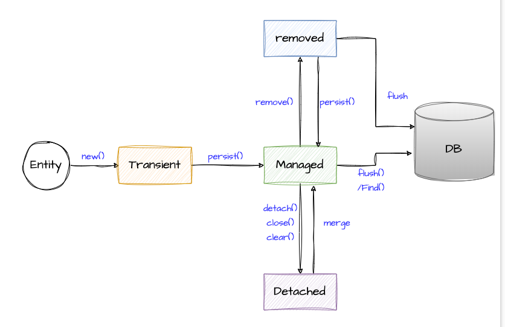

# JPA & Spring Data JPA

## Data Persistence

- Data persistence refers to **the capability of an application to save data so that it can be retrieved and used later,** even after the application has closed or the system has been restarted. 

- A simple way to achieve data persistence for a Java application is through **JDBC.** This does the job of achieving connectivity between a Java application and its storage system, persist data and retrieve it exactly as present in the schema of the database table. Up until JDBC, our focus was solely on achieving the connection between a Java application and its database to automate CRUD operations. But building an enterprise application with JDBC alone for data persistence is taxing and inefficient. This is because **JDBC requires additional coding to map the application’s object-oriented data representation to a relational database model and its schema.** In other words, it requires us to manually translate the transient java objects into relational database schema and back again. This, for an enterprise application, becomes extensively taxing, especially if it implements MVC pattern. Hence we can safely conclude that JDBC lacks in supporting object-to-relational database mapping termed as Object Relational Mapping (ORM).

## Transient vs Persistent Object

- **Transient Object:** An object is said to be transient if it is just created and is not saved in the database.
- **Persistent Object:** An object is said to be persistent if it is saved in the database.

- For example, when you get an entity from a repository, that entity is persistent. When you create a new entity, it is transient until persisted.

## JDBC

- **JDBC (Java Database Connectivity)** provides a set of Java APIs to access the relational databases from the Java program. Java APIs enable programs to execute SQL statements and interact with any SQL database.

## ORM

- ORM stands for **Object-Relational Mapping**. 

- ORM is a programming technique that maps objects to relational databases. ORM allows developers to work with objects in their code and automatically handles the mapping to and from the database. 


## JPA

- JPA stands for **Java Persistence API**. It is a Java specification for accessing, persisting, and managing data between Java objects / classes and a relational database.

- **JPA manages ORM in a Java application.** JPA defines a set of classes and interfaces without defining its implementation. Hence, an additional ORM tool is required to implement these interfaces. So, ORM tools like `Hibernate`, `TopLink`, `OpenJPA` `EclipseLink` and `iBatis` implements JPA specifications for data persistence.

- **JPA is just a specification,** JPA is not a framework. It defines a concept that can be implemented by any framework. It requires an implementation.

- As an object-oriented query language, it uses **JPQL (Java Persistent Query Language)** to execute database operations. The role of JPA is to transform JPQL into SQL.

- A point to be noted here is that **JPA still uses JDBC under the hood** which helps in dealing with relational database models.

- `javax.persistence` package contains the JPA classes and interfaces. In 2019, JPA renamed to **Jakarta Persistence** `jakarta.persistence`.


> ORM vendors like Hibernate, TopLink..


## JPA vs Hibernate

- **JPA** is a java specification that is used to access, manage, and persist data between Java object and relational database. **It is a standard approach for ORM.**

- **JPA** is a set of rules and guidelines that must be followed. **Hibernate** is an ORM tool that implements these rules.

## Hibernate

- Hibernate is a framework which provides some abstraction layer, meaning that the programmer does not have to worry about the implementations, Hibernate does the implementations for you internally like Establishing a connection with the database, writing query to perform CRUD operations etc.

- The main feature of Hibernate is to map the Java classes to database tables.

- As an object-oriented query language, it uses **Hibernate Query Language (HQL)** to execute database operations.

- Hibernate is described in `org.hibernate package`.
    > It's recomended to use the standard JPA annotations from `javax.persistence` package. This way, you could theoretically run your code on other JPA implementations. Only when you need Hibernate-specific functionality should you use the Hibernate annotations.

## Spring Data JPA

- Spring Data JPA **adds a layer on the top of JPA.**

- Spring Data JPA abstracts JPA, which means that Spring Data JPA's Repository implementation uses JPA.

- Spring Data JPA always requires a JPA implementation such as Hibernate, EclipseLink, etc.

- It likes a jpa but it add some extra functionality, Without jpa we can not implement the spring data jpa.

- If you want to use JPA, you need to inject `EntityManager` and use it. But if you want to use Spring Data JPA, you need to inject `Repository` and use it. 



- **Features:**
    - **Repository Pattern**: Spring Data JPA provides a repository abstraction that allows you to work with JPA entities without writing boilerplate code.
    - **Query Methods**: You can define queries using method names in the repository interface. Spring Data JPA will automatically generate the required SQL queries based on the method names.
    - **Pagination and Sorting**: Spring Data JPA provides built-in support for pagination and sorting of query results.

- **Spring Data Repositories**:
    - `CrudRepository`: It offers standard create, read, update, and delete It contains method like `findOne()`, `findAll()`, `save()`, `delete()`.
    - `PagingAndSortingRepository`: It extends `CrudRepository` and adds additional methods to retrieve entities using pagination and sorting.
    - `JpaRepository`: It extends both `CrudRepository` and `PagingAndSortingRepository` and provides additional JPA-specific methods like `flush()`.

### JPA Example vs Spring Data JPA Example

- **JPA Example**:
    ```java
    @Repository
    public class EmployeeDAO {
        @PersistenceContext
        private EntityManager entityManager;
        public void saveEmployee(Employee employee) {
            entityManager.persist(employee);
        }

        public List<Employee> getAllEmployees() {
            Query query = entityManager.createQuery("SELECT e FROM Employee e");
            return query.getResultList();
        }
    }
    ```

- **Spring Data JPA Example**:
    ```java
    public interface EmployeeRepository extends JpaRepository<Employee, Long> {
    }
    ```
    ```java
    @Service
    public class EmployeeService {
        @Autowired
        private EmployeeRepository employeeRepository;
        public void saveEmployee(Employee employee) {
            employeeRepository.save(employee);
        }

        public List<Employee> getAllEmployees() {
            return employeeRepository.findAll();
        }
    }
    ```

--------------------------------------------

## JPA Architecture



The main components of JPA include:

- **Entity Manager Factory**: 
    - It is a factory class of `EntityManager` instances. 
    - It is used to create and manage multiple `EntityManager` instances. 
    - It is thread-safe and expensive to create, so **it should be created once per application** and reused.
    - It's created using the `Persistence` class.
    - It takes the `persistence-unit` name from the `persistence.xml` file.

- **Entity Manager**: 
    - It is created using the `EntityManagerFactory` instance.
    - It manages the lifecycle of entity instances, performs CRUD operations, and executes queries. 
    - It manages the lifecycle of entities, such as persisting, finding, merging, and removing them.    
    - It is not thread-safe and should be used per transaction or per request.

    ```java
    import javax.persistence.EntityManager;
    import javax.persistence.EntityManagerFactory;
    import javax.persistence.Persistence;

    public class Main {
        public static void main(String[] args) {
            
            EntityManagerFactory entityManagerFactory = Persistence.createEntityManagerFactory("MyPersistenceUnit");

            EntityManager entityManager = entityManagerFactory.createEntityManager();

            entityManager.getTransaction().begin();

            // Perform CRUD operations using entityManager
            Manager manager = new Manager();
            manager.setName("John Doe");
            entityManager.persist(manager);

            Employee employee = new Employee();
            employee.setName("Alice");
            entityManager.persist(employee);

            // Commit the transactions made (persist, update, delete)
            entityManager.getTransaction().commit();

            entityManager.close();
            entityManagerFactory.close();
        }
    }
    ```

- **Entity**: 
    - It is a class that represents a table in the database. 
    - The Entity class maps to the required table schema present in the linked database. 
    - It is annotated with `@Entity` annotation.

- **Persistence Unit**: 
    - It is a logical grouping of related entity classes and their configurations.
    - It defines all entity classes managed by an `EntityManager`. 
    - Specifies database connection properties, transaction management type, and any additional settings.
    - It is defined in the `persistence.xml` file.
    ```xml
    <?xml version="1.0" encoding="UTF-8"?>
    <persistence version="2.1"
        xmlns="http://xmlns.jcp.org/xml/ns/persistence" xmlns:xsi="http://www.w3.org/2001/XMLSchema-instance"
        xsi:schemaLocation="http://xmlns.jcp.org/xml/ns/persistence http://xmlns.jcp.org/xml/ns/persistence/persistence_2_1.xsd">
        <persistence-unit name="TestPersistence" transaction-type="RESOURCE_LOCAL">
            <class><!-- Entity Manager Class Name --></class>
            <properties>
                <property name="javax.persistence.jdbc.url" value="Database Url" />
                <property name="javax.persistence.jdbc.user" value="Database Username" />
                <property name="javax.persistence.jdbc.password" value="Database Password" />
                <property name="javax.persistence.jdbc.driver" value="Database Driver Name" />
            </properties>
        </persistence-unit>
    </persistence>
    ```

    **Example**:
    ```xml
    <persistence-unit name="myPersistenceUnit">
        <class>com.example.demo.entity.Manager</class>
        <class>com.example.demo.entity.Employee</class>
        <properties>
            <property name="javax.persistence.jdbc.url" value="jdbc:mysql://localhost:3306/mydb"/>
            <property name="javax.persistence.jdbc.user" value="root"/>
            <property name="javax.persistence.jdbc.password" value="root"/>
            <property name="javax.persistence.jdbc.driver" value="com.mysql.jdbc.Driver"/>
        </properties>    
    </persistence-unit>
    ```


- **Entity Transaction**:
    - The `EntityTransaction` interface manages transaction boundaries. 
    - It allows you to begin, commit, and rollback transactions to ensure data consistency and integrity.
    - A transaction is a set of operations that either fail or succeed as a unit. 
    - A database transaction consists of a set of SQL DML (Data Manipulation Language) operations that are committed or rolled back as a single unit. 
    - It lives for a short period of time. It dies after the transaction is either committed or rolled back.

    ```java
    entityManager.getTransaction().begin();
    // Perform multiple operations
    entityManager.getTransaction().commit();
    ```

- **JPQL**: 
    - It is a query language that is used to execute queries on entities. It is similar to SQL but operates on entities rather than tables.


--------------------------------------------

## Entity Lifecycle Model in JPA & Hibernate

- The entity lifecycle model is one of the core concepts of JPA and all its implementations. Even though it’s not directly visible when working with JPA’s EntityManager, it affects all operations you perform. The different states of the model define how your persistence provider, e.g. Hibernate, handles your entity objects. This includes if it loads it from the database or gets it from an internal cache, if it persists changes and if it removes the entity.

- Each status has its distinct behavior and determines how your persistence provider handles the entity object.



- Entities in JPA can exist in one of the following statuses:
    - **New (Transient)**: 
        - The entity is not associated with any persistence context and has no record in the database. It’s a new object that hasn’t been persisted yet.
        ```java
        Employee employee = new Employee(); // New entity
        ```

    - **Managed (Persistent)**: The entity is associated with a persistence context and has a representation in the database. Any changes made to it will be automatically synchronized with the database upon transaction completion.
        ```java
        @Transactional
        public User updateUser(Long id, String newName) {
            User user = userRepository.findById(id).orElseThrow(() -> new RuntimeException("User not found"));
            user.setName(newName);
            // No explicit save() call required here, changes will be auto-saved at the end of the transaction.
            return user;
        }
        ```

    - **Detached**: 
        - Entities can become “Detached” from the persistence context. This means they’re no longer monitored for changes by the `EntityManager`. 
        - Changes made to a detached entity won’t be automatically synchronized with the database. For the changes to be reflected in the database, the entity must be merged back into the persistence context. 
        - It still has a representation in the database.
        - Entities can become detached in several ways:
            - When a transaction completes, all managed entities associated with `EntityManager` become detached.
                - Once a transaction is committed, the persistence context is flushed and cleared, causing entities to become detached.
            - When an `EntityManager` is closed or cleared.
                ```java
                entityManager.clear(); // Detaches all entities from the persistence context.
                entityManager.close(); // Closes the persistence context; entities are no longer managed.
                ```
            - When the entity is explicitly detached using the `EntityManager.detach()` method.
            - When putting an entity through serialization/deserialization process.
                - **Serialization**: For example when the entity is sent as a JSON response, the entity is no longer managed by the persistence context once it leaves the server.
                    ```java
                    return ResponseEntity.ok().body(user); // User entity is serialized and sent as a JSON response.
                    ```
                - **Deserialization**: For example when the server receives the JSON payload and deserializes it back into a User object. The entity will be detached until it’s reattached to the persistence context.

        ```java
        // Load user within a transaction
        @Transactional(readOnly = true)
        public User loadUser(Long id) {
            return userRepository.findById(id).orElseThrow(() -> new RuntimeException("User not found"));
        }

        // Save a possibly detached user entity
        public void saveEditedUser(User editedUser) {
            userRepository.save(editedUser); 
        }

        public void demonstrateDetachedLifecycle(Long userId) {
            User user = loadUser(userId); // Here, the user entity is managed within the transaction.

            // Once the above method completes, the transaction ends, and the user entity becomes detached.

            // Some changes to the user entity can be made here...

            saveEditedUser(user); // The entity is reattached and updated in the database.
        }
        ```

    - **Removed**: An entity can be marked as “Removed”, signaling that it will be deleted from the database once the transaction completes. This is the end state of an entity before it gets garbage collected.
    ```java
    public void deleteUser(Long id) {
        User user = userRepository.findById(id).orElseThrow(() -> new RuntimeException("User not found"));
        userRepository.delete(user); // Here, the entity is marked for removal and will be deleted from the database at the end of the transaction.
    }
    ```

- These statuses have a clear sequence of transitions:
    - An entity starts as `New` when first created.
    - It becomes `Managed` when associated with a persistence context, e.g., after being persisted or retrieved from the database.
    - An entity can be `Detached` from the context, which means it’s no longer tracked for changes.
    - Lastly, an entity can be marked as `Removed`, indicating it will be deleted from the database.

- When working with JPA and Spring Data, it’s wise to know when to explicitly call methods such as `save()`and when it's redundant. Improper handling of save operations can lead to issues like unintended data updates, reduced performance, and potential version conflicts.

- **When to call `save()` and other methods:**
    - Entities in the `New` state: When you have a new entity (i.e., it has not been saved to the database yet), an explicit call to `save()` is necessary to persist it.
    - Detached entities: If you have an entity that was previously fetched but is currently not associated with the active persistence context (i.e., it’s in the “Detached” state), an explicit call to `save()` or `merge()` is required to save any modifications.
    - Deleting an entity: Use the `delete()` method to remove an entity from the database.

- **When not to call save():**
    - Entities in the “Managed” state: If an entity is already in a managed state and is associated with the current persistence context, any changes to it will be automatically synchronized with the database upon transaction completion. In such cases, explicitly calling `save()` is redundant.

- **Risks of calling save() when it's not required:**
    - Performance: Excessive `save()` calls can lead to additional system overhead, as each call might initiate a database query.
    - Unintended updates: Calling `save()` on an already managed entity can result in unintended updates of all fields of the entity, even if they were not modified.

--------------------------------------------