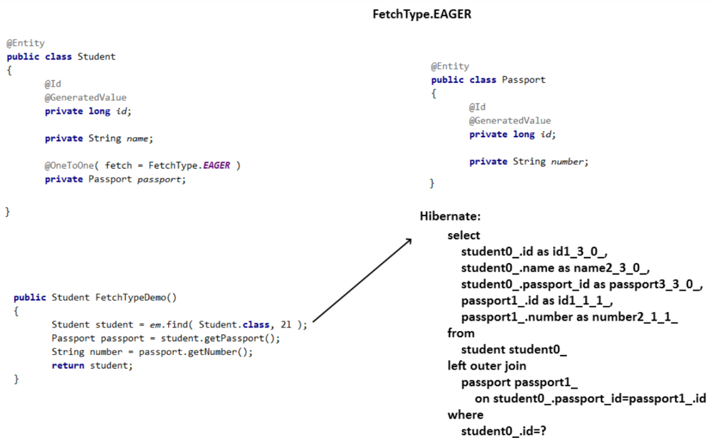

## JPA Relationships

- Relationships may be **bidirectional** or **unidirectional**.
    - **Unidirectional associations** are associations where only one entity knows about the other entity through a reference(foreign key). The entity that knows about the other entity is called the **owning entity** (parent), and the entity that is known is called the **inverse entity**(child). Only the **owning entity** has a reference to the **inverse entity**.
        ```java
        @Entity
        public class Department {
            @Id
            @GeneratedValue(strategy = GenerationType.IDENTITY)
            private Long id;
            private String name;
        }

        @Entity
        public class Person {
            @Id
            @GeneratedValue(strategy = GenerationType.IDENTITY)
            private Long id;
            private String name;
            @ManyToOne
            private Department department;
        }
        ```

    - **Bidirectional associations** are associations where both entities know about each other. Each entity has a reference to the other entity.
        - You can have bidirectional associations in JPA by using `mappedBy` attribute.
        - `mappedBy` attribute is used on the **non-owning side** of the relationship to indicate that the relationship is managed by the other side.
        - In this example, the `mappedBy` attribute specifies that the `Department` entity is the inverse side of a OneToMany relationship with the `Person` entity, and that the foreign key is on the `Person` side of the relationship.

        ```java
        @Entity
        public class Department {
            @Id
            @GeneratedValue(strategy = GenerationType.IDENTITY)
            private Long id;
            private String name;
            @OneToMany(mappedBy = "department")
            private List<Person> persons;
        }

        @Entity
        public class Person {
            @Id
            @GeneratedValue(strategy = GenerationType.IDENTITY)
            private Long id;
            private String name;
            @ManyToOne
            private Department department;
        }
        ```

    > The main difference is that bidirectional relationship provides navigational access in both directions, so that you can access the other side without explicit queries. Also it allows you to apply cascading options to both directions.

- In JPA, the **“owning side”** of a relationship refers to the entity that takes charge of managing and updating the **join table**. On the flip side, the **“inverse side”** (denoted by the `mappedBy` attribute) mirrors the relationship but doesn’t interfere with the **join table** management.
   - Consider a relationship between two entities: `Author` and `Book`. If `Author` is the owning side, it implies that `Author` is accountable for updating the relationship between `Author` and `Book` in the database.

- **Owning Entity**:
   - **The owning side is typically the entity that most frequently manages changes in the relationship, thus updating the join table.**
   - It contorls the relationship between the two entities:
      - Any changes to the relationship, such as adding, removing, or updating the associated entities, are handled through the owning entity. For example, if you remove an entity from the owning entity’s collection, JPA will automatically remove the corresponding row(s) from the database based on the foreign key relationship.
   - It contains the foreign key column that references the primary key of the inverse entity.
   - You can use `@JoinColumn` annotation to customize the foreign key column name.
      - **Join Column**: The column in the owning entity’s table that stores the foreign key reference(s) to the other entity.

- **Inverse Entity**:
   - It is simply a reference to the owning entity and does not directly participate in persisting or managing the relationship in the database.

- Choosing the wrong entity as the owning side can lead to several issues and inefficiencies:
   - If we choose the `role` entity as the owning side instead of `user`, we might encounter the following issues:
      - **Unnecessary Database Operations:** If we add a new role to a user in our application and then save the user, the new role won’t be reflected in the database because User is not the owning side. This can lead to unnecessary database operations.
      - **Unexpected Behavior:** If we try to remove a role from a user and then save the user, we might expect the role to be removed from the user in the database. However, since User is not the owning side, the role won’t be removed in the database.


- **Association Mappings**:
   - `@OneToOne` - `1:1` relationship
      - One instance of the current Entity refers to One instance of the referred Entity.
   - `@OneToMany` - `1:N` relationship
      - One instance of the current Entity has Many instances (references) to the referred Entity.
   - `@ManyToOne` - `N:1` relationship
      - Many instances of the current Entity refer to One instance of the referred Entity.
   - `@ManyToMany` - `M:N` relationship
      - Many instances of the current Entity refer to Many instances of the referred Entity.


- A **bidirectional** relationship has both an **owning side and an inverse side**.
    - `@ManyToOne` is **always the owning side** of a bidirectional association.
    - `@OneToMany` is **always the inverse side** of a bidirectional association.
    - `@OneToOne` the **owning side** is the entity with the table containing the **foreign key.**
    - `@ManyToMany` both sides can be the owning side. Choose what makes sense for your use case.

- A **unidirectional** relationship only has an **owning side.**
   
- By default, hibernate creates a foreign key column that references the primary key of the inverse entity to join the two entities. The foreign key column name is the name of the inverse entity followed by `_id`. If you want to specify a different column name, you can use the `@JoinColumn` annotation.

### `@ManyToMany` Relationship

- When you have a many-to-many relationship in JPA, you generally need a **join table** to represent the relationship in the database. JPA can automatically create a join table for you if you don’t specify one explicitly. This approach is straightforward and works well for simple many-to-many relationships where you don’t need additional attributes in the join table.

- Example of JPA Creating a Join Table Automatically:
    ```java
    @Entity
    public class Student {
        @ManyToMany
        private Set<Course> courses;
    }

    @Entity
    public class Course {
        @ManyToMany(mappedBy = "courses")
        private Set<Student> students;
    }
    ```
    In this case, JPA will create a join table with default naming conventions, typically based on the entity class names and their primary key fields.


### Explicitly Define a Join Table `@JoinTable`

- If you need control over the join table structure, want to specify custom join column names, or require additional attributes in the join table, you should explicitly define it using the `@JoinTable` annotation.

- Explicitly defining a join table is useful when:
    - You need a specific table name or column names.
    - You want to add attributes to the join table.
    - You require unique constraints or other configurations.

- Example of Explicitly Defining a Join Table:
    ```java
    @Entity
    public class Student {
        @ManyToMany
        @JoinTable(
            name = "student_course", // Custom table name
            joinColumns = @JoinColumn(name = "student_id"), // Custom join column
            inverseJoinColumns = @JoinColumn(name = "course_id") // Custom inverse join column
        )
        private Set<Course> courses;
    }

    @Entity
    public class Course {
        @ManyToMany(mappedBy = "courses")
        private Set<Student> students;
    }
    ```

## Jackson Bidirectional Relationships

- **Jackson** is a popular Java library for serializing and deserializing Java objects to and from JSON. When serializing entities with bidirectional relationships, you may encounter issues with infinite recursion or stack overflow errors.

- **Infinite Recursion**: When serializing entities with bidirectional relationships, Jackson will keep serializing the same entities over and over again, leading to an infinite loop.
    - For example, when serializing a `Department` entity that has a list of `Employee` entities, Jackson will serialize the `Department` entity, then the `Employee` entities, which will in turn serialize the `Department` entity again, and so on.
        ```json
        {
            "id": 1,
            "name": "HR",
            "employees": [
                {
                    "id": 1,
                    "name": "Alice",
                    "department": {
                        "id": 1,
                        "name": "HR",
                        "employees": [
                            {
                                "id": 1,
                                "name": "Alice",
                                "department": {
                                    "id": 1,
                                    "name": "HR",
                                    "employees": [
                                        ...
                                    ]
                                }
                            }
                        ]
                    }
                }
            ]
        }
        ```

- **Solution**: To prevent infinite recursion, you can use Jackson’s `@JsonManagedReference` and `@JsonBackReference` annotations to define the owning and inverse sides of the relationship.

    - **`@JsonManagedReference`**: Used on the owning side of the relationship to indicate that this side is responsible for managing the relationship.
    - **`@JsonBackReference`**: Used on the inverse side of the relationship to indicate that this side should be ignored during serialization.
    ```java
    @Entity
    public class Student {
        @ManyToMany
        @JsonManagedReference
        private Set<Course> courses;
    }

    @Entity
    public class Course {
        @ManyToMany(mappedBy = "courses")
        @JsonBackReference
        private Set<Student> students;
    }
    ```
    
> Serialization means converting an object into a stream of bytes to store the object or transmit it to memory, a database, or a file. Its main purpose is to save the state of an object to be able to recreate it when needed.

> A byte stream is just a stream of binary data. Because only binary data can be stored or transported.

> Deserialization is the exact opposite process of serialization where the byte data type stream is converted back to an object in the memory. 

--------------------------------------------

## Cascading

- **Cascading** means that when an operation is performed on one entity, the same operation is also performed on related entities. For example, if a parent entity is deleted, the child entity should also be deleted.

- Cascading is suitable for Parent-Child **(‘Has a’)** associations where Parent entity's state changes extend to its Child entities.

- For example the Person–Address relationship. Without the Person, the Address entity doesn’t have any meaning of its own. When we delete the Person entity, our Address entity should also get deleted.

- **Without Cascade:**
   - If you delete a Department without any cascade settings, only the Department record will be deleted. The Employee records that were associated with this Department will remain in the database, but they'll now have a null or invalid reference where their Department used to be. This can lead to data integrity issues.
- **With Cascade:**
   - If you set up cascading on the relationship between Department and Employee, when you delete a Department, all associated Employee records will also be deleted automatically. This maintains data integrity but means you lose all Employee data for that Department.
   ```java
   @OneToMany(mappedBy = "department", cascade = CascadeType.ALL)
   private List<Employee> employees;
   ```

### Cascade Types

- **JPA Cascade Types**: `ALL`, `PERSIST`, `REMOVE`, `MERGE`, `REFRESH`, `DETACH`
    - `CascadeType.ALL` - Propagates all operations from the parent entity to the child entity.
    - `CascadeType.PERSIST` - Propagates the `persist` (create) operation from the parent entity to the child entity.
    - `CascadeType.REMOVE` - Propagates the `remove` (delete) operation from the parent entity to the child entity.
    - `CascadeType.MERGE` - Propagates the `merge` (update) operation from the parent entity to the child entity.
- **Hibernate Cascade Types**: JPA Cascade Types + `REPLICATE`, `SAVE_UPDATE`, `LOCK`

#### `CascadeType.ALL`

- This cascade type specifies that all state transitions (create, update, delete, and refresh) should be cascaded from the parent entity to the child entities.

- E.g. If you have a customer entity with a one-to-many relationship to Order entity then all operations on the Customer entity should be cascaded to the Order entity. This means that when a Customer entity is saved, updated, or deleted, all of its associated Order entities will also be saved, updated, or deleted accordingly.

```java
@OneToMany(mappedBy = "customer", cascade = CascadeType.ALL)
private Set<Order> orders;
```

#### `CascadeType.PERSIST`

- This cascade type specifies that the persist operation should be cascaded to the child entities. This means that whenever a persist operation is executed on the parent entity, the persist operation is also cascaded to the child entities. However, updates or deletions made to the parent entity will not be cascaded to the child entities.

- E.g. If you have a customer entity with a one-to-many relationship to Order entity then the persist operation on the Customer entity will be cascaded to the Order entity automatically. However, updates or deletions made to the Customer entity will not be cascaded to the associated Order entities.

```java
@OneToMany(mappedBy="customer", cascade=CascadeType.PERSIST)
private Set<Order> orders;
```

#### `CascadeType.REMOVE`

- This cascade type specifies that the remove operation should be cascaded to the child entities. This means that whenever a remove operation is executed on the parent entity, the remove operation is also cascaded to the child entities. However, updates made to the parent entity will not be cascaded to the child entities.

```java
@OneToMany(mappedBy="customer", cascade=CascadeType.REMOVE)
private Set<Order> orders;
```

##### `CascadeType.REMOVE` vs `OrphanRemoval = true`

- `CascadeType.REMOVE` - **When you delete the parent entity,** the child entity will also be deleted.
    - Example: If you delete a Department entity that has employees associated with it, using `CascadeType.REMOVE` would automatically delete all related Employee entities.
- `OrphanRemoval = true` - **When you remove or disassociate the child entity from the parent entity,** the child entity will be deleted.
    - A child entity is considered an orphan if it's removed from the parent’s collection or if its relationship with the parent is broken (e.g., setting the reference to null).
    - Example: If an Employee is removed from the employees list in a Department entity, `orphanRemoval = true` would automatically delete that Employee from the database, even if the Department itself is not deleted.
    ```java
    @OneToMany(mappedBy = "department", cascade = CascadeType.ALL, orphanRemoval = true)
    private List<Employee> employees;
    ```

- If you invoke `setOrders(null)`:
    - **For orphan removal:** The related Order entities **will be removed** in db automatically.
    - **For remove cascade:** The related Order entities **will NOT be removed** in db automatically.

--------------------------------------------

## Fetch Types

- **Fetch Types** define how JPA loads the related entities when querying the database.

- All `to-one` associations use `FetchType.EAGER` and all `to-many` associations `FetchType.LAZY` by default.
    - You can override the default by setting the fetch attribute of the `@OneToMany`, `@ManyToOne`, `@ManyToMany`, and `@OneToOne `annotation.

### `FetchType.EAGER` - Fetch it so you’ll have it when you need it

- **Eager fetching** means that when you fetch an entity, JPA will also fetch all its related entities from the database and load them into memory. This can be useful when you know you’ll need the related entities and want to avoid additional database queries.



- **Eager fetching** can lead to performance issues if you fetch too many entities at once. If you have a large number of related entities, eager fetching can result in a large amount of data being loaded into memory, which can slow down your application.

### `FetchType.LAZY` - Fetch it only when you need it

- **Lazy fetching** means that when you fetch an entity, JPA will only fetch the entity itself from the database. The related entities are not loaded into memory until you explicitly call a method to access them.


- **Lazy fetching** can becoem a performance issue if you access the related entities frequently. Each time you access a related entity, JPA will need to fetch it from the database, which can result in multiple database queries. This is known as the **N+1 query/select problem.**

##### N+1 Select Problem

- The n+1 select problem occurs when an application loads an entity and then lazily loads its associated entities in separate queries, causing unnecessary database calls and impacting performance.

- Here’s how it works:
    - When you retrieve a main entity (e.g., an `Order`), a single query is executed for that entity.
    - For each associated entity (e.g., `Items` in the Order), an additional query is executed to fetch each relation.
- Example:
    - **Scenario**: You have an `Order` entity with 5 associated entities (e.g., `Items`, `Customer`, `Address`, etc.).
    - **Queries**: This results in:
        - **1 query** to fetch the `Order`
        - **5 additional queries** to fetch each associated entity (1 for each relation).
        - **Total = 1 + 5 = 6 queries**

    If 100 users make requests in parallel:
    - **Total queries = 100 * (1 main query + 5 additional queries)** = **100 * 6 = 600 queries**
    This exponential growth in queries is the essence of the *n+1 select problem*, where performance degradation becomes increasingly significant as the number of associations and users grows so that the application becomes slow.

##### Avoiding the N+1 Select Problem

- You can use **JOIN FETCH** in JPQL queries to fetch the related entities in a single query. This can help avoid the n+1 select problem by fetching all the related entities in one go.

- **Example**:
    ```java
    public class Order{
        ...
        ...
        @OneToMany(mappedBy = "order", fetch = FetchType.LAZY)
        private List<Item> items;
    }

    // JPQL query with JOIN FETCH with lazy-loaded associations
    @Query("SELECT o FROM Order o JOIN FETCH o.items WHERE o.id = :orderId")
    Order findOrderWithItems(@Param("orderId") Long orderId);
    ```
--------------------------------------------

## Primary Key Generation Strategies

- `@GeneratedValue`:  This annotation is used to mark a field as a generated value. It tells Spring Boot that this field should be generated by the database when a new record is inserted into the table.

- The JPA specification supports 4 different primary key generation strategies which generate the primary key values programmatically or use database features to generate them.

### `strategy = GenerationType.IDENTITY`

- It is a strategy that relies on the database to generate the primary key value using the auto-increment column option. It requires the database to support auto-increment columns.

### `strategy = GenerationType.SEQUENCE`

- It is a strategy that uses a database sequence to generate primary key values. It requires the usage of database sequence objects, which varies depending on the database being used as not all databases support sequences (e.g., MySQL).
    - Not all databases support sequences, so it’s essential to check database compatibility.
        > Sequences are supported by databases like Oracle, PostgreSQL, and MSSQL, but not by MySQL.

### `strategy = GenerationType.AUTO`

- It is a strategy that lets the persistence provider (e.g., Hibernate) choose the generation strategy. It selects the strategy based on the database-specific dialect. It is the default generation type.


## `@SequenceGenerator (name = "sequence_name", sequenceName = "sequence_name", allocationSize = 1)`

- This annotation tells JPA to use a specific sequence in the database to generate unique values for a primary key.

- `name` - The name of the sequence generator. It should be unique within the persistence unit. It is used to reference the sequence generator in the `@GeneratedValue` annotation.
- `sequenceName` - The name of the database sequence object. It checks if the sequence exists in the database and uses it, if not, it creates a new sequence with the specified name.
- `allocationSize` - The increment size for the sequence.

```java
@Id
@GeneratedValue(strategy = GenerationType.SEQUENCE, generator = "user_seq_generator")
@SequenceGenerator(name = "user_seq_generator", sequenceName = "user_seq", allocationSize = 1)
private Long id;
```

Ensure the database has a sequence named `user_seq` created before using the `@SequenceGenerator` annotation.
```sql
CREATE SEQUENCE user_seq START WITH 1 INCREMENT BY 1;
```

> If no `@SequenceGenerator` annotation is provided, JPA will use the default sequence generator. The default sequence generator is specific to the database dialect and may not be suitable for all use cases.

--------------------------------------------