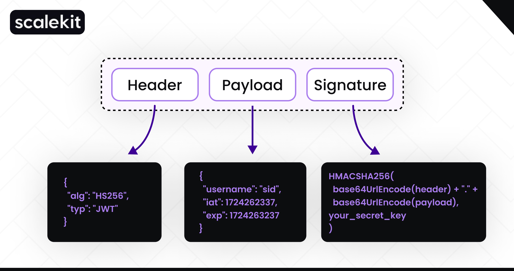

# JWT

- **A JSON Web Token (JWT)** is a **compact**, **self-contained** way to transmit information between two parties as a JSON object securely. It’s designed to ensure data integrity and authenticity without the need for server-side session management. 
    - **Compact:** Because of its size, it can be sent through an URL, POST parameter, or inside an HTTP header. Additionally, due to its size its transmission is fast.
    - **Self-contained:** The payload contains all the required information about the user, to avoid querying the database more than once.

- The information can be verified and trusted because it is digitally signed using a secret key (using the HMAC algorithm) or a public/private key pair (using RSA or ECDSA).

- It’s important to note that a JWT guarantees data ownership but not encryption. If you need to encrypt the data, you should encrypt the payload before sending it as a JWT.

## Structure of a JWT

A JWT is a string that has three parts separated by dots. Each part is a base64 encoded string of a JSON object.

```
header.payload.signature
```



### Header

The header typically consists of two parts: the type of the token, which is JWT, and the signing algorithm being used, such as HMAC SHA256 or RSA.

**Example**
```json
{
  "alg": "HS256",
  "typ": "JWT"
}
```

### Payload

The second part of the token, the payload contains the data, or “claims”, which you wish to transfer using this JWT. This data typically contains user information (username, email), session data (IP address, time or last login), or authorization permissions (roles or groups the user belongs to). 

Claims are key-value pairs and can be divided into three categories:
    - Registered claims: These are predefined claims specified by the JWT standard (RFC 7519). While they are not mandatory, they are recommended to provide a consistent and interoperable structure for tokens. Some of the registered claims include:
        - **iss**: Issuer - Who created the token
        - **sub**: Subject - The entity identified by this token. For example, if the token is used to authorize a user, sub could be the user ID.
        - **aud**: Audience - The intended recipient of the token. For example, if the token is intended to be used by your beta testers user pool, you could specify that as an audience. It is advised to reject tokens with no audience.
        - **exp**: Expiration Time - When the token expires (in Unix time)
        - **nbf**: Not Before - The token should not be accepted before this time (in Unix time)
        - **iat**: Issued At - When the token was issued (in Unix time)
        - **jti**: JWT ID - A unique identifier for the token (can be used to prevent the token from being replayed)
    - Public claims: These are collision-resistant. Public claims should be registered with the **IANA JSON Web Token Registry** to avoid collisions.
        - Collisions occur when a developer creates a custom claim with the same name as a registered term. For example, if you’d like to associate a sandwich type with each user, you should not name your custom claim “sub.” Another application will read it as the registered “subject claim,” so your JWT won’t convey the user data that you want.
    - Private claims: These are subject to possible collisions. 

**Example**
```json
{
  "sub": "1234567890",
  "name": "John Doe",
  "admin": true
}
```

### Signature

This will allow us to verify that the token is valid and no changes has been done to it. The way it works it takes the first 2 parts of the token, it will encode the header to base64 and do the same for the payload. Then it will concatenate it with a "." so that way we have all of the data that we have shared with the user.

Then it will take the algorithm provide and apply it on the first part. If the result of hashing the first couple of parts match the 3rd section of the token it means the JWT is valid. if it didn't match it shows the token has been edited and its invalid.

> Verifying the signature must be the first step that any consumer of a JWT performs. If the signature doesn’t match, no further processing should take place.

**Example**
```json
HMACSHA256(
  base64UrlEncode(header) + "." +
  base64UrlEncode(payload),
  secret)
```

-----------------------------------

## Signing Keys

The security of your JWTs depends on the signing keys used to create their signatures:

- **Symmetric Keys (HMAC)**: With HMAC, the same key is used for both signing and verifying the token. This means that both the issuer and the verifier must share this secret key. It's crucial to keep this key secure because if it is compromised, anyone with access to the key can forge valid tokens.
    - **Secret**: The secret key used to sign the token. This key must be kept secret and should only be known to the server that issued the token. You could use any string as a secret (for example, `dontUseThisSecret123##$%83`), and the same secret will be used to verify the signature.

- **Asymmetric Keys (RSA)**: Asymmetric cryptography uses a pair of keys: a private key and a public key. The private key is used to sign the token, and this key must be kept secret. The corresponding public key is then distributed to anyone who needs to verify the JWT's authenticity. This method offers enhanced security, especially in distributed systems, as only the private key holder can create valid tokens, while anyone with the public key can verify them.
    - Following this approach, the issuer of our token (Auth Service) will use a private key to sign the tokens (using RSA or ECSA algorithms). As the name implies, this key will be private and won’t be shared with any other service.
    - Any other service interested in verifying incoming tokens will have the public key. Public keys are able to verify tokens but not sign new ones.


-----------------------------------

## JWT Authentication Flow

- A user provides their credentials (e.g., username and password) and sends them to the server.

- The server validates the credentials. If they are correct, the server generates a JWT containing the user's information (in a claim) and signs it with a secret key.

- The server sends the JWT back to the user.

- The user stores the JWT (usually in the browser's local storage or as a cookie) and includes it in the Authorization header in subsequent requests to the server. 

- When the user sends a new request with the JWT, the server decodes the JWT, and verifies its signature. If the token is valid, the server processes the request and returns the appropriate response.

-----------------------------------

## Short-lived JWTs and Refresh Tokens

- **Short-lived tokens** (tokens that expire quickly after they are issued) are highly advised. Some services have their tokens expire as soon as 5 minutes after issuing them. If a token is stolen, it will only be valid for a limited time. 

- **Refresh tokens** are used to obtain new access tokens after the original token expires. The refresh token is a long-lived token that is used to request a new access token. This way, the user doesn't have to log in again to get a new access token. Refresh tokens are usually stored securely on the client side (e.g., in an HTTP-only cookie) and are sent to the server when requesting a new access token.
    - The way Refresh Tokens work is fairly simple. Upon initial authentication, the user will receive two tokens (note that the names might differ per auth provider):
        - **Access Token:** Your typical JSON Web Token that is sent with every request. Contains the user claim.
            - It will be sent with every request and at some point the token will expired. Then, the front-end will send a refresh request with the refresh token. The auth server will generate a new Access Token (JWT) with the most up-to-date claims, and send it back to the user. The user will use this token until it’s expired, and then refresh again. Over and over.
        - **Refresh Token:** This special kind of token is persisted in a database, mostly owned by an Authentication Service of some sort. This is often not a JWT — but rather a unique hash.
            - It can be valid for months, and that is often the case. When the refresh token expires, the user will be signed out and need to authenticate again. 

-----------------------------------

## Where Should I Store The JSON Web Tokens?

**Use Cookies with HttpOnly**

- **Local Storage**: A JWT needs to be stored in a safe place inside the user’s browser. If you store it inside localStorage, it’s accessible by any script inside your page. This is as bad as it sounds; an XSS attack could give an external attacker access to the token.

- **Session Storage**: Like local storage, session storage is accessible by any javascript code running on the same domain that the web application is hosted. So the only thing that changes, is that when a user closes their browser, the JWT will disappear and the user will have to login again in their next visit to your web application. It stores the data for only one session (the data is deleted when the browser tab is closed).

- **Cookies**: Cookies are a great place to store JWTs. They are sent automatically in every HTTP request to the server, and they can be set to be HTTP-only (not a regular cookie), meaning that they are not accessible via JavaScript. This makes them secure against XSS attacks. However, **cookies are vulnerable to CSRF attacks**, so you should also implement CSRF protection.

    - `HttpOnly` cookies are special cookies that are only sent in HTTP requests to the server. It’s never accessible (both for reading or writing) from JavaScript running in the browser.

-----------------------------------

## JWT Implementation in Spring Boot

```java
package com.y.x.Service.Impl;

import com.y.x.Service.JwtService;
import io.jsonwebtoken.Claims;
import io.jsonwebtoken.Jwts;
import io.jsonwebtoken.SignatureAlgorithm;
import io.jsonwebtoken.io.Decoders;
import io.jsonwebtoken.security.Keys;
import org.springframework.beans.factory.annotation.Value;
import org.springframework.security.core.userdetails.UserDetails;
import org.springframework.stereotype.Service;

import java.security.Key;
import java.util.Date;
import java.util.HashMap;
import java.util.Map;
import java.util.function.Function;


@Service
public class JwtServiceImpl implements JwtService {
    @Value("${security.jwt.secret-key}")
    private String secretKey;

    @Value("${security.jwt.expiration-time}")
    private long jwtExpiration;

    @Override
    public String extractUsername(String token) {
        return extractClaim(token, Claims::getSubject);
    }

    @Override
    public <T> T extractClaim(String token, Function<Claims, T> claimsResolver) {
        final Claims claims = extractAllClaims(token);
        return claimsResolver.apply(claims);
    }

    @Override
    public String generateToken(UserDetails userDetails) {
        return generateToken(new HashMap<>(), userDetails);
    }

    @Override
    public String generateToken(Map<String, Object> extraClaims, UserDetails userDetails) {
        return buildToken(extraClaims, userDetails, jwtExpiration);
    }

    @Override
    public long getExpirationTime() {
        return jwtExpiration;
    }

    @Override
    public String buildToken(Map<String, Object> extraClaims, UserDetails userDetails, long expiration) {
        return Jwts
                .builder()
                .setClaims(extraClaims)
                .setSubject(userDetails.getUsername())
                .setIssuedAt(new Date(System.currentTimeMillis()))
                .setExpiration(new Date(System.currentTimeMillis() + expiration))
                .signWith(getSignInKey(), SignatureAlgorithm.HS256)
                .compact();
    }

    @Override
    public boolean isTokenValid(String token, UserDetails userDetails) {
        final String username = extractUsername(token);
        return (username.equals(userDetails.getUsername())) && !isTokenExpired(token);
    }

    @Override
    public boolean isTokenExpired(String token) {
        return extractExpiration(token).before(new Date());
    }

    @Override
    public Date extractExpiration(String token) {
        return extractClaim(token, Claims::getExpiration);
    }

    @Override
    public Claims extractAllClaims(String token) {
        return Jwts
                .parser()
                .setSigningKey(getSignInKey())
                .build()
                .parseClaimsJws(token)
                .getBody();
    }

    @Override
    public Key getSignInKey() {
        byte[] keyBytes = Decoders.BASE64.decode(secretKey);
        return Keys.hmacShaKeyFor(keyBytes);
    }
}
```

### Secret Key Preparation (`getSignInKey`)

```java
public Key getSignInKey() {
    byte[] keyBytes = Decoders.BASE64.decode(secretKey);
    return Keys.hmacShaKeyFor(keyBytes);
}
```

- `byte[] keyBytes = Decoders.BASE64.decode(secretKey);`: This line decodes the secret key from base64 to a byte array. The secret key is stored in the application.properties file as a base64 encoded string.

- `return Keys.hmacShaKeyFor(keyBytes);`: This line creates a new HMAC key from the byte array. The key is used to sign and verify the JWT.

### JWT Generation

```java
public String buildToken(Map<String, Object> extraClaims, UserDetails userDetails, long expiration) {
    return Jwts
            .builder()
            .setClaims(extraClaims)
            .setSubject(userDetails.getUsername())
            .setIssuedAt(new Date(System.currentTimeMillis()))
            .setExpiration(new Date(System.currentTimeMillis() + expiration))
            .signWith(getSignInKey(), SignatureAlgorithm.HS256)
            .compact();
}
```

- `setClaims(extraClaims)`: This line sets the extra claims in the JWT. Extra claims are additional key-value pairs that you can add to the JWT.
- `setSubject(userDetails.getUsername())`: This line sets the subject of the JWT which typically is the user the token represents. Basically, this value is a unique user identifier, which is usually a username or a user ID.
- `signWith(getSignInKey(), SignatureAlgorithm.HS256)`: This line signs the JWT with the HMAC SHA256 algorithm using the secret key.
- `compact()`: It is called to finalize the JWT construction and return it as a compact, URL-safe string.

This generated JWT can now be used for secure communication, carrying the subject, issued time, and expiration time as claims.

### JWT Validation

```java
public boolean isTokenValid(String token, UserDetails userDetails) {
    final String username = extractUsername(token);
    return (username.equals(userDetails.getUsername())) && !isTokenExpired(token);
}
```

```java
public String extractUsername(String token) {
    return extractClaim(token, Claims::getSubject);
}
```

- `return extractClaim(token, Claims::getSubject);`: This line extracts the subject (username) from the token.
    - `Claims::getSubject` is a method reference that refers to the `getSubject` method of the `Claims` class.

```java
public <T> T extractClaim(String token, Function<Claims, T> claimsResolver) {
    final Claims claims = extractAllClaims(token);
    return claimsResolver.apply(claims);
}
```

- `final Claims claims = extractAllClaims(token);`: This line extracts all the claims from the token like the subject, issued time, and expiration time.
- `return claimsResolver.apply(claims);`: This line applies the `claimsResolver` function to the claims and returns the result which is the extracted claim requested by the caller like `Claims::getSubject`, `Claims::getExpiration`, etc.

```java
public Claims extractAllClaims(String token) {
    return Jwts
            .parser()
            .setSigningKey(getSignInKey())
            .build()
            .parseClaimsJws(token)
            .getBody();
}
```

Every time you call `extractAllClaims`, the token is validated automatically.

- `.parser()`: This line creates a new parser instance to parse the token.
- `.setSigningKey(getSignInKey())`: This line sets the signing key to verify the token.
    - If the signature is invalid, this method will throw an exception (e.g., `SignatureException`).
    - If the token is valid, it returns the Claims object containing all the claims.
- `.build()`: This line builds the parser instance.
- `.parseClaimsJws(token)`: This line parses the token and returns a JWS object.
- `.getBody()`: This line returns the body of the JWS object which contains the claims.

-----------------------------------