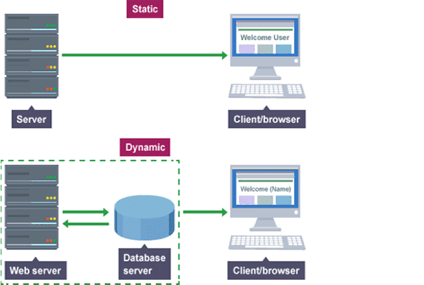

# Web Server

A web server is a simple server to serve static content. It only supports static resource, like image and HTML files. However, it cannot handle dynamic containers.

**Apache Web Server** is the most popular web server, followed by **MS’s IIS**, **Nginx** is also a good one


### Static vs Dynamic Content

- **Static content** is content that doesn’t change. It can be an HTML page, an image, a video file, a PDF document, or anything else that doesn’t require any processing before it’s served to the client.

- **Dynamic content** is content that is generated by a web application. It can be a web page that displays the results of a database query, a graph generated by a graphing library, or anything else that is generated by code before it’s served to the client.



# Web Container

- A web container, also known as a **servlet container**, is a component of a web server that manages the execution of servlets and JavaServer Pages (JSP).

> Web Container = Servlet container, supports JSP/Servlet API

- A web container is responsible for managing the lifecycle of servlets, mapping a URL to a particular servlet and ensuring that the URL requester has the correct access rights.

- The Web container creates servlet instances, loads and unloads servlets, creates and manages request and response objects, and performs other servlet-management tasks.

- Most popular web containers are **Tomcat**, **Jetty**, and **WildFly**.

- It works in Web Server, e.g., Tomcat lives in Apache

- It generates some static content and returns responses


# Tomcat

- Tomcat is both a web server and a web container (servelt container), but it’s not really meant to function as a high-performance web server, nor does it include some features typical of a web server.

- Tomcat is developed and maintained by Apache Software Foundation.

# Apache vs Tomcat

- Apache only supports static ordinary web pages such as HTML. It can connect Tomcat in one direction; Tomcat is a Servlet container that can support JSP, PHP and CGI, etc.

- Apache Web Server serves static content efficiently.

- Tomcat serves dynamic content, it also can handle static content, but less efficient.

----------------------------------------------------------------

# Servlet Container

- Three components of a Servlet Container:
    - Filter
    - Servlet
    - Listener

# Servlets

Servlets are simple Java files that are used to create dynamic content on the server side. These servlets are stored in web containers such as TOMCAT, GLASS FISH and JBOSS.

A Servlet is a class that handles requests, processes them and reply back with a response.

For example, we can use a Servlet to collect input from a user through an HTML form, query records from a database, and create web pages dynamically.

Servlets are under the control of **Servlet Container**. When an application running in a web server receives a request, the Server hands the request to the Servlet Container – which in turn passes it to the target Servlet.


## Servlet Lifecycle

A Servlet has a well-defined lifecycle that is implemented through the `init()`, `service()`, and `destroy()` methods.


### init()

The init() method is called only once during the lifecycle of a Servlet. It is called when the Servlet is first created, and not called again for each user request.

The init method is designed to be called only once. If an instance of the servlet does not exist, the **web container**:
   1. Loads the servlet class
   2. Creates an instance of the servlet class
   3. Initializes it by calling the init method

The init method must complete successfully before the servlet can receive any requests. The servlet container cannot place the servlet into service if the init method either throws a ServletException or does not return within a time period defined by the Web server.

```java
public void init() throws ServletException {
    // Initialization code like set up database etc....
}
```

### service()

This method is only called after the servlet’s init() method has completed successfully.

The Container calls the service() method to handle requests coming from the client, interprets the HTTP request type (GET, POST, PUT, DELETE, etc.) and calls doGet, doPost, doPut, doDelete, etc. methods as appropriate.

```java
public void service(ServletRequest request, ServletResponse response)
  throws ServletException, IOException {
    // ...
}
```

### destroy()

Called by the **Servlet Container** to take the Servlet out of service.

This method is only called once all threads within the servlet’s service method have exited or after a timeout period has passed. After the container calls this method, it will not call the service method again on the Servlet

```java
public void destroy() {
    // Cleanup code like closing database connection etc...
}
```

# Servlet Filter

A filter is an object that performs filtering tasks on either the request to a resource, or on the response from a resource, or both.

- When a request comes in the Tomcat, which is the Servlet Container, Servlet Filter is the first stop.
Servlet handles the request and generates the response.

### Some common uses for filters are:

- **Authentication & Authorization Filters** can check whether a user is authenticated and authorized to access a specific resource and can redirect unauthenticated users to a login page.
- **Data compression Filters:** can compress response content to reduce bandwidth usage and improve page load times.
- **Input validation Filters:** can validate incoming data, such as form submissions, to prevent security vulnerabilities like XSS and SQL injection.

### Servlet Filter Interface

Servlet Filter interface is similar to Servlet interface and we need to implement it to create our own servlet filter. Servlet Filter interface contains lifecycle methods of a Filter and it’s managed by servlet container.

The `javax.servlet.Filter` interface defines three methods:
- `init()` method is called by the web container when the filter is instantiated.
- `doFilter()` method is called by the web container each time a request/response pair is passed through the chain due to a client request for a resource at the end of the chain.
- `destroy()` method is called by the web container when the filter is removed from service.

```java
public interface Filter {
    public default void init(FilterConfig filterConfig) throws ServletException {}
    public void doFilter(ServletRequest request, ServletResponse response, FilterChain chain) throws IOException, ServletException;
    public default void destroy() {}
}
```

# Servlet Listener

They provide a way to execute code when certain event occurs.

Listeners are generally used in cases where you want to
   - execute some actions or load some data/configuration on application startup,
   - or to open and close database connections on the occurrence of an event
   - and to perform any actions on the application being shut down.

----------------------------------------------------------------
