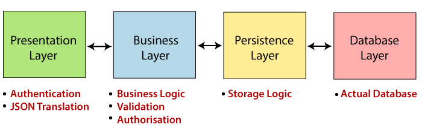
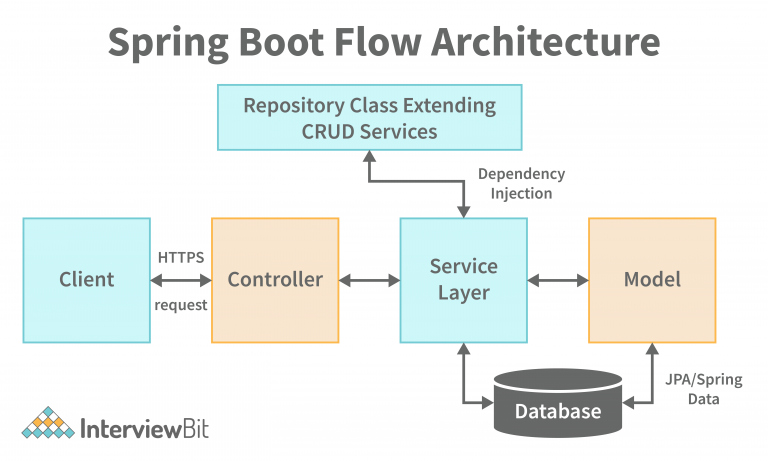

# Spring Boot Architecture

- Spring boot follows a layered architecture in which each layer communicates to other layers(Above or below in hierarchical order).

- Spring Boot Architecture has four layers:
    - Presentation Layer
    - Business Layer
    - Persistence Layer
    - Database Layer – Actual Database

### Presentation Layer (Controller)

The presentation layer handles the HTTP requests, translates the JSON parameter to object, and authenticates the request and transfer it to the business layer. In short, it consists of views i.e., frontend part.

### Business Layer (Service)

This layer contains the business logic that drives the application’s core functionalities. Like making decisions, calculations, evaluations, and processing the data passing between the other two layers.

The business logic in software engineering is where we decide what the software needs to do. An example of this is validation. If you are ever requested to validate something, this needs to happen inside the Service class.

### Persistence Layer (Repository)
### Data access object (DAO)

The persistence layer is responsible for:
   - Interacting with the database.
   - Performing CRUD operations on the data.
   - Converting the data from the database into an object (and vice versa).

We write database queries inside this interface.
    
### Database Layer

The database layer is the actual database that stores the data. It can be a relational database like MySQL, PostgreSQL, or Oracle, or a NoSQL database like MongoDB or Cassandra.

## Spring Boot Flow Architecture

