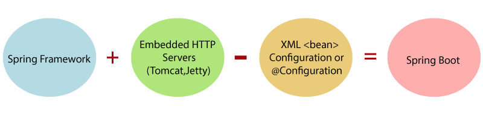

# Spring Boot - Introduction

## What is Spring Boot?
 
Spring Boot is an open source Java-based framework used to create a micro Service. It's used to build stand-alone and production ready spring applications. It's a Spring module that provides the RAD (Rapid Application Development) feature to the Spring framework. It enables the developers to directly focus on the logic instead of struggling with the configuration and set up.

Spring Boot is the combination of Spring Framework and Embedded Servers.



## What is Micro Service?

Microservices are a software architectural style in which a large application is built as a collection of small, independent services that communicate with each other over a network.

Each service is a self-contained unit of functionality that can be developed, tested, and deployed independently of the other services.

Microservices can be written in different programming languages and use different technologies, as long as they can communicate with each other through a common API.

They are designed to be **loosely coupled**, meaning that changes to one service should not affect the other services. This makes it easier to update, maintain, and scale the application.

Spring Boot is a popular framework for building microservices in the Java ecosystem.

## Why Spring Boot?

- Reduces the development time and increases productivity.
- It provides a flexible way to configure Java Beans, XML configurations, and Database Transactions.
- Everything is auto configured; no manual configurations are needed.
- Eases dependency management.
- It includes Embedded Servlet Container

## How Spring Boot Works?

The entry point of the spring boot application is the class contains `@SpringBootApplication` annotation and the main method.

## Spring Boot Components

Spring Boot provides four key features to begin with and these can be considered as the reason behind Spring Boot’s magic.

### Spring Boot Starters

Handling dependency management is a difficult task for big projects. Spring Boot resolves this problem by providing a set of dependencies for developers convenience.

For example, if you want to use Spring and JPA for database access, it is sufficient if you include `spring-boot-starter-data-jpa `dependency in your project.

#### Examples

- Spring Boot Starter Actuator Dependency : It's used to monitor and manage the application.

```xml
<dependency>
   <groupId>org.springframework.boot</groupId>
   <artifactId>spring-boot-starter-actuator</artifactId>
</dependency>
```

- Spring Boot Starter Security Dependency : It's used to secure the application.

```xml
<dependency>
   <groupId>org.springframework.boot</groupId>
   <artifactId>spring-boot-starter-security</artifactId>
</dependency>
```


### Spring Boot Auto Configuration

Spring Boot Auto Configuration automatically configures your Spring application based on the JAR dependencies you added in the project. For example, if MySQL database is on your class path, but you have not configured any database connection, then Spring Boot auto configures an in-memory database.

> On your class path means, if you have added the dependency in your pom.xml file.

For this purpose, you need to add `@EnableAutoConfiguration` annotation or `@SpringBootApplication` annotation to your main class file. Then, your Spring Boot application will be automatically configured.

```java
@SpringBootApplication
// @EnableAutoConfiguration
public class DemoApplication {

	public static void main(String[] args) {
		SpringApplication.run(DemoApplication.class, args);
	}

}
```


[Read more](https://www.geeksforgeeks.org/spring-boot-auto-configuration/)

### Spring Boot CLI

### Spring Boot Actuator

--------------------------------------------
