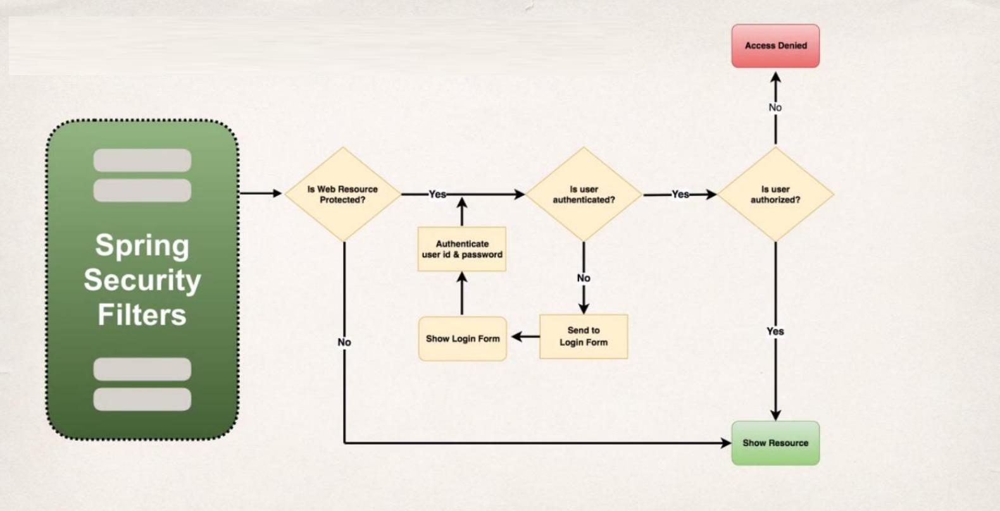
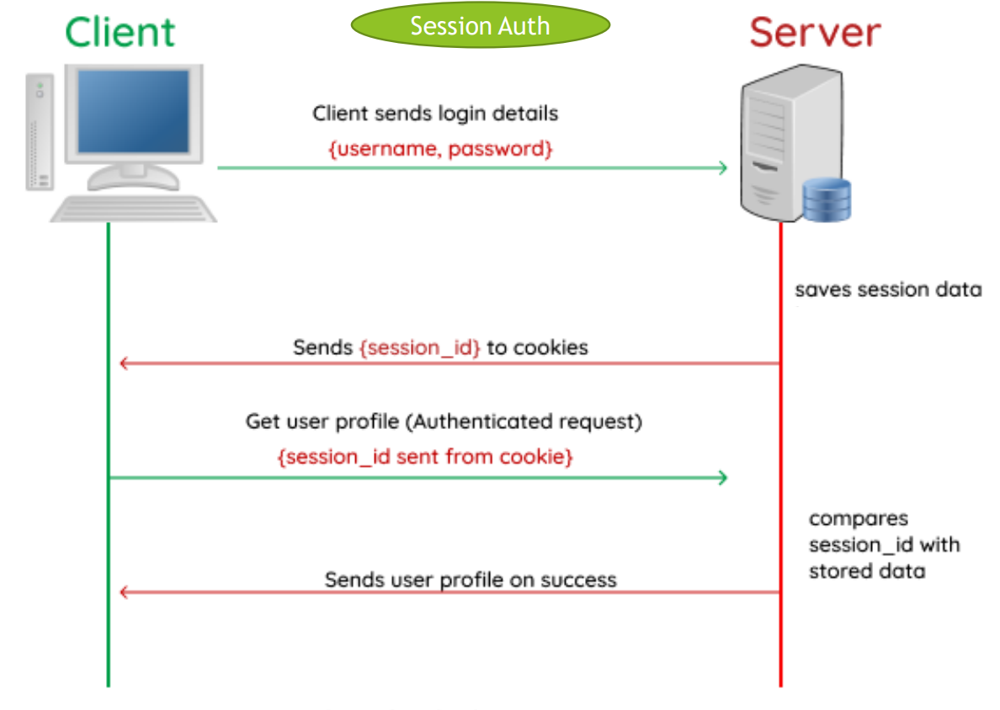
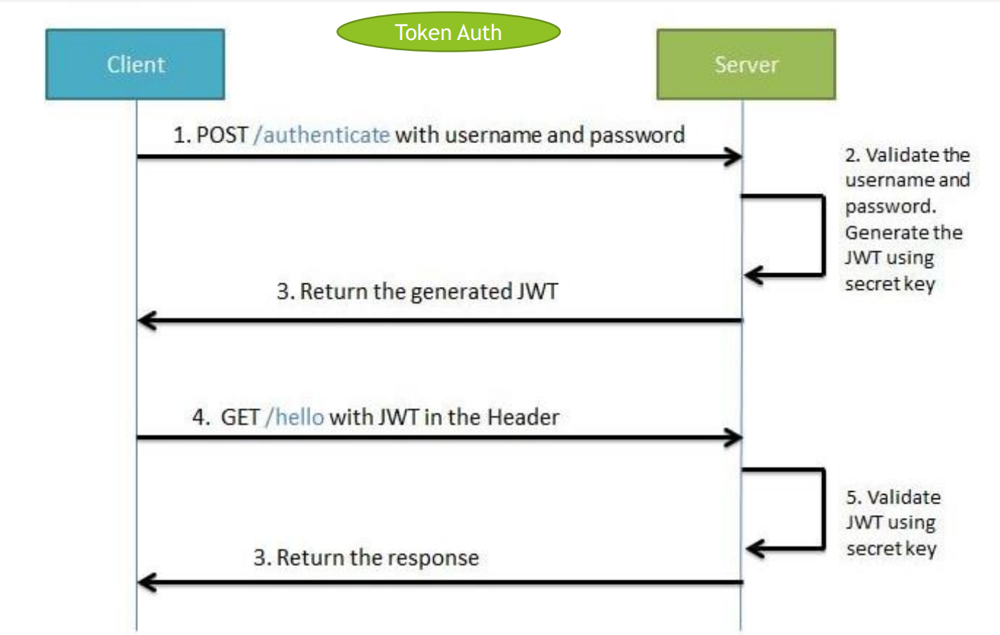
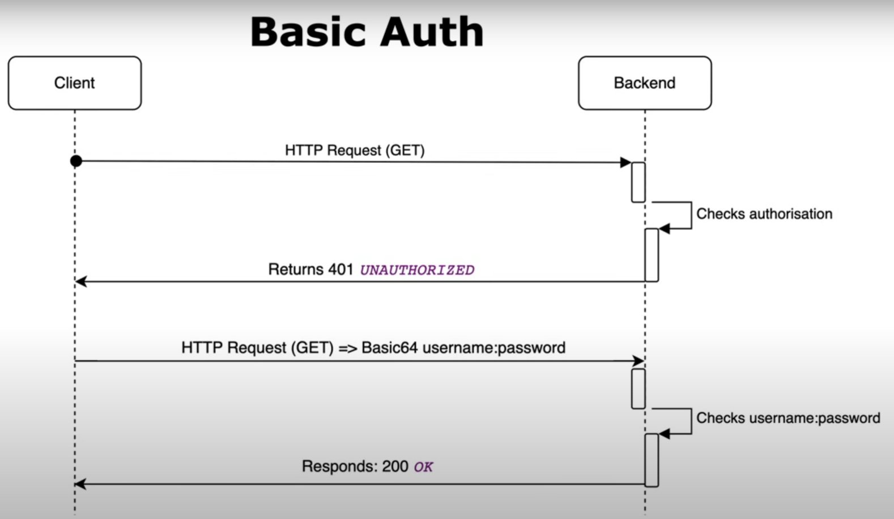
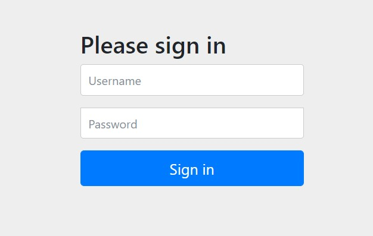
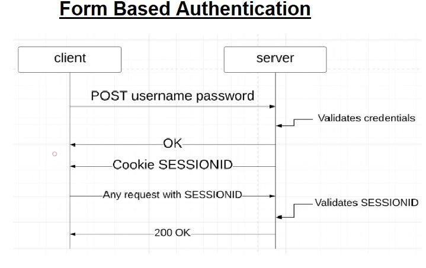
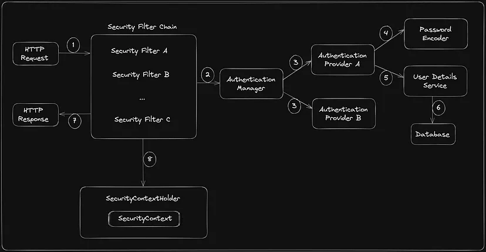
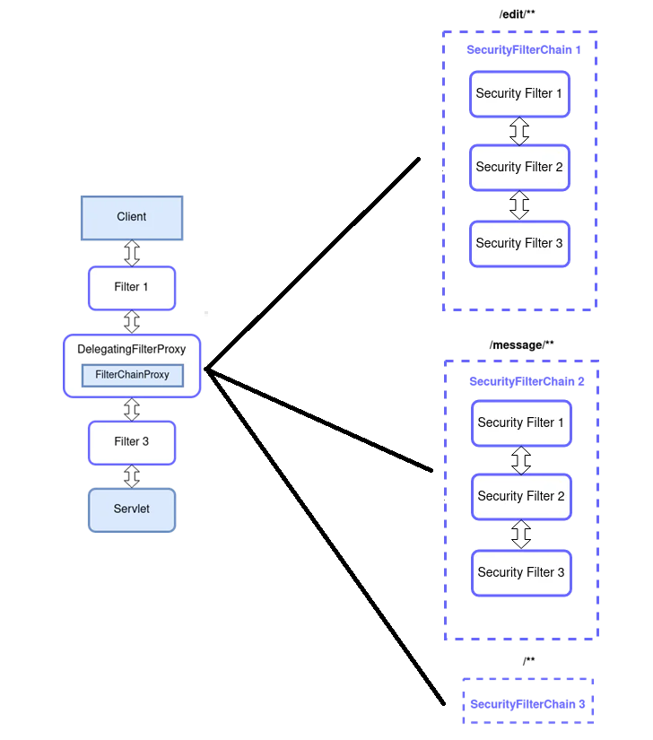

# Spring Security

- Spring Security is a framework for securing Java-based applications at various layers with great flexibility and customizability.

- Spring Security provides authentication and authorization support against database authentication, LDAP, form authentication, JA-SIG central authentication service, Java Authentication and Authorization Service (JAAS), and many more.

- Spring Security provides support for dealing with common attacks like CSRF, XSS, and session fixation protection, with minimal configuration.

- Spring Security can be used to secure the application at various layers, such as web URLs, service layer methods, etc.

- In order to use Spring Security in the Spring Boot project, we need to add the below Maven dependency:
    
    ```xml
    <dependency>
        <groupId>org.springframework.boot</groupId>
        <artifactId>spring-boot-starter-security</artifactId>
    </dependency>
    ```
    Once the dependency is added, Spring Security is enabled by default, it enables **form-based** and **HTTP basic** authentication.
    - If You Access a Resource 
        - via a Web Browser: Spring Security will redirect you to a default login page (form-based authentication).
        - via a Tool like Postman: Spring Security will use HTTP Basic Authentication.

- Adding the Spring Security Starter `spring-boot-starter-security` to an Spring Boot application will:-
    - Enable HTTP basic authentication for all endpoints.
    - Generate a default user with the username `user` and a randomly generated password, which is logged in the console when the application starts.
    - Add a series of security filters to the application's filter chain.
    - Enable Cross-Site Request Forgery (CSRF) protection. This means that any state-changing requests (e.g., POST, PUT, DELETE) must include a CSRF token.
    - Enable common low-level features such as XSS, CSRF, caching, etc.

- There are different ways to configure Spring Security in a Spring Boot application:
    - **Java Configuration** (using `@Configuration` classes) - **Recommended**
    - **XML Configuration**

- The data like username, password, roles, etc., need to be stored somewhere. Spring Security provides various ways to work with user data that needs to be authenticated and authorized in the application. Some of the ways to store user data are:
        - **In-Memory**
        - **JDBC**
        - **LDAP**
        - **Custom**



## Security Concepts

### Authentication

- **Authentication** is the process of verifying the identity of a user. It answers the question, **"Who are you?"**
    > Check if you're a user or not. Typically, this is done by providing a username and password.

### Authorization

- After authentication, **authorization** determines whether the authenticated user has permission to perform a given action or access a resource. It answers the question, **"Are you allowed to do this?"**

### Session Authentication

- **Session Authentication** is a **stateful authentication technique** where we use sessions to keep track of the authenticated user across multiple requests.

- It uses a **session cookie** to store the user's identity.

- Here's how it works:
    - User submits the login request for authentication.
    - Server validates the credentials. If the credentials are valid, the server initiates a session and stores some information about the client. This information can be stored in memory, file system, or database. The server also generates a unique identifier (session id) that it can later use to retrieve this session information from the storage. Server sends this unique session identifier to the client.
    - Client saves the session id in a cookie and this cookie is sent to the server in each request made after the authentication.
    - Server, upon receiving a request, checks if the session id is present in the request and uses this session id to get information about the client.



### Token Authentication

- **Token Authentication** is a way to authenticate users using tokens. A token is a piece of data that is used to authenticate a user. It is generated by the server and sent to the client. The client then sends this token in the header of each request to authenticate itself.

- Here's how it works:
    - User submits the login request for authentication.
    - Server validates the credentials. If the credentials are valid, the server generates a token and sends it to the client.
    - Client saves the token and sends it in the header of each request made after the authentication.
    - Server, upon receiving a request, checks if the token is present in the header and validates it.



------------------------------------------------------------------

## Basic Authentication

- **Basic Authentication** is a simple authentication mechanism that requires a username and password to access a resource. **It is a stateless authentication mechanism**, meaning that each request must include the user's credentials.

- Basic Auth uses **Base 64** encoded username and password in the header.

- **Basic Auth uses an HTTP header** in order to provide the username and password when making a request to a server. The header field itself looks like the following:
    ```
    Authorization: Basic Base64-encoded(username:password)
    ```

- Basic Authentication **DO NOT use cookies**, hence there is no concept of a session or logging out a user, which means each request has to carry that header in order to be authenticated.



## Form-based Authentication

- Form-based authentication uses standard HTML form (Login Form) fields to pass the username and password values to the server via a **POST request**.

- The server validates the credentials provided and **creates a session** tied to a unique token stored in a cookie and passed between the client and the server on each HTTP request. If the cookie is invalid or the user is logged out, the server then usually redirects to a login page.

- In most of cases, Form-based Authentication is used to authenticate a web browser based client.

|                                   |                               |
|:---------------------------------:|:------------------------------:|
|| |


-------------------------------------------------------------

# Spring Security Architecture

- The request is intercepted by the Security Filter Chain. The Security Filter Chain consists of a series of filters, each with a specific security-related task.

- If the user is not yet authenticated (i.e., not logged in), Spring Security’s authentication filters will trigger the Authentication Manager. If the credentials match, the Authentication Manager generates an Authentication Object indicating a successful authentication.

- The Authentication Manager uses the configured Authentication Providers to verify the user’s credentials.

- Authentication Providers will use the PasswordEncoder to store and compare passwords.

- Authentication Providers may use the `UserDetailsService` to fetch user details. The user’s credentials are compared to the stored or provided credentials.

- The status of the authentication process will be sent to the user as a success or unauthorized response.

- This Authentication object is stored within the security context managed by SecurityContextHolder. The security context now represents the authenticated user.



# Components of Architecture

## Security Filter Chain

- It's a series of filters that intercepts incoming HTTP requests and communicates with the Authentication Manager for the validation of requests.

- Each filter is responsible for a specific security-related task, such as authentication, session management, request validation, or authorization.

- The filter chain is **built dynamically at runtime**, with filters ordered to handle security concerns in a structured manner. Filters in Spring Security are not simple servlet filters; they are deeply integrated into Spring’s security framework, interacting with authentication providers, context holders, and request metadata.

- When you add the Spring Security framework to your application, it automatically registers a filters chain that intercepts all incoming requests. This chain consists of various filters, and each of them handles a particular use case.
    - For example:
        - Check if the requested URL is publicly accessible, based on configuration.
        - In case of session-based authentication, check if the user is already authenticated in the current session.
        - Check if the user is authorized to perform the requested action, and so on.

- Spring Security maintains a filter chain internally where each of the filters has a particular responsibility and filters are added or removed from the configuration depending on which services are required.

### How Security Filters Works

- When an HTTP request reaches the application:
    - The servlet container invokes `DelegatingFilterProxy`, which acts as a wrapper for Spring Security’s filters.
    - The `DelegatingFilterProxy` forwards the request to the `FilterChainProxy`.
    - The `FilterChainProxy` delegates the request to the `SecurityFilterChain`.
    - The `SecurityFilterChain` is a chain of filters that process the request and perform security-related tasks.

- When a request reaches an authentication filter:
    - The filter checks if authentication is already established in the `SecurityContextHolder`.
    - If authentication is not present, the filter attempts to extract credentials.
        > `SecurityContextHolder.getContext().getAuthentication() == null`
    - If valid credentials are found, an AuthenticationManager processes them.
    - If authentication succeeds, a security token is stored in the `SecurityContextHolder`.
    - If authentication fails, the filter triggers an AuthenticationEntryPoint, returning an error response.
    - Once authentication is successful, control moves to the next filter in the chain.

- Each authentication filter only executes if the request meets its conditions. If credentials are missing, it does nothing and passes control to the next filter.

- **`DelegatingFilterProxy`**: It is a special filter that acts as a bridge between the Servlet container's lifecycle and Spring's `ApplicationContext`. The servlet container only recognizes `DelegatingFilterProxy`, while the actual security logic resides in the Spring-managed `SecurityFilterChain` so `DelegatingFilterProxy`'s job is to ensure the Spring `ApplicationContext` is ready before the filter is invoked, so that the filter can safely access the beans it needs. 
    - **Servlet Container vs. Spring Context**:  
    The Servlet container initializes and manages filters independently of Spring's `ApplicationContext`. Since the Servlet container loads before the Spring context, there’s a need to ensure that Spring-managed beans (such as those annotated with `@Component`) are available when the filter is invoked.  

    - **Spring-Managed Filter Logic**:  
    The actual filtering logic is implemented as a Spring bean, which allows it to be configured and managed by the Spring `ApplicationContext`. This is where `DelegatingFilterProxy` comes in.

    - **Ensures Proper Initialization**:  
    `DelegatingFilterProxy` guarantees that the Spring application context is fully initialized before the filter is invoked. This prevents issues where filters might attempt to access beans that haven’t been loaded yet.

    - **Spring Security Integration**:  
    In a typical Spring Security setup, `DelegatingFilterProxy` looks up the target filter bean named `springSecurityFilterChain` in the Spring context. This bean represents the core filter chain responsible for handling security-related tasks such as authentication, authorization, CSRF protection, and more.  


- **`FilterChainProxy`**: `DelegatingFilterProxy` delegates the request to the `FilterChainProxy` which is the main filter that delegates the request to the appropriate `SecurityFilterChain` based on the request URI.
    **Example Configuration**:
    ```Java
    @EnableWebSecurity
    public class SecurityConfig extends WebSecurityConfigurerAdapter {

        @Override
        protected void configure(HttpSecurity http) throws Exception {
            http
                .authorizeRequests()
                    .antMatchers("/public/**").permitAll() // Public endpoints
                    .antMatchers("/secure/**").authenticated() // Secured endpoints
                .and()
                .formLogin() // Enable form-based login
                .and()
                .csrf().disable(); // Disable CSRF for simplicity
        }
    }
    ```
    - In this example:
        - Spring Security automatically creates a `FilterChainProxy` bean.
        - It configures two filter chains: one for `/public/**` (public access) and another for `/secure/**` (requires authentication).




### Order of Filters

- Spring Security filters are registered with the lowest order and are the first filters invoked. If you want to put your custom filter in front of them, you will need to add padding to their order:
    ```
    spring.security.filter.order=10
    ```
    Once we add this configuration to our `application.properties` file, we will have space for 10 custom filters in front of the Spring Security filters.

### How Filters Are Added to the Chain

- They are inserted into the Spring Security filter chain using `HttpSecurity` methods.

- There are three ways to insert a filter:
    - Before a specific filter using `addFilterBefore()`.
    - After a specific filter using `addFilterAfter()`.
    - At a specific position using `addFilterAt()`.

- If a filter must execute before authentication occurs, it should be placed before `UsernamePasswordAuthenticationFilter`. If it needs authentication details, it should be placed after it.

### Default Filters

- `OncePerRequestFilter` — ensures that a filter is only applied once per request.

- `UsernamePasswordAuthenticationFilter` — checks the provided credentials and creates an Authentication Object if they are valid.
    - It's responsible for processing form-based login requests which are POST requests containing username and password.
    - It processes our input when we get to the `/login` page.

- `BasicAuthenticationFilter` — responsible for processing HTTP Basic authentication. It decodes the Authorization header, extracts the username and password, and attempts to authenticate the user.
    - `Authorization: Basic base64encoded(username:password)`.

- `LogoutFilter` — it handles the user logout process. It intercepts the logout request, clears the security context, and performs any necessary cleanup or additional actions.

- `ExceptionTranslationFilter` — handles exceptions thrown during the security process. It catches and translates authentication-related exceptions into meaningful HTTP responses, such as redirecting to a login page or returning an unauthorized status.

- `RememberMeAuthenticationFilter` — enables "remember me" functionality. It remembers the user's authentication details (typically a token or cookie) to automatically log them in when they revisit the application.

- `AnonymousAuthenticationFilter` — responsible for creating an anonymous user who is not authenticated but has limited access to some parts of the application.

- `SecurityContextPersistenceFilter` — stores the security context between requests. Spring run this filter before authentication filters to ensure that the security context is available for the entire request.
    **How It Works**
        - **At the Start of the Request:**
            - The filter retrieves the `SecurityContext` from the HTTP session (if sessions are enabled) or creates a new, empty `SecurityContext`.
            - It then sets the `SecurityContext` in the `SecurityContextHolder`, making it available for the rest of the request-processing chain.
        - **During the Request:**
            - Other filters and components (e.g., `UsernamePasswordAuthenticationFilter`, `FilterSecurityInterceptor`) can access the `SecurityContext` from the `SecurityContextHolder` to perform authentication and authorization checks.
        - **At the End of the Request:**
            - The filter saves the `SecurityContext` back to the HTTP session (if sessions are enabled).
            - It then clears the `SecurityContext` from the `SecurityContextHolder` to ensure that no sensitive information is retained in the thread.
    
    > By default, the `SecurityContextPersistenceFilter` uses an `HttpSessionSecurityContextRepository` to store the `SecurityContext` in the HTTP session. For stateless applications, you can configure it to use a `NullSecurityContextRepository` so no session will be created or used to keep the context. You can also set `SessionCreationPolicy.STATELESS` to disable session creation.


## Authentication Manager 

- This is an interface whose implementation (`ProviderManager`) has a list of configured AuthenticationProviders that are used for authenticating user requests.

- Once received request from filter, it delegates the validating of the user details to the authentication providers available. Since there can be multiple providers inside an app, it is the responsibility of the AuthenticationManager to manage all the authentication providers available.

- You can think of AuthenticationManager as a coordinator where you can register multiple providers, and based on the request type, it will deliver an authentication request to the correct provider.

- In more complex systems, you might have multiple Authentication Managers. Each manager can be associated with a specific set of Authentication Providers, allowing you to handle different types of authentication for different parts of your application.

## Authentication Provider 

- The Authentication Providers are the workers of the Authentication Manager. They are responsible for actually performing the authentication.

- Each authentication provider needs to implement `AuthenticationProvider` interface. It exposes only two functions:
    - `authenticate`: performs authentication with the request.
    - `supports`: checks if this provider supports the indicated authentication type.

- Spring Security supports various types of Authentication Providers:
    - `DaoAuthenticationProvider` — uses a `UserDetailsService` to retrieve user details from database and compare credentials.
    - `LdapAuthenticationProvider` — used for authenticating against LDAP servers.
    - `JwtAuthenticationProvider` — used for validating JWT tokens of the user.
    - `Custom Authentication Providers` — handle authentication using specific logic or external systems.

## UserDetailsService

- The `UserDetailsService` is an interface which retrieves user details during the authentication process. It is often used in conjunction with Authentication Providers to obtain user details from the database for authentication.

- The `UserDetailsService` interface has a single method `loadUserByUsername(String username)` which returns a `UserDetails` object. We use this method to fetch user details from the database.


```Java
public interface UserDetailsService {
    UserDetails loadUserByUsername(String username) throws UsernameNotFoundException;
}
```

## Password Encoder

- The Password Encoder is used to hash and verify passwords securely as storing and comparing passwords is crucial for user authentication.

- `BCryptPasswordEncoder` — this is widely recommended choice for securely hashing passwords in Spring Security. It handles the generation of random salts for each password.
- `SCryptPasswordEncoder` — SCrypt is another secure password hashing algorithm, similar to BCrypt. It’s designed to be memory-intensive, making it resistant to certain types of attacks. SCryptPasswordEncoder is a good choice for secure password hashing.
- `NoOpPasswordEncoder` — this encoder does not perform any hashing or encoding of passwords and stores passwords in plain text which makes them highly vulnerable.
- `MessageDigestPasswordEncoder` — this encoder uses a specified message digest algorithm (e.g., SHA-256) to hash passwords. While it's more secure than plain text, it's not as strong as BCrypt and is considered less secure in modern applications.

## Security Context

- The `SecurityContext` is a container that stores authentication and security-related information about the currently logged-in user. 

- The `SecurityContext` contains the `Authentication` object, which provides:
    - The principal (typically the username or user object).
    - The credentials (password, if present, or other authentication tokens).
    - Granted authorities (roles or permissions).

-  If no user is authenticated, it will hold `null`.

- `Authentication` is an interface.
    - Its implementation specifies the type of Authentication. 
    - `UsernamePasswordAuthenticationToken` is an implementation of the Authentication interface and used when a user wants to authenticate using a username and password.
    - Other examples include `OpenIDAuthenticationToken` , `RememberMeAuthenticationToken`.

## Security Context Holder 

- The `SecurityContextHolder` is a helper class that provides access to the `SecurityContext`. It is the central point for accessing the security information of the current user in Spring Security.

- Once the user is successfully authenticated, Spring Security creates an Authentication Object within the security context managed by `SecurityContextHolder`.

- It stores the `SecurityContext` in a thread-local variable by default to ensure that the security information is specific to the current thread.

- It provides static methods to retrieve or update the `SecurityContext`.

- It can be configured to use different strategies for storing the `SecurityContext`, such as thread-local, inheritable thread-local, or custom storage strategies.

--------------------------------------------------------

# Security Cors Origin

- **Cross-Origin Resource Sharing (CORS)** is a security feature that allows web applications running at one domain to access resources from a different domain.

- CORS is a security feature implemented by browsers to prevent unauthorized access to resources on a different domain. Without CORS, browsers block such requests by default due to the **Same-Origin Policy**.
    - For example, if a website hosted on `www.example.com` tries to access resources from `www.anotherdomain.com`, the browser will block the request by default. The browser will only allow the requests to `www.example.com`'s domain.
    > Most front-end applications are built using frameworks like ReactJS, Angular, etc. These are hosted separately from the backend servers and make REST calls to these servers. This wouldn’t be possible if the browser behaved as discussed above.

- An origin is defined by the combination of:
    - **Protocol**: `http` or `https`.
    - **Host**: `www.example.com`.
    - **Port**: `8080`.

### How CORS Works

When a web page makes a cross-origin request, the browser enforces CORS by following these steps:

**Browser Sends a Preflight Request (for Non-Simple Requests)**
- For certain types of requests (e.g., `POST`, `PUT`, `DELETE` with custom headers or `Content-Type: application/json`), the browser first sends an **OPTIONS** request (preflight request) to the server.
    - The preflight request includes:
        - `Origin`: The origin of the requesting page. 
            - This is the domain from which the request is being made (e.g., `https://example.com`).
        - `Access-Control-Request-Method`: The HTTP method being used (e.g., `POST`).
        - `Access-Control-Request-Headers`: Any custom headers being sent.

**Server Responds to the Preflight Request**
- The server responds to the preflight request with headers indicating whether the actual request is allowed:
    - `Access-Control-Allow-Origin`: Specifies which origins are allowed (e.g., `https://example.com` or `*` for all origins).
    - `Access-Control-Allow-Methods`: Lists the allowed HTTP methods (e.g., `GET`, `POST`).
    - `Access-Control-Allow-Headers`: Lists the allowed headers (e.g., `Content-Type`, `Authorization`).
    - `Access-Control-Max-Age`: Specifies how long the preflight response can be cached (in seconds).

**Browser Sends the Actual Request**
- If the preflight response allows the request, the browser sends the actual request (e.g., `POST` or `PUT`) to the server.
- The request includes the `Origin` header, indicating the origin of the requesting page.

**Server Responds to the Actual Request**
- The server processes the request and includes the `Access-Control-Allow-Origin` header in the response to indicate whether the response can be shared with the requesting origin.
- If the `Access-Control-Allow-Origin` header matches the requesting origin (or is `*`), the browser allows the response to be accessed by the web page.

### Simple Requests vs. Preflighted Requests

- **Simple Requests**:
  - These are requests that do not trigger a preflight check.
  - Conditions for a simple request:
    - HTTP methods: `GET`, `POST`, `HEAD`
    - Headers: Only `Accept`, `Accept-Language`, `Content-Language`, `Content-Type` (with values `application/x-www-form-urlencoded`, `multipart/form-data`, or `text/plain`)
  - Example: A `GET` request to fetch data from an API.

- **Preflighted Requests**:
  - These are requests that trigger a preflight check.
  - Conditions for a preflighted request:
    - HTTP methods: `PUT`, `DELETE`, `PATCH`, etc.
    - Custom headers (e.g., `Authorization`, `X-Custom-Header`)
    - `Content-Type` other than `application/x-www-form-urlencoded`, `multipart/form-data`, or `text/plain` (e.g., `application/json`)
  - Example: A `POST` request with `Content-Type: application/json`.


----------------------------------------------------------------------