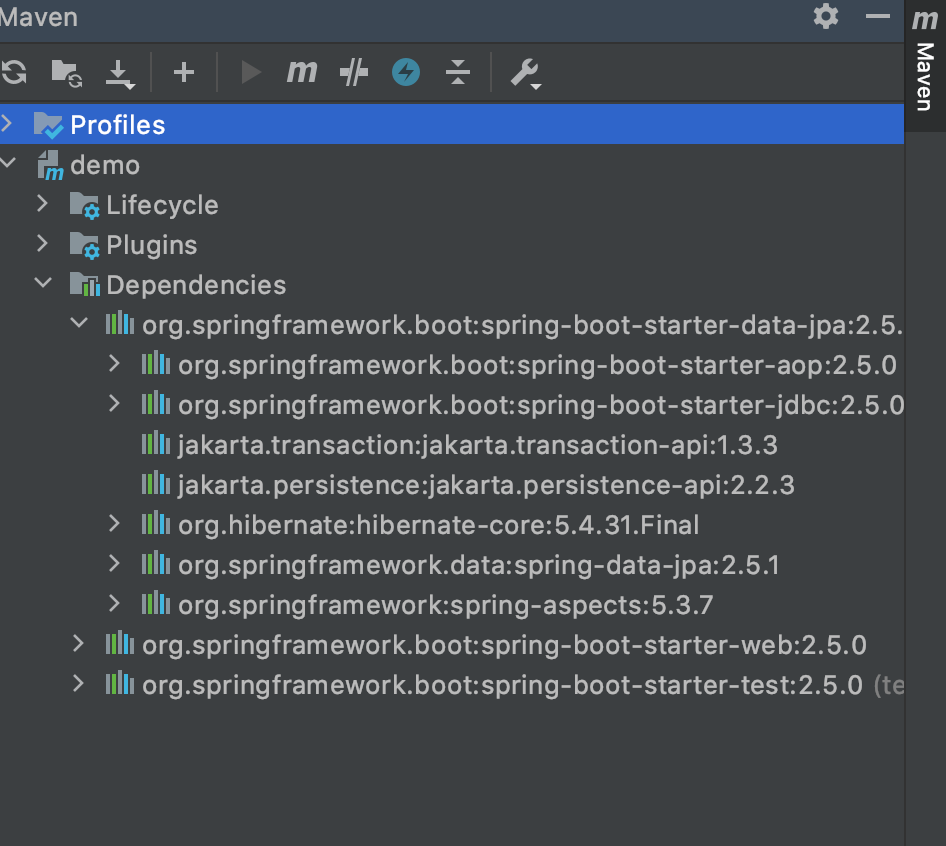

# Spring Boot Starter

- Before Spring Boot was introduced, Spring Developers used to spend a lot of time on Dependency management. Spring Boot Starters were introduced to solve this problem so that the developers can spend more time on actual code than Dependencies.

- **Spring Boot Starters are dependency descriptors** that can be added under the `<dependencies>` section in `pom.xml`. There are around 50+ Spring Boot Starters for different Spring and related technologies. These starters give all the dependencies under a single name.

- For example, if you want to use Spring Data JPA, you can add the following dependency in your `pom.xml`:

```xml
<dependency>
    <groupId>org.springframework.boot</groupId>
    <artifactId>spring-boot-starter-data-jpa</artifactId>
</dependency>
```
This gives all the required dependencies and can be seen under the Maven tab.



In earlier days, developers used to include all those dependencies. Now Spring Boot Starters provides all those with just a single dependency.

- The official starters follow a naming convention `spring-boot-starter-*`, where `*` denotes application type. For example, if we want to build web including RESTful applications using Spring MVC we have to use `spring-boot-starter-web` dependency.

--------------------------------------------

## Third-Party Starters

- If you want to make your own starter or other third-party starters name should not start with `spring-boot `as it reserved for official Spring Boot Starters. It can start with the name of the project. For example, the third-party project name is `abc`, then the dependency name will be `abc-spring-boot-starter`.

--------------------------------------------

## Spring Boot Starter Parent
```xml
<parent>
    <groupId>org.springframework.boot</groupId>
    <artifactId>spring-boot-starter-parent</artifactId>
    <version>3.3.5</version>
</parent>
```

- All Spring Boot projects use `spring-boot-starter-parent` as a parent in `pom.xml` file.

- The `spring-boot-starter-parent`is a special starter that provides default configurations for our application and a complete dependency tree to quickly build our Spring Boot project. It also provides default configurations for Maven plugins.

- Parent Poms allow us to manage the following things for multiple child projects and modules:
    - **Configuration**: It allows us to maintain consistency of Java Version and other related properties.
    - **Dependency Management**: It controls the versions of dependencies to avoid conflict.
    - **Source encoding**
    - **Default Java Version**
    - **Resource filtering**
    - **Default plugin configuration**

--------------------------------------------

## Spring Boot Official Starters

- The Spring Boot Framework provides the following starters under the `org.springframework.boot` group.

### Application Starters

#### `spring-boot-starter`

- This is the core starter, which includes logging, auto-configuration support, and YAML.

#### `spring-boot-starter-web`

- Starter dependency that brings in all the necessary libraries and configurations for building web applications, including RESTful services, applications using Spring MVC. Uses Tomcat as the default embedded container which can be replaced with other containers like Jetty, Undertow.

- It auto-configures the following things that are required for the web development:
    - **Dispatcher Servlet** for handling the requests
    - **Error Page configuration** provides a default error page mapping.
    - **WebJars** for managing the static dependencies
    - **Embedded Servlet Container**

- This dependency includes the following dependencies:
    - `spring-boot-starter`
    - `spring-boot-starter-tomcat`
    - `spring-web`
    - `spring-webmvc`
    - `jackson`

- **Key Features of Spring Boot Starter Web:**
    - **Supports both RESTful APIs and Web Applications**: It provides the foundation for building both RESTful APIs and Web Applications using Spring MVC.
    - **Embedded Servlet Container**: By default, Starter Web includes an embedded servlet container, typically Tomcat, eliminating the need for a separate server installation.
    - **Automatic Configuration:**  It automatically configures various aspects of the web application, including components, beans, and configurations. This reduces boilerplate code and allows developers to focus on implementing specific application logic.

#### `spring-boot-starter-thymeleaf`

- Starter for building MVC web applications using Thymeleaf views.

- Thymeleaf is a Java Template Engine which enables creation of web applications. It enables interaction between Java Classes and HTML/XML templates.

#### `spring-boot-starter-data-jpa`

- This starter includes Spring Data JPA with Hibernate.

#### `spring-boot-starter-data-redis`

- This starter includes Spring Data Redis.

#### `spring-boot-starter-jdbc`

- Starter for using JDBC with the HikariCP connection pool

### Production Starters

#### `spring-boot-starter-actuator`

- Starter for using Spring Boot’s Actuator which provides production-ready features to help you monitor and manage your application

### Technical Starters

#### `spring-boot-starter-tomcat`

- Starter for using Tomcat as the embedded servlet container.

--------------------------------------------