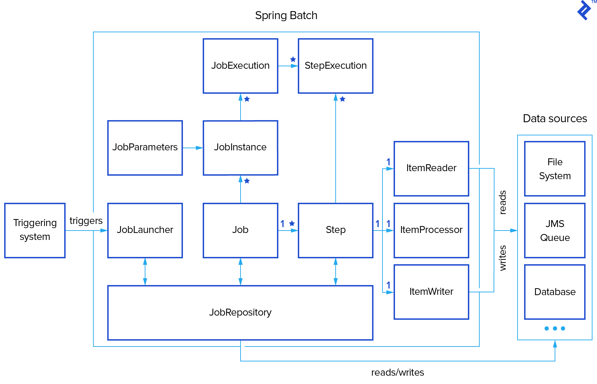
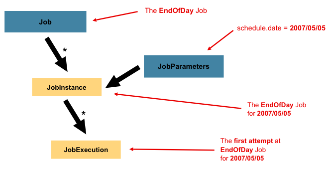
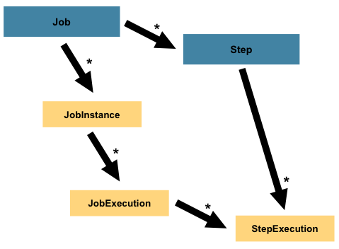

# Spring Batch

- Spring batch is a framework that allows us to create reusable functions to process huge amounts of data for daily operations. This includes transaction management, logging, resource management, etc.

- Batch processing in Spring Boot refers to the execution of a series of tasks or operations as a batch job. This can involve processing large volumes of data, handling repetitive tasks, or performing complex operations in scheduled or parallel executions.

- Spring Batch is not a scheduling framework. There are many good enterprise schedulers (such as Quartz, Tivoli, Control-M, and others) available in both the commercial and open source spaces. Spring Batch is intended to work in conjunction with a scheduler rather than replace a scheduler.
    - **Scheduler**: A scheduler is a system that is responsible for executing tasks at a specific time or after a specific interval. It can be used to schedule jobs, such as running a batch job at a specific time or after a specific interval.
    - Spring Batch is the target of the scheduler. The scheduler is responsible for starting the Spring Batch job at the appropriate time.

## Dependencies

- To use Spring Batch in a Spring Boot application, you need to include the `spring-boot-starter-batch` dependency in your `pom.xml` file.

    ```xml
    <dependency>
        <groupId>org.springframework.boot</groupId>
        <artifactId>spring-boot-starter-batch</artifactId>
    </dependency>
    ```
---------------------------------------------------

## Primary components of Spring Batch



### JobLauncher

- `JobLauncher` is initiated from the job scheduler or any other mechanism. `JobLauncher` triggers the `job` with `JobParameters` (e.g., timestamps, file paths).

    ```java
    public interface JobLauncher {

        public JobExecution run(Job job, JobParameters jobParameters)
                    throws JobExecutionAlreadyRunningException, JobRestartException,
                        JobInstanceAlreadyCompleteException, JobParametersInvalidException;
    }
    ```

### Job

- It represents a **single batch process** that is to be executed by a `JobLauncher`. 

- The metadata about the job is stored in a `JobRepository`. 

- 1 job can contain 1~N steps.

- A job can be run multiple times. Each run of the job is called an `JobInstance` which is uniquely identified by its `JobParameters` that are used to start the job.

- The job configuration contains:

    - The simple name of the job.
    - Definition and ordering of Step instances.
    - Whether or not the job is restartable.

- A job can be defined in an XML file or Java configuration. For example, the following XML configuration defines a job with two steps:
    ```xml
    <job id="endOfDayJob" restartable="true">
        <step id="step1" next="step2">
            <tasklet ref="tasklet1"/>
        </step>
        <step id="step2">
            <tasklet ref="tasklet2"/>
        </step>
    </job>
    ```


### JobInstance

- It is a **logical run** of a job.

- `JobInstance` can be restarted multiple times in case of execution failure, and its lifecycle ends with first successful execution.
    - Using the EndOfDay Job as an example, consider a `JobInstance` for 01-01-2008 that failed the first time it was run. If it is run again with the same identifying job parameters as the first run (01-01-2008), a new `JobExecution` will be created. However, there will still be only one `JobInstance`.

- Each `JobInstance` can have multiple `JobExecution` instances, each representing a single attempt to run the job.


- For same job parameters each job instance will be same but for each execution of the same job instance , job execution will be different.


### JobExecution

- A `JobExecution` refers to the technical concept of a **single attempt to run a Job.**

- Each run of a `JobInstance` is referred to as a `JobExecution`. 

- Each `JobExecution` typically tracks what happened during a run, such as current and exit statuses, start and end times, etc.

- There are two types representing status in Spring Batch: 
    - **BatchStatus**: Represents the status of the job execution.
        ```java
        public enum BatchStatus {
            STARTING, STARTED, STOPPING, STOPPED, 
            FAILED, COMPLETED, ABANDONED
            ...
        }
        ```
    - **ExitStatus**: The result status of execution.
        - **COMPLETED**: Status of finished processing.
        - **FAILED** : Finished processing with an error.
        - **STOPPED** : finished processing with an interrupted status.
        - **NOOP**: It represents that no processing occurred like when the operations are finished already.
        - **UNKNOWN**: Job ends in unknown status. It signifies a no continuable status.
        - **EXECUTING** : continuable status without further action. It is used for asynchronous execution that does not need one to wait for results.

- A `Job` defines what a job is and how it is to be executed, and `JobInstance` is a purely organizational object to group executions together, primarily to enable correct restart semantics. A `JobExecution`, however, is the primary storage mechanism for what actually happened during a run, and as such contains many more properties that must be controlled and persisted:
   
    **JobExecution Properties**:
    - **status**: A `BatchStatus` object that indicates the status of the execution. While running, it's `BatchStatus.STARTED`, if it fails, it's `BatchStatus.FAILED`, and if it finishes successfully, it's `BatchStatus.COMPLETED`.
    - **startTime**:A `java.util.Date` representing the current system time when the execution was started.
    - **endTime**: A `java.util.Date` representing the current system time when the execution finished, regardless of whether or not it was successful.
    - **exitStatus**: The `ExitStatus` indicating the result of the run. It is most important because it contains an exit code that will be returned to the caller. 
    - **createTime**: A `java.util.Date` representing the current system time when the `JobExecution` was first persisted. The job may not have been started yet (and thus has no start time), but it will always have a `createTime`, which is required by the framework for managing job level ExecutionContexts.
    - **lastUpdated**: A `java.util.Date` representing the last time a `JobExecution` was persisted.
    - **executionContext**:	The 'property bag' containing any user data that needs to be persisted between executions.
    - **failureExceptions**: The list of exceptions encountered during the execution of a Job. These can be useful if more than one exception is encountered during the failure of a Job.

### JobParameters

- **"How is one JobInstance distinguished from another?"** The answer is: JobParameters

-  A `JobParameters` object holds a set of parameters used to start a batch job.

- For example, if you have a job that reads a file and writes to a database, you might want to pass the file name as a parameter to the job. This is where `JobParameters` comes in.

    

### Step

- A `Step` is a **single action** within a job.

- Similar to a job, a step can be run multiple times. Each run of the step is called a `StepExecution`.

- Each step consists of a `ItemReader`, a `ItemProcessor`, and a `ItemWriter`.
    - **ItemReader**: It reads data from different data sources.
        - When the `ItemReader` has exhausted the items it can provide, it indicates this by returning `null`.
    - **ItemProcessor**: It processes the data read by the `ItemReader`.
        - If, while processing the item, it is determined that the item is not valid, returning `null` indicates that the item should not be written out. 
    - **ItemWriter**: It writes the data processed by the `ItemProcessor`.
        - It writes **one item a time**. 

    

- There are basically two types of steps:
    - **Tasklet**: 
        - Tasklets are meant to perform a single task within a step.
        - Tasklet is ideal for executing sequential tasks.
        - Imagine you have a step that needs to send an email to all customers who have not made a purchase in the last 30 days. You can create a tasklet that reads all customers who have not made a purchase in the last 30 days and sends an email to each one.
        - Another example: After processing each chunk of orders using Chunk Processing, you want to send confirmation emails to the customers. You create a Tasklet that sends these emails. Spring Batch will execute this Tasklet after each chunk of orders is processed. This way, you ensure that customers receive timely confirmations without overwhelming the system.
    - **Chunk**:
        - Chunks are used for handling large datasets by breaking them into smaller, more manageable pieces. In chunk-oriented processing, data is read, processed, and written in chunks. 
        - Imagine you have a list of 1000 orders to process. With Chunk Processing, you can specify that you want to process 100 orders at a time. Spring Batch will read the first 100 orders, process them, and then move on to the next 100 until all orders are processed. This way, you’re not overwhelmed by the sheer volume of data, and your system operates efficiently.

### StepExecution

- A `StepExecution` represents a **single attempt** to execute a Step. A new `StepExecution` is created each time a Step is run, similar to `JobExecution`. However, if a step fails to execute because the step before it fails, no execution is persisted for it. A `StepExecution` is created only when its Step is actually started.

- `StepExecution` stores the metadata about the step execution, such as the status of the step, the start and end times of the step, and a reference to its corresponding `Step` and `JobExecution`.

- `StepExecution` may finish in success or failure status and so it has a `BatchStatus` and `ExitStatus` like a `JobExecution`.

### ExecutionContext

- An `ExecutionContext` represents a collection of key/value pairs that are persisted and controlled by the framework in order to allow developers a place to store persistent state that is scoped to a `StepExecution` object or a `JobExecution` object.

- Spring Batch persists the `ExecutionContext`, which helps in cases where you want to restart a batch run (e.g., when a fatal error has occurred, etc.). All that is needed is to put any object to be shared between steps into the context and the framework will take care of the rest. After restart, the values from the prior `ExecutionContext` are restored from the database and applied.

- There are 2 execution contexts that the spring batch framework provides:
    - **Job’s ExecutionContext**: 
        - This context is available during the job execution. It is unreachable afterwards.
        - It's stored in `BATCH_JOB_EXECUTION_TABLE` of a Spring Batch Application.
    - **Step’s ExecutionContext**: 
        - This context is available during the step execution. It is unreachable afterwards.
        - It's stored in `BATCH_STEP_EXECUTION_TABLE` of a Spring Batch Application.
        - Each step execution contains an `ExecutionContext`, which contains any data a developer needs to have persisted across batch runs, such as statistics or state information needed to restart.
        - For example, in the Step's ExecutionContext, the state of a step (how many records have been read, etc) is typically stored so that on restart the reader and writer can be reset to the correct position.
### JobRepository

- `JobRepository` is the mechanism in Spring Batch that makes all this persistence possible. It is the keeper of all the knowledge and metadata for each job (including component parts such as `JobInstances`, `JobExecution`, and `StepExecution`)

- It provides CRUD operations for `JobLauncher`, `Job`, and `Step` instantiations. 

- When a `Job` is first launched, a `JobExecution` is obtained from the repository, and, during the course of execution, `StepExecution` and `JobExecution` implementations are persisted by passing them to the repository.

---------------------------------------------------

## Running Your Spring Batch Application

There are several ways to run a batch application. Let’s examine some of them.

### Spring Scheduler

- Spring provides a scheduling framework that can be used to schedule batch jobs. You can use the `@Scheduled` annotation to schedule a method to run at a specific time.

- Using this approach is so easy. However, you should handle cases such as exceptions, notifications, running chained jobs, etc. yourself.

```java
@Component
public class ScheduledTasks {

    private static final Logger log = LoggerFactory.getLogger(ScheduledTasks.class);

    private static final SimpleDateFormat dateFormat = new SimpleDateFormat("HH:mm:ss");

    @Scheduled(fixedRate = 5000)
    public void reportCurrentTime() {
        log.info("The time is now {}", dateFormat.format(new Date()));
    }
}
```
In the preceding example, the `reportCurrentTime` method is scheduled to run every 5 seconds.

### Using a Job Scheduling Tool

- You can use a job scheduling tool like UC4, Quartz, Control-M, or Tivoli to schedule your batch jobs.

---------------------------------------------------

## Annotations

### `@EnableBatchProcessing`

- This annotation is used to enable Spring Batch features and provide a base configuration for setting up batch jobs in the application.

- It automatically creates bean for a `JobRepository`, `JobLauncher`, `JobRegistry`, `PlatformTransactionManager`, `JobBuilderFactory` and `StepBuilderFactory`.

```java
@EnableBatchProcessing
@SpringBootApplication
public class SpringBatchApplication {
    public static void main(String[] args) {
        SpringApplication.run(SpringBatchApplication.class, args);
    }
}
```
---------------------------------------------------
<!-- 
## Spring Batch's chunk-based processing model example

```java
package com.demo.springbatchsampleapp.batch.config;


import com.demo.springbatchsampleapp.batch.CustomItemProcessor;
import com.demo.springbatchsampleapp.batch.CustomItemReader;
import com.demo.springbatchsampleapp.batch.CustomItemWriter;
import org.springframework.batch.core.Job;
import org.springframework.batch.core.Step;
import org.springframework.batch.core.job.builder.JobBuilder;
import org.springframework.batch.core.repository.JobRepository;
import org.springframework.batch.core.step.builder.StepBuilder;
import org.springframework.context.annotation.Bean;
import org.springframework.context.annotation.Configuration;
import org.springframework.transaction.PlatformTransactionManager;

@Configuration
public class BatchConfig {
    @Bean
    public CustomItemReader reader() {
        return new CustomItemReader();
    }

    @Bean
    public CustomItemProcessor processor() {
        return new CustomItemProcessor();
    }

    @Bean
    public CustomItemWriter writer() {
        return new CustomItemWriter();
    }

    @Bean
    public Step step1(JobRepository jobRepository, PlatformTransactionManager platformTransactionManager) {
        return new StepBuilder("step1", jobRepository).<String, String>chunk(0, platformTransactionManager)
                .reader(reader())
                .processor(processor())
                .writer(writer())
                .build();
    }

    @Bean
    public Job demoJob(JobRepository jobRepository) {
        return new JobBuilder("demoJob", jobRepository)
                .start(step1(jobRepository, null))
                .build();

    }
}
``` -->

---------------------------------------------------

<!-- ## References

- [The Domain Language of Batch](https://docs.spring.io/spring-batch/docs/2.2.x/reference/html/domain.html#:~:text=3.1.,-1.&text=A%20JobInstance%20refers%20to%20the,Job%20must%20be%20tracked%20separately.) -->