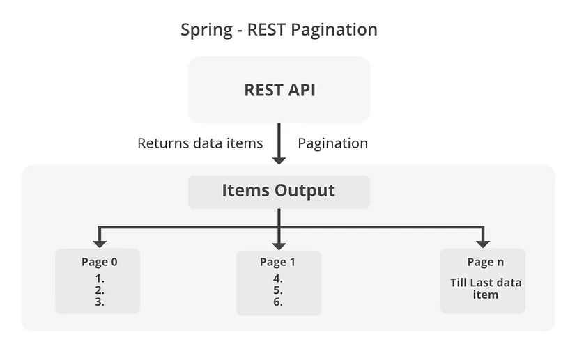

## Saving Entities

- `save()` method is dual purpose method. It can be used to save new entity or update existing entity.

- There are different mechanisms used by Spring to decide if it must use `persist()` (for new entity) or `merge()` (for existing entity) method of `EntityManager`.

### Entity State Detection Strategies

- **@Id-Property inspection (the default)**: By default, Spring Data inspects the identifier property of the given entity. If the identifier property is null or 0 in case of primitive types, then the entity is assumed to be new. Otherwise, it is assumed to not be new.

- **@Version-Property inspection**: If a property annotated with `@Version` is present and null, or in case of a version property of primitive type 0 the entity is considered new. If the version property is present but has a different value, the entity is considered to not be new. If no version property is present Spring Data falls back to inspection of the identifier property.
    > If the entity has a version property, Spring Data JPA will use the version property to determine if the entity is new or not even if the entity has an identifier property.

- **Implementing Persistable**: If the entity implements the `Persistable` interface, the `isNew()` method is used to determine if the entity is new or not.

- **Providing a custom EntityInformation implementation**: If none of the above strategies apply, you can provide a custom `EntityInformation` implementation that determines the state of the entity.

----------------------------------------------------------------

## Different Query Types in Spring Data Repositories

You can define queries in Spring Data JPA repositories using the following methods:

- **Derived Query Methods**: It allows you to create queries based on method names. 
    ```java
    List<Student> findByCoursesId(Long courseId);
    void deleteByCoursesId(Long courseId);
    Long countByCoursesId(Long courseId);
    ```
    > [Derived Query Methods](https://docs.spring.io/spring-data/jpa/reference/jpa/query-methods.html)

- **Native Queries**: It permits the execution of SQL queries directly.
    ```java
    @Query(value = "SELECT * FROM student_course WHERE course_id = :courseId", nativeQuery = true)
    List<Map<String, Object>> findStudentCourseMappings(@Param("courseId") Long courseId);
    ```
- **JPQL Queries**: It allows you to write queries using entity classes and fields. 
    ```java
    @Query("SELECT s FROM Student s JOIN s.courses c WHERE c.id = :courseId")
    List<Student> findStudentsByCourseId(@Param("courseId") Long courseId);
    ```

----------------------------------------------------------------

## Sorting & Pagination

## Sorting

- Sorting allows you to order the records based on the one or more fields. You can sort the results of a query using the `Sort` parameter.
```java
public interface StudentRepository extends JpaRepository<Student, Long> {
    List<Student> findByCoursesId(Long courseId, Sort sort);
}

// Usage
List<Student> studentsSortedByFirstName = studentRepository.findByCoursesId(courseId, Sort.by(Direction.ASC, "firstName"));

// Multiple Sort
List<Student> studentsSortedByFirstNameAndLastName = studentRepository.findByCoursesId(courseId, Sort.by(Direction.ASC, "firstName", "lastName"));
```

### Sort Class

- `Sort` class: Provides sorting options for database queries with more flexibility in choosing single/multiple sort columns and directions (ascending/descending).
    
- **Methods**:
    - `Sort.by(Direction direction, String... properties)`: It creates a new `Sort` object with the given direction and properties.
        - Example: `Sort.by(Direction.ASC, "firstName", "lastName")`
    - `Sort.by(String... properties)`: It creates a new `Sort` object with the given properties in ascending order.
        - Example: `Sort.by("firstName", "lastName")`
    - `Sort.by(List<Order> orders)`: It creates a new `Sort` object with the given list of orders.
        - `Sort.Order` class: Allows you to customize the sorting for individual fields, including direction and null handling.
        - Example: `Sort.by(List.of(Order.asc("firstName"), Order.desc("lastName")))`
    - `Sort.unsorted()`: It returns an unsorted `Sort` object.
        - Example: `List<Student> students = studentRepository.findByCoursesId(courseId, Sort.unsorted());`

## Pagination

- **Pagination**: Pagination refers to the process of dividing a large dataset into smaller chunks or pages of the data. It allows the users to navigate through the subsets of the data rather than loading all data at once, which can be inefficient and slow.

- **Advantages of Pagination:**
    - Reduces the amount of data transferred over the network.
    - Improves the performance of the application by loading data in smaller chunks.
    - Enhances the user experience by providing a better navigation experience.

- **how does pagination work in Spring Boot?**
    


- **Pageable Interface**: It provides a way to handle pagination and sorting of database queries by allowing you to request a specific subset, or "page," of a dataset. It provides methods to get the page number, page size, sorting information, etc.
    ```java
    public interface StudentRepository extends JpaRepository<Student, Long> {
        Page<Student> findByCoursesId(Long courseId, Pageable pageable);
    }

    // Usage
    Page<Student> studentsPage = studentRepository.findByCoursesId(courseId, PageRequest.of(0, 10, Sort.by(Direction.ASC, "firstName")));
    ```

    - Return `List<Entity>` vs `Page<Entity>` :
        - `List<Entity>`: It returns all the records that match the query without any pagination information.
        - `Page<Entity>`: It returns a page of records along with the metadata like total number of records, total number of pages, page number, etc.

- **Page Interface**: It represents a page of data along with the metadata like total number of records, total number of pages, etc.
    ```java
    Page<Student> studentsPage = studentRepository.findByCoursesId(courseId, PageRequest.of(0, 10, Sort.by(Direction.ASC, "firstName")));
    int totalPages = studentsPage.getTotalPages();
    long totalElements = studentsPage.getTotalElements();
    ```

- **PageRequest Class**: It is an implementation of the `Pageable` interface that represents a request for a specific page of data with a given page number(starting at 0), page size, and optional sorting information.
    - ```java
        public static PageRequest of(int pageNumber, int pageSize) {
            return of(pageNumber, pageSize, Sort.unsorted());
        }

        public static PageRequest of(int pageNumber, int pageSize, Sort sort) {
            return new PageRequest(pageNumber, pageSize, sort);
        }
        ```
    - Example: `PageRequest.of(0, 10, Sort.by(Direction.ASC, "firstName"))`
        - It asks for the first page of data with 10 records per page, sorted by the `firstName` field in ascending order.

- This pageable object can be passed to repository methods, like `findAll(Pageable pageable)` , to retrieve a `Page` object that contains a subset of data as well as metadata, such as total pages, total elements, and navigation information (e.g., whether there are more pages). 
    ```java
    Pageable pageable = PageRequest.of(0, 10, Sort.by(Direction.ASC, "firstName"));
    Page<Student> studentsPage = studentRepository.findByCoursesId(courseId, pageable);
    int pageNumber = studentsPage.getNumber();
    // Number of records in the current page.
    int pageSize = studentsPage.getSize();
    // Number of records that match the query criteria in the database.
    long totalElements = studentsPage.getTotalElements();
    int totalPages = studentsPage.getTotalPages();
    boolean hasNext = studentsPage.hasNext();
    boolean hasPrevious = studentsPage.hasPrevious();
    boolean isEmpty = studentsPage.isEmpty();
    // Check if the current page is the first page or the last page.
    boolean isFirst = studentsPage.isFirst();
    boolean isLast = studentsPage.isLast();
    ```