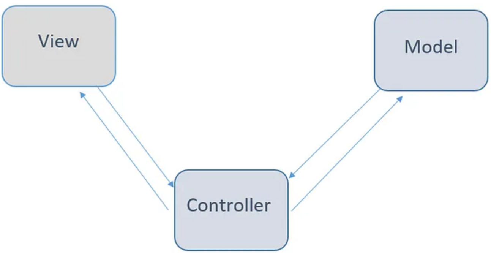
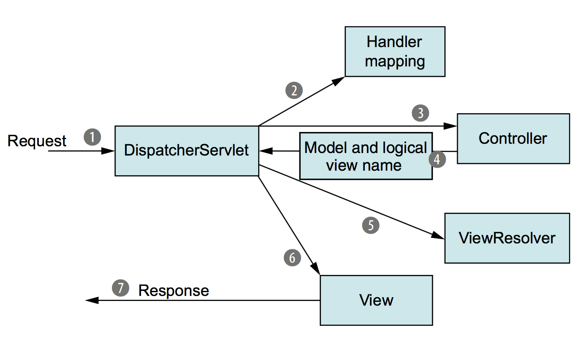
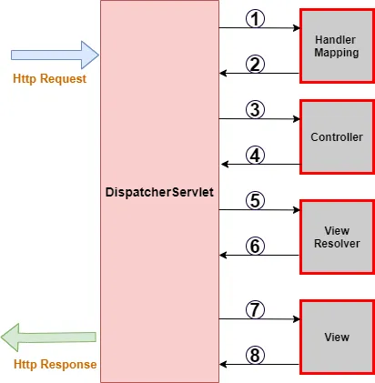

# Spring MVC

The Spring MVC is a web application framework that is part of the Spring Framework. It is designed to make it easy to build web applications using the **MVC design pattern**.

The core elements of the Spring MVC framework is the **DispatcherServlet**,  which is the main servlet that handles all requests and dispatches them to the appropriate channels. With the Dispatcher Servlet, Spring MVC follows the **Front Controller pattern** that provides an entry point for handling all requests of web applications.

## Architecture

### Model-View-Controller (MVC)

The Model-View-Controller (MVC) pattern is an architectural pattern that separates the application logic from the user interface. It does this by separating the application into three parts: the model, the view, and the controller.

- **The model** is responsible for managing the data of the application. It receives user input from the controller, processes it, and sends it back to the controller.

- **The view** is responsible for displaying the data of the application. It receives data from the controller, formats it, and displays it to the user.

- **The controller** is responsible for handling user input and updating the model and the view accordingly.

> The MVC pattern is used in many different frameworks, such as Spring MVC, Ruby on Rails, and Django.

### Front Controller

The Front Controller pattern is a design pattern that provides a centralized entry point for handling requests. It is used in web applications to provide a single point of contact for all requests.

The front controller is responsible to perform pre-processing and post-processing of incoming requests.
   - **pre-processing request:** capturing form data incoming from the client.
   - **post-processing request:** returning data to the client.

-------------------------------------------------------------------

# Components

The Spring MVC framework has several key components that work together to handle the requests and generate the appropriate responses in a web application. These components include:

## 1. DispatcherServlet

- The `DispatcherServlet` is a `Servlet`.

- The `DispatcherServlet` is the front controller in **Spring MVC**. All incoming requests are routed to the `DispatcherServlet` which then dispatches the request to controllers based on configuration.

- When you create a Spring Boot web application, the `DispatcherServlet` is automatically configured and plays a key role in managing the routing of HTTP requests to your controllers.

- For each incoming request, the `DispatcherServlet` determines which controller to call based on the request URL. The controller returns a model and view object to the `DispatcherServlet`, which then selects the appropriate view to render based on the model data.

### How DispatcherServlet works

**DispatcherServlet in a Nutshell:**

1. **Request Initiation (User's Browser to DispatcherServlet):** When a user initiates a request from their browser, it is sent to the DispatcherServlet, which is the front controller in Spring MVC.

2. **Front Controller (DispatcherServlet):** The request is first handled by Spring's DispatcherServlet, acting as a front controller. It's the entry point for requests in Spring MVC. A front controller is a common web application pattern where a single servlet delegates responsibility for a request to other components of an application to perform actual processing.

3. **Handler Mapping (Choosing the Right Controller):** DispatcherServlet consults handler mappings to determine which Spring MVC controller should handle the request based on the request's URL as the app may have several controllers. The dispatcher then dispatches the request to the chosen controller.

4. **Controller Processing:** The chosen controller processes the request (a well-designed controller delegates responsibility for the business logic to one or more service objects). The contoller packages the model data and identifies the name of a view that should render the output. It then sends the request, along with the model and view name, back to the DispatcherServlet.

5. **View Resolution:** A view resolver helps DispatcherServlet map the logical view name to an actual view implementation, which may be a JavaServer Page (JSP) or another technology.

6. **View Rendering (Output Generation):** The request is sent to the selected view (usually a JSP), where the model data is used to create the response content (e.g., HTML).

7. **Response Delivery (DispatcherServlet to User's Browser):** The response is delivered back to the user's browser to display the requested content.

### Request execution flow

## 2. Handler Mapping

The Handler Mapping is responsible for mapping the incoming request to the appropriate controller and return details to the DispatcherServlet.

## 3. Handler Adapter

It is used to invoke the appropriate controller method and return the response.

## 4. Controllers

- Controllers are classes annotated with `@Controller` annotation.

- Controllers are responsible for processing user input and building an appropriate model and returning the view to be rendered to the user.

## 5. Model and View Name

The model holds data retrieved from the data source.

The view represents a logical view name.

In Spring MVC, views are typically implemented using JSPs, but other view technologies such as Thymeleaf, FreeMarker, Velocity can also be used.

## 6. View Resolver

The View Resolver is responsible for mapping the view names to the actual views, such as JSPs or Thymeleaf templates. It is used to determine which view to render based on the view name returned from the controller.

## 7. View

The View is responsible for rendering the model data to the user.

-------------------------------------------------------------------