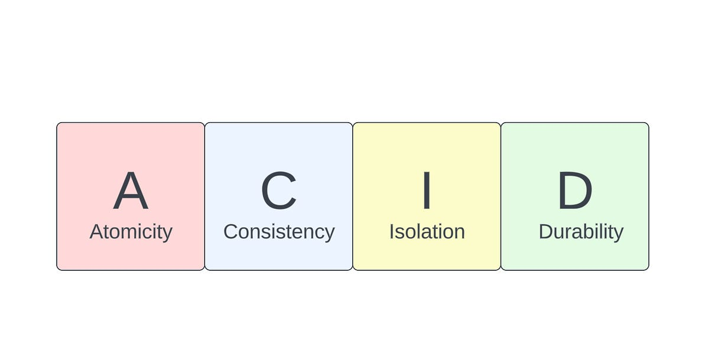

## What is a transaction?

- **A transaction is any operation that is treated as a single unit of work,** which either completes fully or does not complete at all, and leaves the storage system in a consistent state. 

- The classic example of a transaction is what occurs when you withdraw money from your bank account. Either the money has left your bank account, or it has not — there cannot be an in-between state.

- Lots of things can go wrong when using a database:
    - the database hardware or software can fail
    - the application calling the database can fail mid-operation
    - the network can be flooded with more traffic can it can handle
    - several clients can make writes at the same time that overwrite the other’s changes
    - and so on.

- **Keep Transaction scopes as small as possible**
    - Transactions should only be used for the smallest possible unit of work to minimize the potential for locking or blocking other database transactions.
    - Let’s say we have a service that performs two operations on our database: it updates a user’s email address and then sends an email to the user to confirm the change. To keep the transaction scope as small as possible, we should split this service into two separate services, each with its own transactional boundary.

- **Avoid Long running Transactions**
    - Long-running transactions can cause performance issues and tie up database resources.
    - Let’s say we have a service that processes a large batch of data and updates the database for each item in the batch. If we execute all of these updates in a single transaction, it could result in a long-running transaction, which can cause performance issues and tie up database resources. To avoid long-running transactions, we can split our batch processing into smaller chunks and execute each chunk within its own transactional boundary.

---------------------------------------------

## ACID properties

- ACID is an acronym that refers to the set of 4 key properties that define a transaction.  
    

- Most popular DBMS like MySQL, PostgresSQL and Oracle have ACID guarantees out of the box. 
    -  While a lot of DBMS may say they are ACID compliant, the implementation of this compliance can vary. So, for example, if isolation is a key property that you need for an application you are building, you need to understand how exactly your chosen DBMS implements isolation.

- If a database operation has these ACID properties, it can be called an **ACID transaction**, and data storage systems that apply these operations are called **transactional systems**. 

- ACID transactions guarantee that each read, write, or modification of a table has the following properties:

### Atomicity

- Atomicity simply means that all queries in a transaction must succeed for the transaction to succeed. If one query fails, the entire transaction fails.

- For example, if you are transferring money from one account to another, you need to make sure that the money is removed from one account and added to the other. If the money is removed from one account but not added to the other, the transaction has failed.

- A non-atomic transaction would remove the money from one account but not add it to the other, leaving the system in an inconsistent state.

### Consistency

- Consistency means consistency in data. The transaction should make no changes that violate the rules or constraints placed on the data. 

- Consistency is defined by the creator of the database. The database creator can define the rules and constraints that must be followed for the data to be considered consistent.

- For example, a database that supports banking transactions might include a rule stating that a customer's account balance can never be a negative number. If a transaction attempts to withdraw more money from an account than what is available, the transaction will fail, and any changes made to the data will roll back.

### Isolation

- Isolation is a guarantee that concurrently running transactions should not interfere with each other. Concurrency here refers to two or more transactions trying to modify or read the same database record(s) at the same time.

- For example, if two users are trying to modify the same data, the DBMS uses a mechanism called a lock manager to suspend other users until the changes being made by the first user are complete.

### Durability

- Durability means that once a transaction has been committed, the changes will persist, even in the case of a system failure. This ensures that any committed transactions are protected even if the database crashes.

- Durability is usually achieved by writing the transaction to a log file before committing it. If the system fails before the transaction is committed, the transaction can be replayed from the log file when the system comes back online.

------------------------------------------------------------

## `@Transactional` Annotation in Spring

- The `@Transactional` annotation is used to mark a method or a class as transactional, meaning that any database operations performed within the marked method or class will be executed within a transaction. If the transaction is successful, the changes will be committed to the database. If an error occurs and the transaction is rolled back, the changes will not be persisted in the database.

- JPA methods (`save()` , `findById(id)` .. ) their implementation already annotated with `@Transactional` which taking care of creating DB transaction if not exists.

- JPA methods like `save()` and `saveAll()` do not directly commit changes to the database. Instead, they modify the state of entities in the Persistence Context (managed by the `EntityManager`). When a transaction ends, JPA performs a flush operation to write the changes to the database, and then the commit is triggered when the session is closed.
    - **Without `@Transactional`**: Each JPA method call (like `save()`) will open its own transaction, perform the operation, and then close the transaction. This can lead to performance issues if there are many `save()` calls in a loop, as each one involves repeatedly opening and closing transactions.
    - **With `@Transactional`**: The entire method is wrapped in a single transaction. Multiple JPA operations (like `save()`) are grouped together and committed at once, improving performance.
    > It's recommended to use `saveAll()` instead of `save()` in case of saving multiple entities.

### Transactional on Methods

- You typically place it on methods of a service class where you want the transactional behaviour.

```java
@Service
public class UserService{

    @Transactional
    public void createUser() {
        // enter your transactional code here
    }
}
```

### Transactional on Classes

You can also place it at the class level to apply it to all methods in the class. Each method will be executed within a transaction.

```java
@Transactional
@Service
public class UserService {

    public void getUser() {
        // transactional code
    }

    public void createUser() {
        // transactional code
    }
}
```

### Rollback Rules

- You can specify which exceptions should trigger a rollback. 

- By default, it will roll back the transaction for any `RuntimeException` or `Error` that occurs within the transaction. You can specify additional exceptions that should trigger a rollback using the `rollbackFor` attribute.

```java
@Transactional(rollbackFor = {CustomException.class})
public void createUser() {
    // your transactional code here
}
```

### Propagation

- Spring Transactions Propagation Levels define how transactions should be handled when multiple transactional methods are invoked within a single transactional context. These levels allow you to control the behavior of transactional methods, such as whether they should join an existing transaction or create a new one.

- **Propagation Levels**
    - `Propagation.REQUIRED`: 
        - The default behavior. 
        - When a method annotated with this level is invoked, it will join an existing transaction if available. If no transaction exists, a new one will be created. 
        - This level ensures that all transactional methods participate in a single transactional context.
        ```java
        @Transactional(propagation = Propagation.REQUIRED)
        public void updateCustomerInfo(Customer customer) {
        // Perform database updates
        }
        @Transactional(propagation = Propagation.REQUIRED)
        public void processOrder(Order order) {
        // Perform order processing
        updateCustomerInfo(order.getCustomer());
        }
        ```
        here, the `updateCustomerInfo` method will join the transaction started by the `processOrder` method.

    
    - `Propagation.REQUIRES_NEW`: 
        - Always creates a new transaction. If a transaction already exists, it will be suspended until the new transaction completes. 
        - This level ensures that each method operates in its independent transactional context.
    
    - `Propagation.SUPPORTS`: 
        - Runs within a transaction if one is already present; otherwise, runs non-transactionally.
        - If there's a transaction, I'll participate; otherwise, I'll run as non-transactional.
    
    - `Propagation.NOT_SUPPORTED`: 
        - Executes non-transactionally, suspending the current transaction if one exists until the method completes.
    
    - `Propagation.MANDATORY`: 
        - The method must execute within an active transaction. If no transaction is present, a `TransactionRequiredException` is thrown.

### Read-Only Transactions

- All requests can be split into two categories. 
    - Those that read data (read-only transactions). 
    - And those that can also update data (read-write transactions). 

- By default, Spring transactions are **read-write**.
    ```java
    boolean readOnly() default false;
    ```

- For read-only operations that don’t modify the database, it’s best to use read-only transactions to improve performance. Read-only transactions do not acquire any database locks, and they can be executed more efficiently than read-write transactions.

    > At end of each transaction hibernate framework needs to know if it should fire any insert/update statements or not , So it fires dirty checking operation so it can know if there any entity changed and fire statement for it , so in case you have a methods with just retrieve operations it's better to set read-only property to true so you can avoid dirty checking operation.

```java
@Transactional(readOnly = true)
public void getUser() {
    // your read-only code here
}
```
